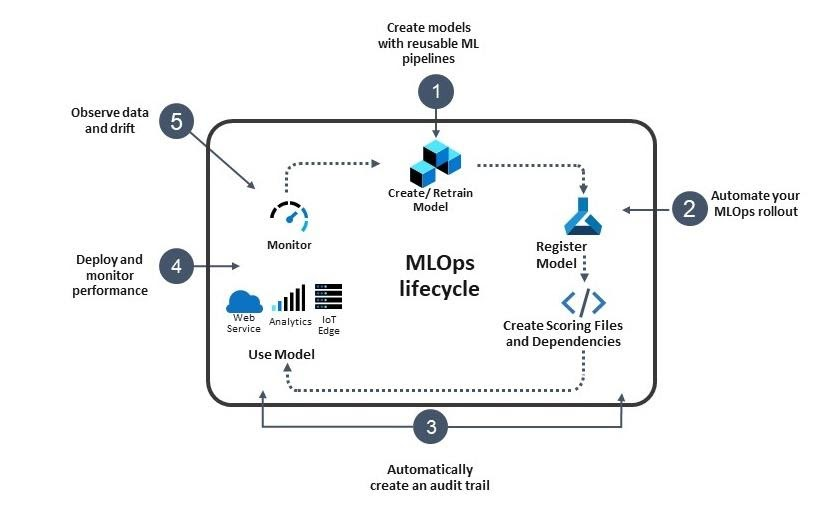
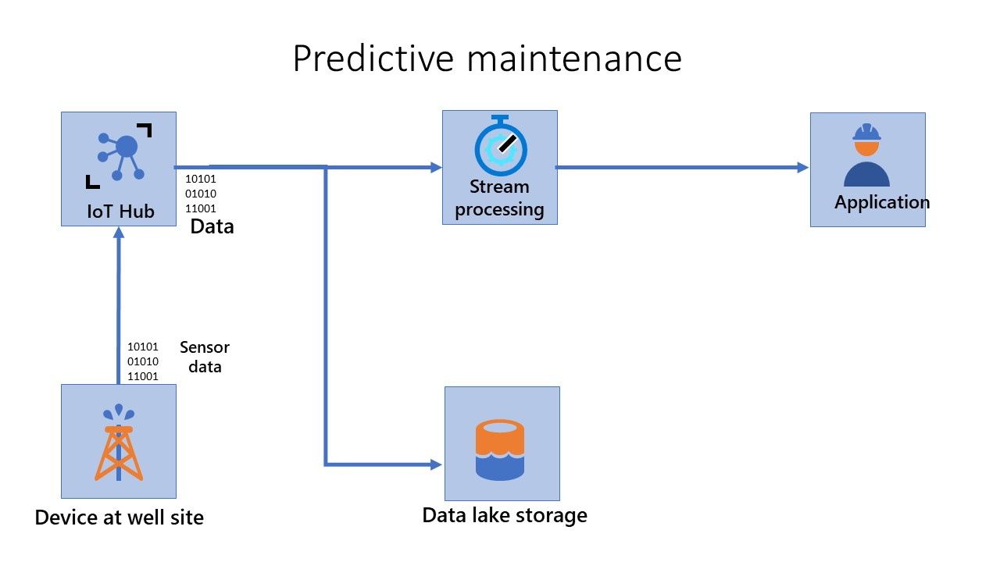

MLOps (DevOps for machine learning) lets data science and IT teams collaborate to speed up model development and deployment through monitoring, validation, and governance of machine learning models. MLOps applies the philosophy of DevOps to machine learning by automating end-to-end workflows. MLOps is a part of Azure Machine Learning and can be deployed to IoT Edge devices. 

The end-to-end machine learning lifecycle is shown in the following diagram:

1. Create models with reusable machine learning pipelines using the Azure Machine Learning extension for Azure DevOps. Store your code in GitHub so it integrates automatically into your MLOps pipeline.

2. Automate your MLOps rollout using Azure DevOps + Azure Machine Learning for version models with rich metadata and event management.

3. Automatically create an audit trail for all artifacts in your MLOps pipeline to ensure asset integrity and meet regulatory requirements.

4. Deploy and monitor performance so you can release models with confidence and know when to retrain.

5. Observe data drift and feedback model information to improve future training.

The deployment of machine learning models in production presents one of the most significant pain points in the workflow. The deployment process presents additional challenges when the target platform is IoT Edge. These include:

- IoT machine learning models are rapidly changing, hence they degrade faster (with respect to data drift of the current data). Therefore, they need more frequent and automatic retraining.

- IoT machine learning models need to be deployed on different kinds of target platforms, and you need to use the capabilities of these platforms for performance, security, and so on.

- IoT Edge solutions might need to run offline, so you need to allow for offline operation with the frequency of model refresh.

## Scenario

Suppose you work in the oil and gas industry, and you're responsible for maintaining thousands of pumps operating in remote or offshore locations. Even if these locations are remote, your team must rapidly identify and fix faults in the field. So, you want to build and deploy a predictive maintenance system for the pumps. Before you create a predictive maintenance model, you must first implement a system for remote monitoring of connected devices to ingest sensor data in a stream, process that data, and store it in a database. Your team achieves this goal with IoT Edge. You can capture data from multiple sensors in the field connected to the pumps. Anomalies are detected visually from a dashboard. So, your engineers want to deploy a new predictive maintenance system that detects anomalies from up-to-date machine learning models. The models generated by the new predictive maintenance system reflect the current state of the data dynamically by accounting for data drift. Hence, the system should allow for frequent and automatic retraining of models to indicate the status. You also need to deploy the trained models on various pumps from a range of manufacturers. The system should use the unique characteristics of the software on the pumps: both for performance and security. Finally, the models deployed should be able to run offline on the Edge device if needed. The company can achieve substantial savings on maintenance and production costs, increase workplace safety, and reduce its environmental impact by achieving these objectives.

This module covers **source control, reproducible training pipelines, model storage and versioning**, **model packaging**, **model validation**, **deployment**, **monitoring models in production**, and **retraining of models** in the context of IoT Edge devices.

In this module, you examine the significance of MLOps for IoT Edge in the context of the previous scenario for developing and deploying machine learning models.
