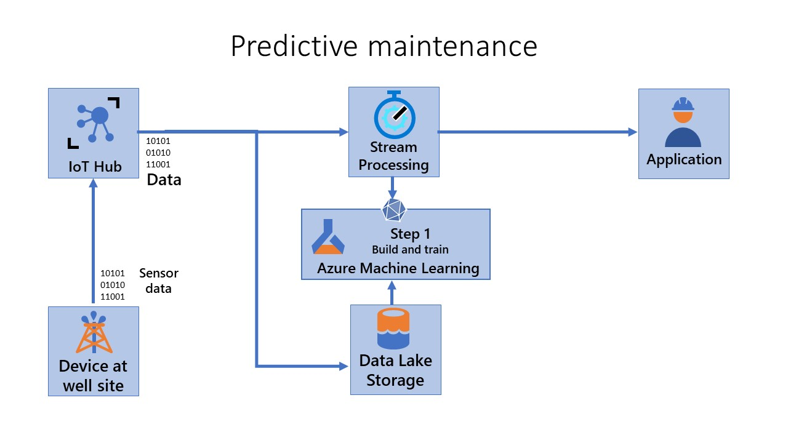
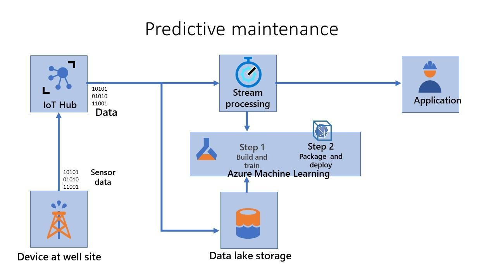
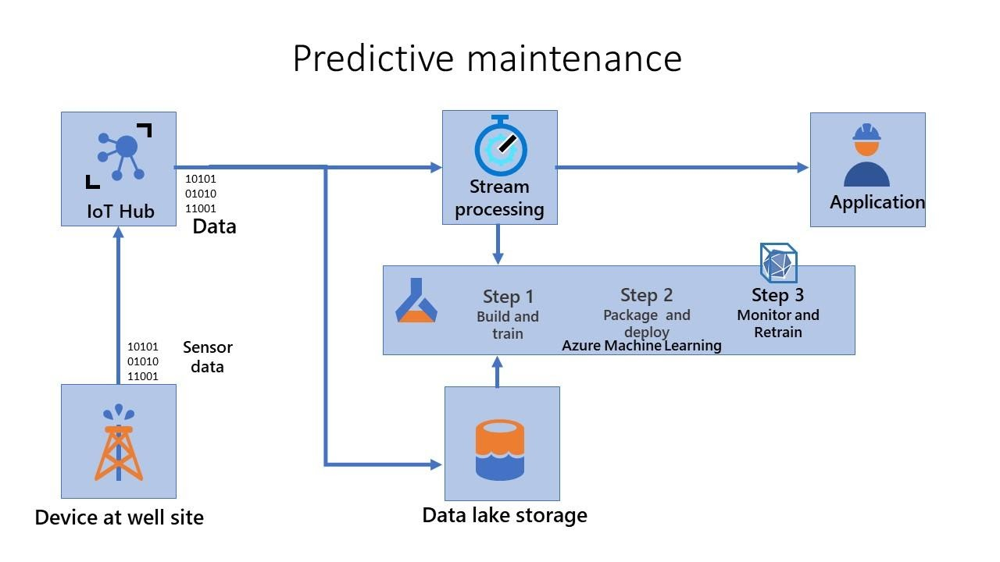

By adopting MLOps, data scientists can use the following capabilities from the DevOps world:

- Source control
- Reproducible training pipelines
- Model storage and versioning
- Model packaging
- Model validation and deployment
- Monitoring models in production
- Retraining models

These capabilities are available individually, but MLOps integrates them seamlessly, allowing data scientists, developers, and ML engineers to collaborate efficiently.

We describe the role of the individual components in this unit:

**Source control:** Use source control to enable collaboration with other data scientists and developers. All artifacts used to generate ML models (including training code and input data) are captured via source control. Models often need to be retrained and redeployed. Capturing all artifacts in a source control system ensures reproducibility and traceability.

**Reproducible training pipeline:** You need a reproducible training pipeline to streamline model development by automating repetitive tasks. By automating the training pipeline, you increase the velocity at which new models are generated.

**Model storage and versioning:**  Model storage and versioning enable easy discoverability, sharing, and collaboration. You can also audit and manage access for individual artifacts.

**Model packaging:** Captures the dependencies required for the model to run in its target inferencing environment. Model packaging is implemented through containers. Containers span both the cloud and intelligent edge. You can implement your models using reusable formats such as Open Neural Network Exchange (ONNX).

**Model validation**: You can validate your model in different kinds of ways including basic unit tests for the training code, an A/B comparison against a previous version of a model, or an end-to-end functional and performance test suite.

**Deployment:** Enables you to deploy new models to different kinds of platforms, including IoT Edge. You'll aim to understand and use the unique characteristics of the target platform.

**Monitoring:** You need the ability to monitor your models in a production environment. You can understand and improve the performance of your models. You can also monitor for data drift between your training dataset and inference data so that you know when your model needs to be retrained.

**Retraining**: Based on the monitoring criteria, you have the ability to retrain your models.

**IoT considerations:** In addition, you need special considerations for IoT deployment. In MLOps, IoT Edge is another deployment platform. However, if you deploy models on IoT Edge, you need to cater to some extra considerations. MLOps models, which target IoT Edge, should be capable of running offline. IoT models are more susceptible to data drift because of the high rate of data. IoT machine learning models need to be deployed on various target platforms, and you need to apply the capabilities of these platforms.  

Other capabilities of MLOps are also applicable to the IoT Edge environment, such as profiling, model optimization, and the ability to deploy models as containers. When you use a model as a web service or IoT Edge device, provide the following items:

- The actual models being deployed.
- An entry script that accepts the request, uses the models to score the data, and returns a response.
- An Azure Machine Learning environment that describes the pip and Conda dependencies required by the models.
- The entry script and any other assets, such as text and data, required by the model and entry script.

You also provide the configuration of the target deployment platform. When the image is created, components required by Azure Machine Learning are also added. For example, assets needed to run the web service and interact with IoT Edge.

## Revisit scenario

Let's reconsider the oil and gas industry scenario discussed earlier. You're responsible for maintaining thousands of oil and gas pumps in remote or offshore locations. Your team must rapidly identify and fix faults in the field. You want to build and deploy a predictive maintenance system for the pumps using the data captured from the sensors to create up-to-date machine learning models. The models should reflect the current state of the data. The model shouldn't be stale due to data drift. Finally, because you're using an IoT Edge scenario, the models should run on edge devices, including offline if necessary.

To address this scenario using MLOps for Edge devices, you can consider three pipelines.

- Build and train (Step 1)

- Package and deploy (Step 2)

- Monitor and retrain (Step 3)

**Step 1 - Build and train:** Create reproducible models and reusable training pipelines. The CI pipeline triggers whenever code is checked in. It publishes an updated Azure Machine Learning pipeline after building the code and running tests. The build pipeline includes unit tests and code quality tests.

**Step 2 - Package and deploy**: In this step, you package, validate, and deploy models. In this pipeline, you operationalize the scoring image and promote it safely across different environments. The pipeline triggers whenever a new artifact is available. The registered model is packaged together with a scoring script and Python dependencies (Conda YAML file) into an operationalization Docker image. The image automatically gets versioned through Azure Container Registry. The scoring image deploys to container instances for testing. If it's successful, the scoring image is deployed as a web service in the production environment.

**Step 3 - Monitor and retrain:** Explain and observe model behavior and automate the retraining process. The machine learning pipeline orchestrates the process of retraining the model asynchronously. Retraining triggers on a schedule or when new data is available by calling the published pipeline REST endpoint. In this stage, you retrain, evaluate, and register the model.

The overall flow is shown here:

.
