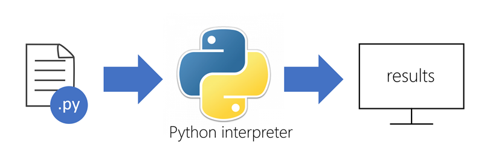

Python is one of the most popular programming languages in the world. Created in the early 1990s, it enjoys a wide range of uses from automating repetitive tasks and writing web apps to building machine learning models and implementing neural networks. Researchers, mathematicians, and data scientists in particular like Python because of its rich and easy-to-understand syntax and the wide range of open-source packages available. Packages are commonly used, shared code libraries that are freely available for anyone to use.

Python has a simple, easy to learn syntax which emphasizes readability. Applications written in Python can run on almost any computer, including those running Windows, macOS, and popular distributions of Linux. Furthermore, the ecosystem contains a rich set of development tools for writing, debugging, and publishing Python applications. 

Finally, Python is supported by an active user community that is eager to help new programmers learn the **Pythonic way** where you don't just get the syntax right, but use the language the way it was intended.

## Running Python code

Python is an _interpreted language_ which reduces the edit-test-debug cycle because there's no compilation step required. In order to run Python apps, you need a runtime environment/interpreter to execute the code.

Most of the runtime environments support two ways to execute Python code:

1. Interactive mode: This is where each command you type is interpreted and executed immediately and you see the results each time you press <kbd>ENTER</kbd>. This is the default mode if you don't pass a filename to the interpreter.
1. Script mode: This is where you put a set of Python statements into a text file with a **.py** extension. You then run the `python` interpreter and point it at the file. The program is executed line-by-line and the output is displayed. There is no compilation step as shown in the following diagram.

> [!NOTE]
> Most Python implementations do a partial compile of scripts, turning the source code into _byte code_ which can be run on any supported platform. This is done to improve performance for subsequent runs of the script and happens automatically. You can also generate a "compiled" version of the script and distribute an app without providing the full source code.

## Python implementations

Python is licensed under the OSI open-source license and there are several implementations available depending on your needs. Here are a few of the options available:

- The most popular is the reference implementation (CPython), available from the [Python website](https://www.python.org). CPython is commonly used for web development, application developement and scripting. There are install packages for Windows and macOS. Linux users can install Python using built-in package managers such as **apt**, **yum**, and **Zypper**. There is also an online playground where you can try Python statements right on the website. Finally, the complete source code is available allowing you to build your own version of the interpreter.

- [Anaconda](https://www.anaconda.com) is a specialized Python distribution tailored for scientific programming tasks such as data science and machine learning.

- [IronPython](https://ironpython.net/) is an open-source implementation of Python built on the .NET runtime.

- [Jupyter notebooks](https://jupyter.org) is a web-based interactive programming environment that supports a variety of programming languages including Python. Jupyter notebooks are widely used in research and academia for mathematical modeling, machine learning, statistical analysis, and for teaching and learning how to code.

We'll use the Azure Cloud Shell to develop with Python in this module, but the summary has links to download and install Python on your local computer once you have completed this module.