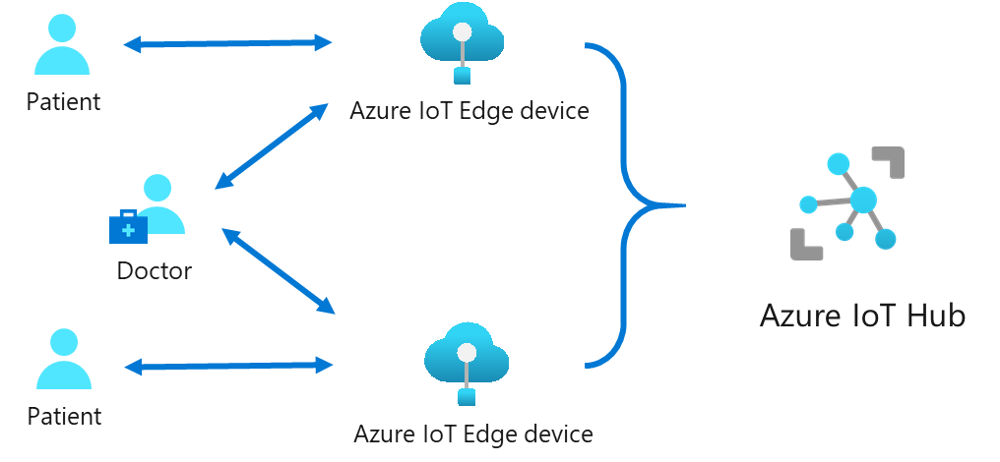

The cloud has made storage and compute costs affordable for IoT developers. In the simplest case, IoT devices connect to the cloud and persist IoT data in the cloud. However, it isn't possible to always manage all the IoT data in the cloud. You often need rapid response times, especially for mission-critical applications. If you store all data in the cloud, then the round trip to the cloud and back would cause high latency, leading to increased response times.

Azure IoT Edge brings compute capability closer to the source of the data, that is, to edge devices. IoT Edge provides the ability to move workloads from the cloud to the edge. In doing so, IoT Edge overcomes the problems of latency and response times.

The ability to move computing workloads to edge devices provides other advantages such as deploying artificial intelligence applications on edge devices. Machine learning models can be trained in the cloud and then deployed on edge devices. IoT Edge can also help devices and modules continue operating with intermittent or no connectivity after the IoT Edge device connects to IoT Hub and syncs at least once. Queued upstream messages are stored and forwarded when connectivity returns, subject to store-and-forward time-to-live (TTL) settings and available storage. IoT Edge also provides an extensible security framework for reliable operations when you configure authentication, authorization, storage, permissions, and encryption for your solution.

Suppose you're a doctor who specializes in diabetic treatment. You want to monitor the patient's blood glucose level and warn the patient when the glucose level changes are of concern to their health. In this case, the IoT Edge device monitors the glucose level of the patient and can keep selected data on the device according to the solution's retention and storage design. The device pushes summarized data from the edge to the cloud. Algorithms that run on the device help to monitor the changes in the glucose levels, which could cause concern. If the glucose levels are of concern, the algorithm can trigger a local alarm immediately because it runs on the edge device and doesn't need a cloud round trip. If the solution also needs to notify the doctor or a cloud system, it can use available local connectivity or queue the notification and data until connectivity returns, subject to configured TTL and available storage. The device also handles situations where connectivity is poor after it has synced with IoT Hub. Data can be protected on the device when the solution configures certificate-based authentication, persistent host storage, storage permissions, and encryption at rest as appropriate.

This module is part of the AI Edge Engineer learning path. In this module, you explore engineering themes such as edge computing, security, large-scale deployment, and managing response times based on system and device constraints.

## Learning objectives

In this module, you'll:

- Evaluate situations where IoT Edge can help run cloud or business logic on edge devices as part of an IoT solution
- Describe the components of IoT Edge
- List the capabilities IoT Edge provides for cloud-connected IoT solutions

## Prerequisites

- Basic knowledge of IoT applications and IoT Hub
