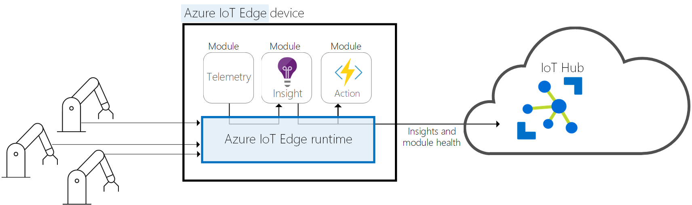

Azure IoT Edge comprises three components:

**IoT Edge modules** are units of execution implemented as Docker compatible containers. IoT Edge modules can run business logic at the edge. IoT Edge modules can run Azure services, third-party services, or your code. Modules are deployed to IoT Edge devices and execute locally on those devices. You can configure modules to communicate with each other to create a pipeline for data processing. Modules can run offline if needed. 

**IoT Edge runtime** runs on each IoT Edge device and manages the runtime and communication for the modules deployed to each device. IoT Edge runtime ensures that the modules are always running and report module health to the cloud. 

The runtime performs several functions such as:
- Installing and updating workloads
- Maintaining IoT Edge security standards
- Managing communication between downstream leaf devices and the IoT Edge device
- Managing communication between modules on an IoT Edge device and managing communications between an IoT Edge device and the cloud. 

**IoT Edge cloud interface** enables you to monitor and manage IoT Edge devices remotely. If your solution is running a diverse set of devices at scale, you can create and configure a workload to run on a specific type of device. You then need to deploy the workload to a set of devices of that type. Once the devices are running, you need to monitor workloads centrally. IoT Edge cloud interface allows you to manage this overall lifecycle at scale for a diverse set of devices, which could be geographically scattered.

It's challenging to manage the software lifecycle for millions of IoT devices that are often different makes and models or in diverse locations. Workloads are created and configured for a particular type of device, deployed to all of your devices, and monitored to catch any misbehaving devices. These activities can’t be done on a per device basis and must be done at scale.

Consider the case of deploying complex event processing or machine learning on edge devices. If you want to implement machine learning on edge devices, you must first train the model in the cloud. After training the model, you need to deploy the trained model to a diverse range of edge devices often across geography. Once deployed, these models will run often offline on the device. You would also need to update the model periodically. By encapsulating the models in docker compatible containers, IoT Edge can manage the end-to-end cycle of deployment for machine learning on IoT. IoT Edge runtime and the cloud interface can monitor the status of the machine learning modules.

In the absence of the IoT Edge, the developer would need to create the added functionality of maintaining the module.

