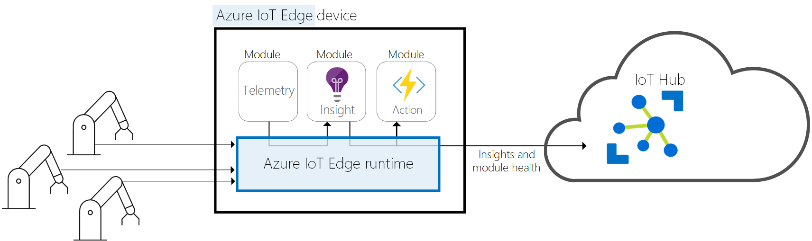

Azure IoT Edge comprises three components.

**IoT Edge modules** are units of execution implemented as OCI/Docker-compatible Linux container images. IoT Edge modules can run business logic at the edge. IoT Edge modules can run Azure services, third-party services, or your code. Modules are deployed to IoT Edge devices and execute locally on those devices. You can configure modules to communicate with each other to create a pipeline for data processing. Modules can run during intermittent or offline periods after the IoT Edge device has connected to IoT Hub and synced at least once.

The **IoT Edge runtime** runs on each IoT Edge device and manages the lifecycle and communication of the modules deployed to that device. The runtime is made up of two system modules — the IoT Edge agent (`$edgeAgent`), which deploys and monitors modules, and the IoT Edge hub (`$edgeHub`), which handles communication between modules, downstream devices, and IoT Hub. The runtime keeps modules running and reports module health to the cloud.

The runtime performs several functions such as:
- Installing and updating workloads
- Maintaining IoT Edge security standards
- Managing communication between downstream devices (child devices) and the IoT Edge device
- Managing communication between modules on an IoT Edge device
- Managing communication between an IoT Edge device and the cloud

The **IoT Edge cloud interface** enables you to monitor and manage IoT Edge devices remotely. If your solution is running a diverse set of devices at scale, you can create and configure a workload to run on a specific type of device. You then need to deploy the workload to a set of devices of that type. After the devices are running, you need to monitor workloads centrally. IoT Edge cloud interface allows you to manage this overall lifecycle at scale for a diverse set of devices, which could be geographically scattered.

It's challenging to manage the software lifecycle for millions of IoT devices that are often different makes and models or in diverse locations. Workloads are created and configured for a particular type of device, deployed to all of your devices, and monitored to catch any misbehaving devices. These activities can't be done on a per device basis and must be done at scale.

Consider the case of deploying complex event processing or machine learning on edge devices. Machine learning models are often trained in the cloud and then deployed to edge devices as IoT Edge module images. IoT Edge can also run suitable prebuilt or custom Linux containerized models or code modules. After you choose or train a model, you need to deploy it to a geographically distributed set of edge devices. After deployment, these models can run during intermittent or offline periods after the IoT Edge device has connected to IoT Hub and synced at least once, with upstream messages stored and forwarded according to TTL and available storage. You also need to update the model periodically. By packaging the models as OCI/Docker-compatible Linux container images, IoT Edge can manage the end-to-end cycle of deployment for machine learning on IoT. The IoT Edge runtime and the cloud interface can monitor the status of the machine learning modules.

