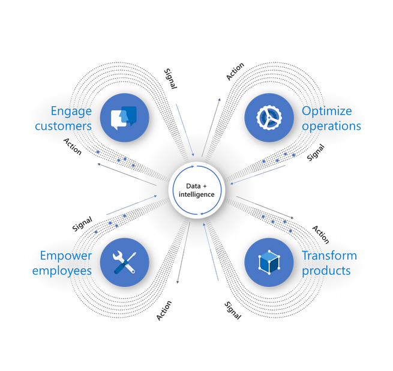
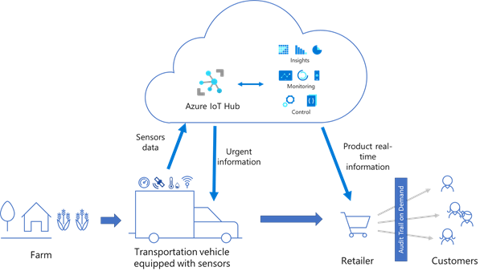

The Internet of Things (IoT) is a promising technology that is transforming enterprises.  In the enterprise domain, IoT continues to grow, especially in a few core industries: manufacturing, retail/wholesale, transportation, government, and healthcare. Efficiency, productivity, safety, and security are the top reasons for enterprises to adopt IoT.

Despite the promises of the technology, many IoT implementations don't progress beyond the Proof of Concept (POC) stage.  Customers often don't see the business value of IoT. They don't understand how IoT can scale.  Customers are concerned about security. And finally, customers are confused about the consumer vs enterprise benefits. For example, the connected toaster and the connected fridge make media headlines. However, it's unclear how these consumer applications translate to benefits for the enterprise.  

Azure IoT addresses these problems by enabling a digital feedback loop through IoT. Businesses can take advantage of the feedback loop through IoT, which connects four elements: Customers, Operations, Products/Assets, and Employees. IoT helps by removing data silos and helps to rethink processes spanning the four elements.

Suppose you run a logistics company responsible for transporting fruit and other perishable food products from the growers to the retailers. In the process of transportation, the fruit needs to be maintained at the correct temperature, humidity, and light exposure.  In the trucks, individual sensors track temperature, humidity, and light exposure. The retailer has stringent requirements for quality. Similarly, the grower wants to ensure that their fruit remains fresh.  Customers are becoming strict in their specifications. Customers want to see an audit trail of the fruit from the 'farm to the table'.  In this scenario, IoT solutions ensure the fruit is fresh over the journey. In the simplest case, the food status (ex: temperature) is tracked using sensors. But to provide business value to the customer, a more comprehensive solution is needed.

This module is a part of the AI Edge Engineer learning path. In this module, several engineering themes can be explored – especially the impact of IoT on other domains such as logistics. From an engineering standpoint, we view the entire process from the farm to retailer as a single holistic system. Through IoT, we capture data to understand, monitor, and predict the behavior of individual components – and the entire system.  To successfully build this solution, we need to consider design, safety, aesthetics, and scale.

## Learning objectives

In this module, you will:  
- Evaluate whether Azure IoT can address the problems associated with large-scale IoT deployment
- Describe how the components of Azure IoT work together to build a cloud-based IoT solution

## Prerequisites

- None

