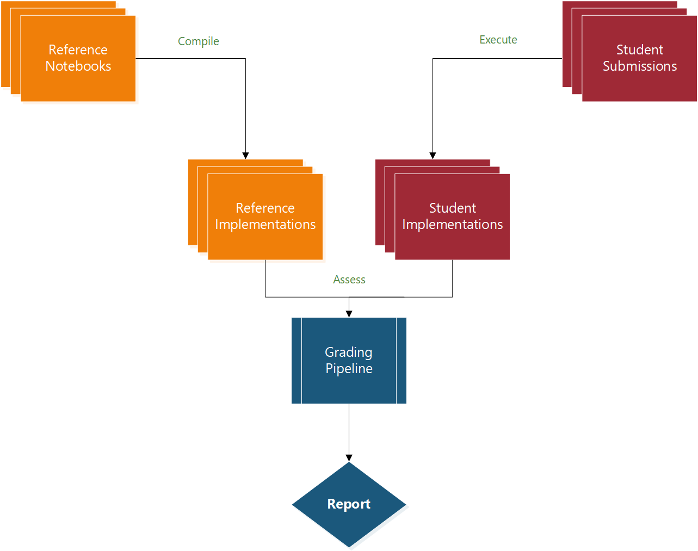

## Important concepts

At a high level, PyBryt is composed of three main components: reference implementations, student implementations, and a grading pipeline.

* A **reference implementation** is an instructor-written solution to a problem. These solutions are created using **annotations**, which assert conditions on the student implementation. Reference implementations can be used in concert to allow students various different methods of implementing solutions.
* A **student implementation** is the student submission that has been processed by PyBryt into a **memory footprint**. This footprint contains all of the values that PyBryt observed the student's solution using, and can be compared against reference implementations to validate their solution.
* The **grading pipeline** is the process by which the student implementations are produced and checked against the reference implementations. This component is freeform, and can be adapted to suit the technological needs of the instructor. These needs can be anything from automation via GitHub Actions to a notebook that runs each submission in sequence using PyBryt's API and spits out a report.

## Building an assignment

The process for building an assignment with PyBryt isn't too complicated:

1. The instructor creates one or more reference implementations for their assignment
2. The instructor sets up and tests the grading pipeline
3. Students implement their solutions and submit to the grading pipeline
4. The instructor runs the grading pipeline and collects the feedback

Now that you know what goes on at high level, lets dive into to these concepts more in detail and see how you implement them using PyBryt.
