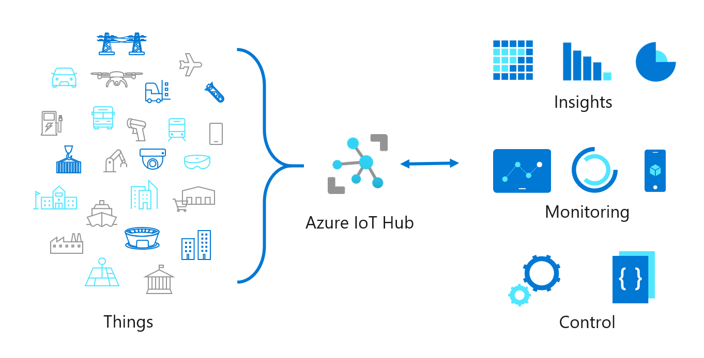

Many organizations face competitive pressures and rapidly evolving customer needs. In response, organizations are embarking on digital transformation Organizations are reimagining their business by bringing together people, data and processes. In this context, IoT (Internet of Things) is the 'glue' that enables digital transformation in an organization.  

According to the IoT Signals 2019 report conducted by Microsoft,  the adoption of IoT spans multiple industries. 85% of IoT decision-makers have at least one IoT project in their pipeline and other IoT projects already in deployment. Adoption of IoT is global and is driven by some core industries such as manufacturing, retail/wholesale, transportation, government, and healthcare. The top four top reasons for companies to utilise IoT are Operations optimization, improvement of employee productivity, safety, and security. 

However, for large enterprises to avail the benefits of digital transformation, it can be challenging to deploy and manage IoT devices across diverse geographies. You need to ensure that a range of devices contribute effectively to creating a solution that solves a large-scale business problem. The IoT requirements of a large enterprise extend beyond basic telemetry (that is, the process of recording and transmitting the data values recorded by an IoT device). As an enterprise running cloud-based solutions, how do you track and maintain the data coming in from all these devices? How do you ensure that only the right devices talk to each other? How do you secure the solution? How can the solution scale and be available as per service level requirements? Besides you need to connect a range of devices over different kinds of communication protocols. You also need to manage the life cycle of the devices from provisioning to ongoing management and finally, retirement.

IoT Hub is a managed service, hosted in the cloud, that acts as a central message hub for bi-directional communication between your IoT solutions and the devices it manages. 

IoT Hub enables highly secure and reliable communication between your IoT solution and the devices it manages. Azure IoT Hub provides a cloud-hosted solution backend to connect IoT devices. IoT Hub allows you to extend your solution from the cloud to the edge with per-device authentication, built-in device management, and scaled provisioning.

Suppose your city council has budgeted to deploy sensors and cameras in the city to manage traffic. You're assigned as the lead developer for this project. Specifically, the new traffic management solution is based on deploying analytics and machine learning to manage traffic optimally.  Traffic congestion is rising and contributes to issues like wasted fuel, increased cost of transportation, greenhouse gas emissions, and safety. As part of the new traffic management solution, three areas were identified: Firstly, to develop coordinated traffic signal timing systems based on real-time data (including the use of smart traffic intersections). Secondly, the ability to manage and share video and sensor traffic data with multiple agencies safely and securely. Finally, to use the traffic management system for future innovations, including connected vehicles and self-driving cars.

Your solution needs to extend beyond the basic telemetry service. To manage these devices, you need a central messaging hub for bi-directional communication in the cloud. You'll need to authenticate, manage, and provision millions of devices reliably and securely. Additionally, you'll need to monitor the health of these devices over time to ensure constant uptime. You can use Azure IoT Hub-based solution to deploy, manage, and scale these devices in the cloud to effectively address the given problem scenario. The solution is scalable to the needs of the city through IoT Hub features like per-device authentication, built-in device management, and scaled provisioning.

Data thus managed by Azure IoT Hub from a diverse set of sensors can be used as a foundation for your analytics solution in the cloud.

This module is a part of the AI Edge Engineer learning path.  In this module, we explore systems thinking approaches to solving complex, multi-faceted problems. Systems thinking is based on the idea that the component parts of a system will act differently when analysed on their own. The systems thinking approach studies the system in a holistic manner by examining the inter-relationships and interactions between the components of the entire system.  The approach can be used to model complex problems like traffic management where each actor (such as a vehicle) can act autonomously and each actor is evolving in capability. 

## Learning objectives

In this module, you will:
- Learn how Azure IoT Hub can effectively address the challenges associated with large-scale IoT deployment
- Discover the main components and primitives of Azure IoT Hub

## Prerequisites

- Basic knowledge of IoT applications and deploying applications in the Cloud