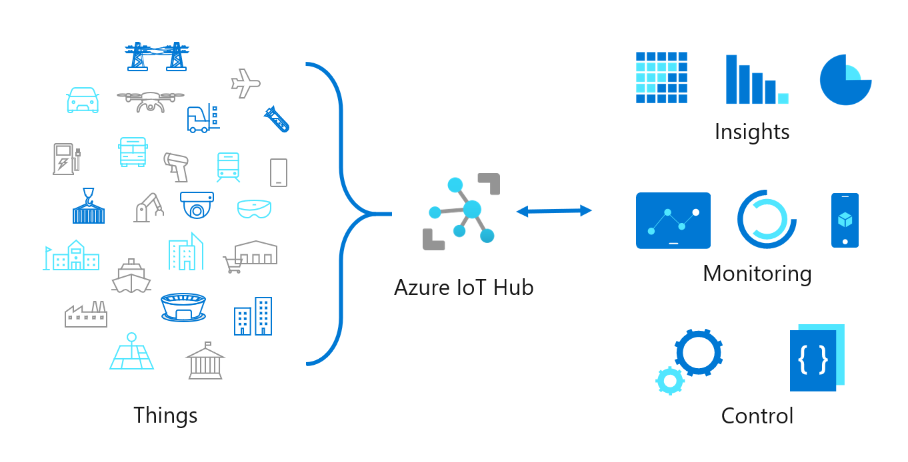

Many organizations face competitive pressures and rapidly evolving customer needs. In response, organizations are embarking on digital transformation. Organizations are reimagining their businesses by bringing together people, data, and processes. In this context, IoT (Internet of Things) is the 'glue' that enables digital transformation in an organization.  

According to the IoT Signals 2019 report conducted by Microsoft, the adoption of IoT spans multiple industries. 85% of IoT decision-makers have at least one IoT project in their pipeline and other IoT projects already in deployment. Adoption of IoT is global and is driven by some core industries such as manufacturing, retail/wholesale, transportation, government, and healthcare. The top four reasons companies adopt IoT are operations optimization, employee productivity, safety, and security. 

However, for large enterprises to realize the benefits of digital transformation, it can be challenging to deploy and manage IoT devices across diverse geographies. You need to ensure that a range of devices contribute effectively to creating a solution that solves a large-scale business problem. The IoT requirements of a large enterprise extend beyond basic telemetry (that is, the process of recording and transmitting the data values recorded by an IoT device). As an enterprise running cloud-based solutions, how do you track and maintain the data coming in from all these devices? How do you ensure that only authorized devices can connect to your solution? How do you secure the solution? How can the solution scale and be available as per service level requirements? Besides, you need to connect a range of devices over different kinds of communication protocols. You also need to manage the lifecycle of the devices from provisioning to ongoing management and finally, retirement.

IoT Hub is a managed service, hosted in the cloud, that acts as a central message hub for bidirectional communication between your IoT solutions and the devices it manages. 

Azure IoT Hub addresses these challenges by providing a managed gateway between your devices and your cloud back-end services. The next unit, "What is Azure IoT Hub?", explores its capabilities in detail; this introductory unit focuses on why IoT Hub is a strong choice for cloud-based, large-scale IoT deployments that need secure device connectivity, messaging, device management, and integration with back-end services.

Suppose your city council has budgeted to deploy sensors and cameras in the city to manage traffic. You're assigned as the lead developer for this project. Specifically, the new traffic management solution is based on deploying analytics and machine learning to manage traffic optimally. Traffic congestion is rising and contributes to issues like wasted fuel, increased cost of transportation, greenhouse gas emissions, and safety. As part of the new traffic management solution, three areas were identified: Firstly, to develop coordinated traffic signal timing systems based on real-time data (including the use of smart traffic intersections). Secondly, the ability to use sensor telemetry and camera metadata, coordinate secure video uploads, and share resulting traffic insights with multiple agencies safely and securely. Large video or media files would be stored and processed with Azure Storage or a media-processing pipeline rather than sent as ordinary IoT Hub messages. For IoT Hub file upload scenarios, configure an Azure Storage account and blob container; IoT Hub provides a per-upload SAS URI, and devices use that URI to upload the file directly to Azure Storage over HTTPS. Finally, to use the traffic management system for future innovations, including connected vehicles and self-driving cars.

Your solution needs to extend beyond the basic telemetry service. To manage these devices, you need a central messaging hub for bidirectional communication in the cloud. You'll need to authenticate, manage, and provision millions of devices reliably and securely. You'll also need to monitor device health and design device and back-end applications with retry/reconnect logic and disaster recovery planning so the overall solution can meet its availability and resiliency requirements. You can use an Azure IoT Hub-based solution to deploy, manage, and scale these devices in the cloud to effectively address the given problem scenario. IoT Hub is well suited for telemetry, device metadata and state, control messages, and coordinating file uploads, while large video or media payloads should flow to storage or a media processing service. The solution is scalable to the needs of the city through IoT Hub features like per-device authentication and built-in device management. For provisioning at scale, you can use Azure IoT Hub Device Provisioning Service (DPS) with IoT Hub. Automatic registration with DPS requires devices prepared with authentication credentials and DPS endpoint information, and a DPS instance configured with enrollments and linked to the target IoT hubs.

Telemetry and device information collected through Azure IoT Hub from a diverse set of sensors and devices provide the foundation for your cloud-based analytics solution.

This module is a part of the AI Edge Engineer learning path.  In this module, we explore systems thinking approaches to solving complex, multi-faceted problems. Systems thinking is based on the idea that the component parts of a system will act differently when analyzed on their own. The systems thinking approach studies the system in a holistic manner by examining the inter-relationships and interactions between the components of the entire system.  The approach can be used to model complex problems like traffic management where each actor (such as a vehicle) can act autonomously and each actor is evolving in capability. 

## Learning objectives

After completing this module, you'll be able to:

- Evaluate whether Azure IoT Hub can effectively address the challenges associated with large-scale IoT deployments.
- Describe how the main components and primitives of Azure IoT Hub work together to build cloud-managed IoT solutions.

## Prerequisites

- Basic knowledge of IoT applications and deploying applications in the Cloud
