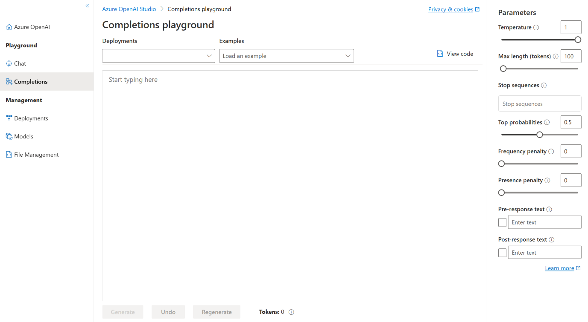

Playgrounds are useful interfaces in Azure OpenAI Studio that you can use to experiment with your deployed models without needing to develop your own client application.

## Completions playground

The Completions playground allows you to make calls to your deployed models through a text-in, text-out interface and adjust parameters. You need to select the deployment name of your model under Deployments. Optionally, you can use the provided examples to get you started, and then you can enter your own prompts.

## LLMs’ capabilities

An LLM has built-in functions, capabilities that you can use without training it further. LLMs can therefore do more than just generating new words, they are also capable of the following behavior:

- **Extracting information**: You can provide an LLM with some text and ask it to extract specific pieces of information from that text. For example, if you provide the LLM with this text:

  *“Hello, my name is Robert Smith”* 

  and ask it to *extract the* *person’s name* from this text it will return:

  “Robert Smith”

  successfully doing the desired operation.

- **Changing the format of content**: You can provide an LLM with some text and ask it to summarize it using a specific format. For example, if you provide the LLM with this text:

  *“I like the following colors: red, green, and yellow. I also like the following food: macaroni, cheese, and honey”*

  and ask it to summarize what you like in a table or JSON format it will return:

  `{ "colors": ["red", "green", "yellow"], "food": ["macaroni", "cheese", "honey"] }` 

successfully doing the desired operation.

- **Classifying content**: You can provide an LLM with some text and ask it to classify the content to different known categories or even give it your own categories. For example, if you provide the LLM with this text:

  *“I loved your product it really helped me do what I wanted”* 

  and ask it whether this text was negative or positive it will return: 

  “positive” 

  successfully doing the desired operation.

- **Summarizing content**: You can provide an LLM with lots of text and ask it to summarize it for you. For example, if you provide the LLM with this text:

  *“Hey James, I had a fun last weekend with you we spend lots of time playing on the beach. Let’s do that again soon! bye”*

  and ask it to summarize what the person want from you it will return:

  “The person is asking James to spend time with them again soon” 

  successfully doing the desired operation.

- **Generating novel content**: You can ask an LLM to generate new content about nearly anything you could think of. For example, if you ask the LLM to write a haiku about happiness it will return:

  “The sun sets gently
  Warm breeze whispers through the trees
  Peaceful, happy heart”

  successfully doing the desired operation.
