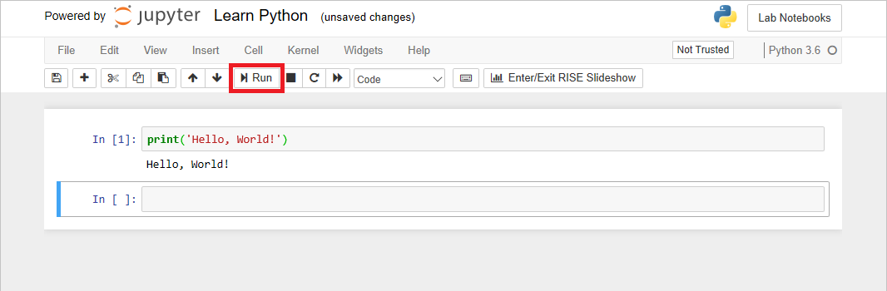

In order to learn Python, you need an environment in which to execute Python code. One option is to download a Python distribution from the [Python Web site](https://www.python.org) and install it on your PC or laptop. Versions are available for Windows, macOS, and a variety of Linux distributions. Another option is to download and install [Anaconda](https://www.anaconda.com), which is a specialized Python distribution tailored for scientific programming tasks such as data science and machine learning.

Another popular way to get started with Python — one that requires nothing more than a modern Web browser such as Edge or Chrome — is through [Jupyter notebooks](https://jupyter.org). Jupyter is an environment based on IPython that facilitates interactive programming and data analysis using a variety of programming languages, including Python. Jupyter notebooks are widely used in research and academia for mathematical modeling, machine learning, statistical analysis, and for teaching and learning how to code.

[Azure Notebooks](https://blogs.msdn.microsoft.com/uk_faculty_connection/2017/06/10/guide-to-the-microsoft-azure-notebooks-for-students/) is a cloud-based platform for building and running Jupyter notebooks. Azure Notebooks provide Jupyter-as-a-service for free. It's a convenient way to build notebooks and share them with others without having to install and manage a Jupyter server. And it's completely Web-based, making it an ideal solution for collaborating online.

In this lesson, you will create  an Azure notebook and use it to run your first Python code. In subsequent lessons, you will enhance the notebook to load a CSV file containing data on airports all over the world and enable users to perform basic queries on the data.

## Create an Azure notebook

Jupyter notebooks are composed of *cells*. Each cell is assigned one of three types:

- **Markdown** for entering text in [markdown](https://github.com/adam-p/markdown-here/wiki/Markdown-Cheatsheet) format
- **Code** for entering code that runs interactively
- **Raw NBConvert** for entering data inline

Code entered into code cells is executed by a *kernel*. The popular IPython kernel supports code written in Python, but [dozens of other kernels](https://github.com/jupyter/jupyter/wiki/Jupyter-kernels) are available supporting other languages. Azure notebooks (Jupyter notebooks created in Azure) support Python, R, and F#. They also support numerous packages and libraries that are commonly used in Python.

Azure notebooks are created through the portal at <https://notebooks.azure.com> and require nothing more than a browser and a Microsoft account. Notebooks are contained in projects, whose primary purpose is to group related notebooks. In this exercise, you will create a new project and then create a notebook inside it.

1. If you don't have a Microsoft account, go to <https://account.microsoft.com/account> and create one. Having a Microsoft account gives you access to a wealth of resources, many of which are free. Microsoft accounts are free as well.

1. Navigate to <https://notebooks.azure.com> in your browser and sign in using your Microsoft account. Click **My Projects** in the menu at the top of the page. Then click the **+ New Project** button at the top of the "My Projects" page.

1. Create a new project named "Learn Notebooks" or something similar.

    

    _Creating a project_

    Leaving the "Public" box checked makes it easy to share notebooks later on. You can also go into project settings once a project is created and change its visibility to public or private.  

1. Click **+ New** and select **Notebook** from the menu to add a notebook to the project.

    

    _Adding a notebook to the project_

1. Give the notebook a name such as "Learn Python.ipynb," and select **Python 3.6** as the language. This will create a notebook with a Python 3.6 kernel for executing Python code. One of the strengths of Azure notebooks is that you can use different languages by choosing different kernels.

    

    _Creating a notebook_

    If you're curious, the .ipynb file-name extension stands for "IPython notebook." Jupyter notebooks were originally known as IPython (Interactive Python) notebooks, and they only supported Python as a programming language. The name Jupyter is a combination of Julia, Python, and R — the core programming languages that Jupyter supports.

1. Click the notebook to open it for editing.

You can create additional projects and notebooks as you work with Azure Notebooks. You can create notebooks from scratch, or you can upload existing notebooks. And once a notebook is created or uploaded, you can take advantage of Azure compute resources to run the notebook and leverage popular Python libraries such as [Keras](https://keras.io/), [NumPy](http://www.numpy.org/), [Pandas](https://pandas.pydata.org/), [Matplotlib](https://matplotlib.org/), and [Scikit-learn](https://scikit-learn.org/stable/index.html).

## Writing output to the screen

A great way to get started with Python is learning how to perform input and output. In Python, the `print` function, which is one of more than 60 functions built into the language, outputs text to the screen. The following statement displays "Hello World!" on the screen:

```python
print('Hello World!')
```

The argument passed to `print` is a *string*, which is one of the fundamental data types in Python. By default, `print` outputs a newline character at the end of the line so that subsequent output — for example, additional calls to `print` — will start on the next line.

### Implement Hello, World in a notebook

The beauty of Azure Notebooks is that you can type in statements like the one above, execute them inside the notebook, and see the output in the notebook as well.

1. Return to the notebook that you created a few moments ago. Type (or paste) the following Python code into the empty cell at the top of the notebook:

    ```python
    print('Hello, World!')
    ```

1. Now click the **Run** button to run the cell and add a new cell after it. Confirm that "Hello, World!" appears in the output of the first cell:

    

    _Running the first cell_

The **Run** button runs the current cell and selects the next one, adding an empty cell if necessary. If preferred, you can use the keyboard equivalent **Shift+Enter** instead. Other keyboard shortcuts include **Ctrl+Enter** (**Cmd+Enter** on a Mac), which runs the current cell without changing the selection, and **Alt+Enter** (**Option+Enter** on a Mac), which runs the current cell and inserts a new cell below it even if there are already cells below it.

## Understanding variables and data types

Variables are one of the fundamental building blocks of programs written in Python. Variables hold data in memory. They have names, and they can be referenced by name. Variables also have *types* such as string and integer, and they can be used in expressions that use *operators* such as `+` and `-` to manipulate their values.

In Python, a variable is declared and assigned a value using the assignment operator `=`. The variable being assigned to is on the left-hand side of the operator, and the value being assigned, which can be an expression such as `2 + 2` and can even include other variables, is on the right-hand side:

```python
x = 1 # assign x the value 1
y = x + 5 # assign y the value of x plus 5
z = y # assign z the value of y
```

These examples assign numbers to variables, but numbers are just one of several data types that Python supports.

Virtually every programming language supports built-in data types such as numbers and strings. Python provides many special-purpose data types as well as more standard types.

### Working with numbers

Most programs manipulate numbers. Computers treat integer numbers and decimal numbers differently. Consider the following code:

```python
x = 1 # integer
x = 1.0 # decimal (floating point)
```

Python creates integers from a built-in data typed called `int`, and decimals (floating-point numbers) as instances of `float`. Python's built-in `type` function returns a variable's data type. The following code outputs types to the screen:

```python
x = 1
print(type(x)) # outputs: <class 'int'>

x = 1.0
print(type(x)) # outputs: <class 'float'>
```

The addition of the ".0" to the end of "1" makes a big difference in how the programming language treats a value. The data type impacts how the value is stored in memory, how the processor (CPU) handles the data when evaluating expressions, how the data relates to other data, and what kinds operations can be performed with it.

Another common data type is the Boolean type, which holds the value `True` or `False`:

```python
x = True
print(type(x)) # outputs: <class 'bool'>
```

Internally, `bool` is treated as a special type of integer. Technically, `True` has a value of 1 and `False` has a value of 0. Typically, Booleans are not used to perform mathematical operations; rather, they are used to make decisions and perform branching. Nevertheless, it is interesting to understand the relationship between types. Many types are nothing more than specialized versions of more general types. Integers are a subset of floating point numbers, and Booleans are a subset of integers.

### Working with strings

Along with numbers, strings are among the most commonly used data types. A string is a collection of zero or more characters. Strings are commonly declared using single quotation marks, but double quotation marks may be used, too:

```python
x = 'This is a string'
print(x) # outputs: This is a string
print(type(x)) # outputs: <class 'str'>
y = "This is also a string"
```

Strings can be added to other strings (an operation known as "concatenation") with the same `+` operator that adds two numbers:

```python
x = 'Hello' + ' ' + 'World!'
print(x) # outputs: Hello World!
```

You will learn more about strings in another lesson, including how to parse them and how to manipulate them in various ways. You will also learn about other important data types such as lists, which store collections of data and are frequently used to hold collections of strings.

## Reading keyboard input

For reading input from the keyboard, Python provides the `input` function. `input` reads what the user types on the keyboard and returns it as a string. Here is an example that combines `input` and `print` to capture a person's name and then display it on the screen:

```python
name = input('Enter your name:')
print(name)
```

The string passed as an argument to the `input` function is the prompt that the user will see. In this example, you are asking the user to type his or her name ('Enter your name'). Once the user types a name and presses **Enter**, the `input` function will return. The function's return value is the text that the user typed, and that text is assigned to the variable named `name`. The `name` variable is then used as an input or argument to the `print` function which will output the name that the user entered.

## Combine input and output in your notebook

Now let's use what you learned about `print`, `input`, and string concatenation to display a personalized greeting.

1. Type the following statements into the empty cell at the end of the notebook:

    ```python
    name = input('Enter your name: ')
    print('Hello, ' + name)
    ```

1. Click the **Run** button or press **Shift+Enter** to run the cell. When prompted, type your name and press **Enter**. Confirm that a personalized greeting appears in the output:

    

    _Displaying a personalized greeting_

If you wanted to add an exclamation mark after the name so the greeting reads "Hello, Jeff!" rather than "Hello, Jeff", how would you do it? Tip: A single Python statement can use multiple `+` operators to concatenate several strings. If you want to try out your answer, simply modify the `print` statement and run the cell again. Code entered into a cell isn't cast in stone. You always have the option of modifying that code and running it again.

## Commenting your code

Just about all programming languages support including comments in source code. Comments do not change what the code does when it runs. Instead, they serve to explain how the code works or why it was written that way. Comments are a great way to document complicated code and to include TODOs reminding you to come back and do something later — for example, "make sure this code works with empty strings."

Python supports comments using the pound sign (or hashtag) followed by the text of the comment:

```python
# I am a comment...
```

Comments are one-line only. For multiline comments, place a pound sign at the start of each line.

Some programmers avoid comments in favor of writing "self-documenting code," which is easy to understand as a result of descriptive variable and function names. There is nothing wrong with self-documenting code, but never hesitate to use comments in an effort to be as explicit as possible about your thoughts and intentions. The purpose of a block of code may be clear to you if you wrote it 10 minutes ago. But a year from now, a well-placed comment may be as helpful to you as it is to other programmers who are seeing your code for the first time.

### Add comments to your notebook

1. Modify the code that you added a few moments ago to include comments:

    ```python
    # Ask for the user's name
    name = input('Enter your name: ')

    # Display a personalized greeting
    print('Hello, ' + name)
    ```

1. Run the cell and confirm that it behaves the same as it did before.

    

    _Running the modified cell_

Finish up by using using the **File** -> **Save and Checkpoint** command to save the notebook. Once the notebook is saved, you can return to it later and pick up where you left off, even if you close the notebook or close the browser.