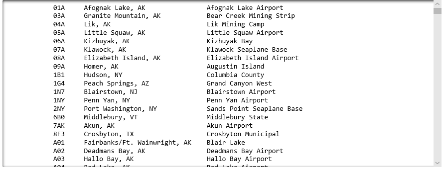

Programs don't merely crunch numbers. They make *decisions* based on those numbers and modify their behavior accordingly. For example, a program might take one action if the sum of a column of numbers is greater than 100, and another action if it does not. Statements that test a condition and branch accordingly are as old as programming itself. Most programming languages use `if` statements to support such branching, and Python is no exception.

Now that the airport data in **airports.csv** has been parsed into a list of lists with each item in the inner list containing strings denoting an airport code, airport location, and airport name, the data can be organized and presented in more meaningful ways. In this lesson, you will filter the list of lists created in the previous lesson so that it includes only U.S. airports. And to do so, you will employ the `if` statement.

## Branching with `if` statements

`if` statements enact conditional logic in Python programs. You have already learned how to use `for-in` and `while` to write loops that execute a block of code repeatedly. Statements that use `if`, `for-in`, and `while` are known as *control-of-flow* statements because they control the flow of execution in a program.

Here is an `if` statement that performs an action only if a specified condition is met:

```python
x = 2

if x > 1:
    print('x is greater than 1')
```

`if` statements can also include `else` clauses that take action if the condition is not met:

```python
x = 2

if x > 1:
    print('x is greater than 1')
else:
    print('x is less than or equal to 1')
```

You can even include `elif` (short for "else-if") clauses that test for multiple conditions:

```python
x = 1

if x > 1:
    print('x is greater than 1')
elif x < 1:
    print('x is less than 1')
else:
    print('x is 1')
```

Blocks of code underneath an `if`, `elif`, or `else` aren't limited to one line each. They can be as long as you'd like, and as usual, Python uses indents to identify lines of code that constitute a block. in addition, there is no limit on the number of `elif` clauses an `if` statement may contain.

## Generate a list of U.S. airports

Now let's use what you learned about `if` statements, plus the `endswith` function that can be called on strings in Python, to generate a new list of lists that contains only U.S. airports.

1. Return to the Azure notebook that you created in the first lesson. Add the following code to the end of the notebook to create a list named `us_airports` that includes only airports located in the U.S.:

    ```python
    us_airports = []

    us_states = ["AL", "AK", "AZ", "AR", "CA", "CO", "CT", "DC", "DE", "FL", "GA",
                 "HI", "ID", "IL", "IN", "IA", "KS", "KY", "LA", "ME", "MD",
                 "MA", "MI", "MN", "MS", "MO", "MT", "NE", "NV", "NH", "NJ",
                 "NM", "NY", "NC", "ND", "OH", "OK", "OR", "PA", "RI", "SC",
                 "SD", "TN", "TX", "UT", "VT", "VA", "WA", "WV", "WI", "WY"]

    for airport in airports:
        if airport[1].endswith(tuple(us_states)):
            us_airports.append(airport)
    ```

    Notice the call to Python's `tuple` function in the second-to-last line. A tuple is similar to a list, but unlike a list, it is immutable. `endswith` won't accept a list, but it will accept a tuple. The solution, therefore, is to use the `tuple` function to wrap a tuple around the `us_states` list. Now `endswith` will return `True` if the string it is called on is present in the list, or `False` if it is not.

1. Run the cell and verify that it executes without error. Then add the following code to the empty cell at the end of the notebook to list all U.S. airports:

    ```python
    for airport in us_airports:
        print('{0:8}{1:32}{2:1}'.format(airport[0], airport[1], airport[2]))
    ```

1. Run the cell and confirm that the output includes only airports in the United States:

    

    _Printing a list of U.S. airports_

1. Use the **File** -> **Save and Checkpoint** command to save the notebook.

You have now filtered the list so that it only includes U.S. airports. In the next lesson, you will add logic that allows a user to interactively filter the data to view all of the airports in a specified state.