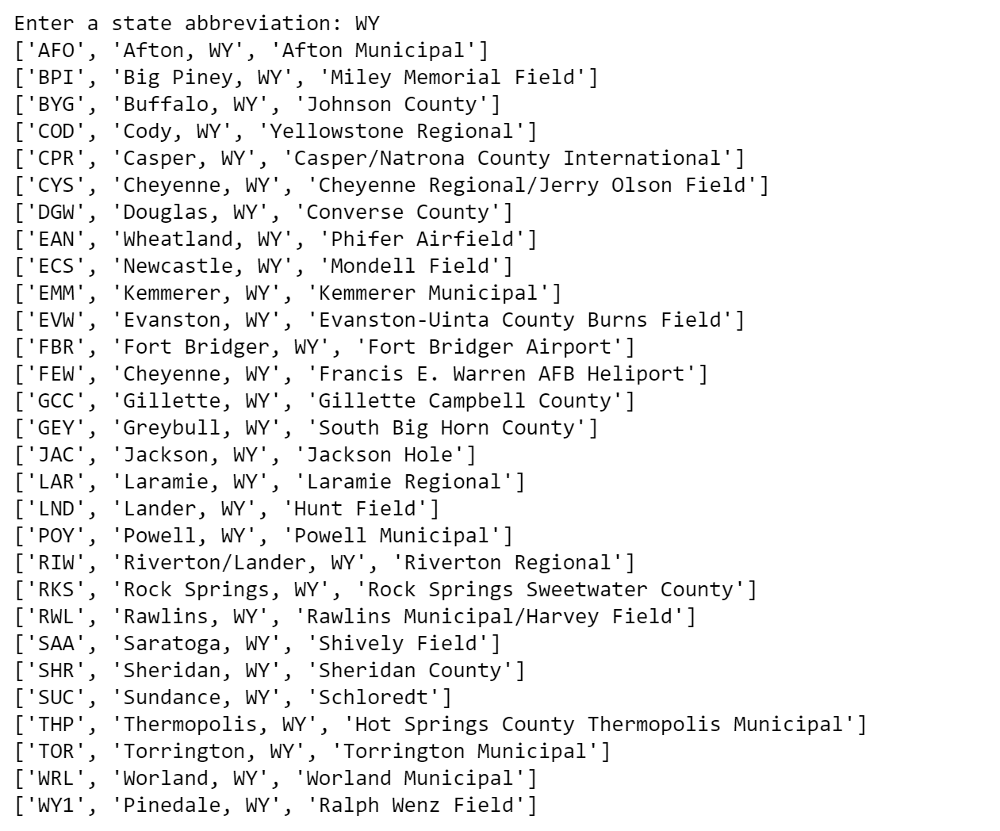

Functions are named blocks of code that you can use again by calling their name. They can accept parameters containing input to use within the function, and they can return values. A function that includes parameters can be called many times with different values passed in, allowing it to behave slightly differently each time it is called.

Functions are important because they promote code reuse. Rather than copy-and-paste a block of code 10 times, you can place the same code in a function and call the function 10 times. If you later discover that the code needs to be modified (perhaps because you found a bug), you only have to change it one place.

Python contains more than 60 built-in functions that you can call at any time. You have already used some of these functions: `print`, `input`, `len`, and others. A complete list of built-in functions can be found [here](https://docs.python.org/3/library/functions.html). In addition, strings and other data types have functions such as `split` and `endswith` that you can call to manipulate them. Significantly, you can define functions of your own to help organize your code and make it more readable and more maintainable.

In the previous lesson, you used a simple `if` statement to determine whether an airport is located in the United States. Then you used it to filter a list of all the airports in the world into a list of U.S. airports. In this lesson, you will add logic that lets users enter the abbreviation for a U.S. state and produce a list (as well as a count) of all the airports in that state. And to make the code clean and compact, you will define your own function.

## Defining and using functions

In Python, a function is defined with the `def` statement. A very simple function named `greet` that accepts no parameters and returns no value can be defined this way:

```python
def greet():
    print('Hello, World!)
```

A function that adds two numbers and returns the sum can be defined like this:

```python
def add(a, b):
    return a + b
```

The `add` function would be called this way to add 2 and 2:

```python
sum = add(2, 2)
```

By convention, words in multi-word function names are separated by underscores. (This is a convention, not a requirement.) Here's a function that accepts a list and prints the items in the list:

```python
def print_items(items):
    for item in items:
        print(item)
```

You could call this function on any list and it would print out each list item on a separate line.

```python
my_list = ['apples', 'bananas', 'clementines']
print_items(my_list)

# outputs:
# apples
# bananas
# clementines
```

```python
def print_numbered_items(items):
    for item_index, item in enumerate(items):
        print(str(item_index + 1) + '. ' + str(item))
```

The above function does something very similar, but adds a bit more. You'll see it calls a built-in function named `enumerate`. `enumerate` iterates over a sequence and returns a tuple. A tuple is a handy way to return multiple values from a function. (From the previous lesson, recall that a tuple is like a list, but unlike a list, its contents can't be changed.) The tuple returned by `enumerate` contains the item's index as well as the item itself.

If you call this code with any list, it prints out each list item on a separate line, but the line starts with a number.

```python
my_list = ['apples', 'bananas', 'clementines']
print_numbered_items(my_list)

# outputs:
# 1. apples
# 2. bananas
# 3. clementines
```

The following code is also a valid way of accomplishing the same thing without using `enumerate`:

```python
def print_numbered_items(items):
    item_index = 0
    for item in items:
        print(str(item_index + 1) + '. ' + str(item))
```

Separating the tuple into discrete items named `item_index` and `item` is known as *destructuring*. It's a feature of Python that programmers use to write code that is more easily maintained.

### Returning data from a function

All functions in Python return a value, even if not explicitly stated with a `return` statement. For functions without an explicit return value, the value of `None` is returned:

```python
def do_it():
    print('did it')

result = do_it()

print(result) # outputs: None
print(type(result)) # outputs: <class 'NoneType'>
```

`None` simply indicates that the function did not return an explicit value.

### Defining default parameter values

Function parameters can be assigned default values. The default value is used if a value isn't given when the function is called. If a value *is* given, that value overrides the default value:

```python
def display_message(msg, msg_type = 'INFO'):
    print(msg_type + ': ' + msg)

display_message('Hello!') # outputs: Hello!: INFO
display_message('Hello!', 'ALERT') # outputs: Hello!: ALERT
```

### Using named parameters

When you pass a parameter in a function call, you have the option of specifying the parameter's name:

```python
def display_message(msg, msg_type = 'INFO'):
    print(msg_type + ': ' + msg)

display_message('Hello!', msg_type = 'ALERT')
```

This isn't especially useful when a function accepts just one or two parameters, but it can be very useful when the function accepts a lot of parameters. Among other things, it lets you specify values for some parameters without specifying values for others. You used this feature in an earlier lesson to prevent `print` from outputting a newline at the end of each line. Here is that statement again:

```python
print(airport, end='')
```

`end` is one of four named parameters that `print` supports. The others are `sep` (for "separator"), `file`, and `flush`. The latter two enable `print` to send output to a file rather than the screen.

## Filter airport data by state

Now let's enhance your notebook to allow users to interactively query for airports in a specified state. You will use a custom function to make the code compact and tidy, and Python's `input` function to solicit user input.

1. Return to the Azure notebook in which you generated a list of U.S. airports. In the empty cell at the end of the notebook, add the following function definition:

    ```python
    def get_airports_by_state(airports, state):
        result = []
        for airport in airports:
            if airport[1].endswith(state):
                result.append(airport)
        return result
    ```

1. Run the cell to make sure there are no syntax errors. Then add the following code to the empty cell at the end of the notebook:

    ```python
    state = input('Enter a state abbreviation: ')
    state_airports = get_airports_by_state(us_airports, state)

    for airport in state_airports:
        print(airport)
    ```

1. Run the cell and enter a state abbreviation such as WY or VA. Then press **Enter**. Confirm that the result is a list of airports in that state:

    

    _Airports in the state of Wyoming_

1. On your own, modify the code in the previous cell to show the **number** of airports in the specified state:

    > Hint: You can use the `len` function to count the number of items in a list. And you can use Python's built-in `str` function to convert the number returned by `len` into a string.

    

    _Modified output_

Finish up by using the **File** -> **Save and Checkpoint** command to save the notebook.

## Show your Pythonic mettle

You have come a long way in a few short lessons. But there is still more that you can do if you would like. Here are a few suggestions:

- Define a function named `print_airport` that replaces the following line in the previous code sample and gives the output nicer formatting. See this helpful site for ideas of how to do string formatting: <https://pyformat.info/>

    ```python
    print(airport)
    ```

    Then replace that statement with calls to `print_airport` like this:

    ```python
    for airport in state_airports:
        print_airport(airport)
    ```

    What advantages are there to creating your own function to replace the default? Is it possible to define the function in such a way that it accepts parameters specifying the widths of the columns? Would default parameters be useful in this regard so callers could opt to use default column widths without specifying those widths in each call?

- Write a function that determines which U.S. state has the most airports
- Write a function that determines which U.S. city has the most airports

There are some great Python tutorials online, including [this one](https://docs.python.org/3/tutorial/) from the Python Software Foundation. Python is a simple language, and yet a powerful one. Learning it opens the door to a whole new world of data exploration, discovery, and even visualization. Now that you've learned the basics, use them as building blocks for Python applications of your own.