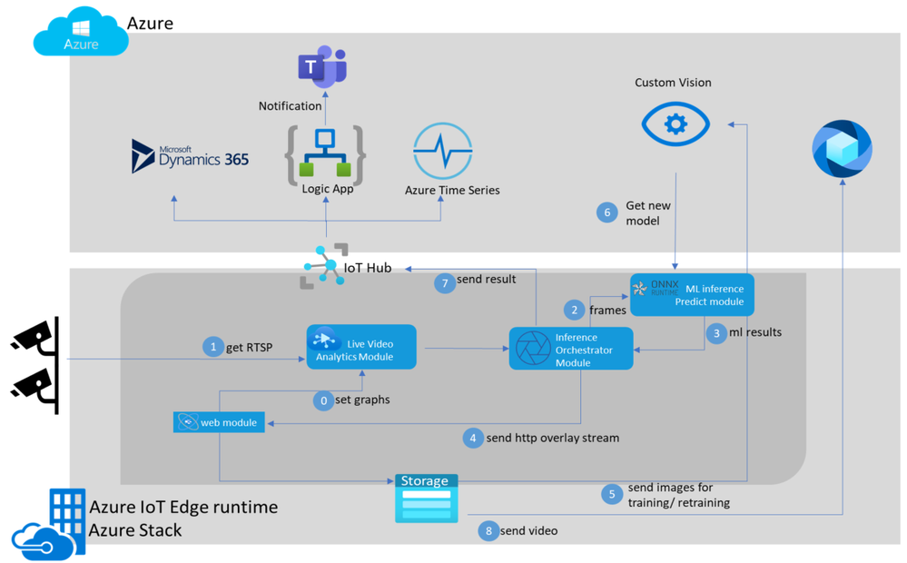

In this module, you'll review a historical edge video analytics solution that used Azure Live Video Analytics (LVA) on Azure IoT Edge, the archived Vision on Edge sample, Azure Media Services, and Custom Vision to detect people in a simulated factory-floor video feed.

> [!IMPORTANT]
> This module is retained for learning and architecture context only. Don't use it as a current, end-to-end deployment guide. Live Video Analytics client packages are no longer maintained, Azure Video Analyzer Edge is retired, Azure Media Services retired on June 30, 2024, and the Azure-Samples Vision on Edge repository used by this module is archived. Custom Vision also has a planned retirement, with support for existing customers ending September 25, 2028. For new edge video analysis, don't treat Azure AI Video Indexer enabled by Arc as an IoT Edge module or drop-in replacement for LVA. Azure AI Video Indexer enabled by Arc is generally available on Azure Arc-enabled Kubernetes, and its real-time video analysis capability is currently in preview and requires subscription approval. For custom model work, plan for Azure Machine Learning AutoML for image classification and object detection. For broader generative or custom-solution scenarios, evaluate Azure AI Foundry separately.

You'll see how the original solution was designed to:

- Set up Azure resources for an edge video analytics lab
- Set up edge workloads on an IoT Edge device
- Bring and deploy an inference YOLO model to an edge device
- Connect a simulated live video stream to the edge application
- Examine the intended results of object detection at the edge

The original module used Azure VM infrastructure to host the IoT Edge runtime, and the video analytics solution was based on the archived [Azure-Samples Vision on Edge repository](https://github.com/Azure-Samples/azure-intelligent-edge-patterns/tree/master/factory-ai-vision). Treat links to that repository as historical references. Assets, scripts, images, and deployment templates in archived repositories might not match current Azure services or supported IoT Edge runtime versions.

## Sample

The original module used an [employee safety video](https://github.com/Azure-Samples/azure-intelligent-edge-patterns/blob/master/factory-ai-vision/EdgeSolution/modules/CVCaptureModule/videos/scenario2-employ-safety.mkv) file to simulate a live stream. If you're building a current lab, use media you're authorized to use and a supported RTSP or camera ingestion component in your own environment.

## Solution workflow

In the original workflow, you set up an edge device with the IoT Edge runtime installed. After configuring your device in IoT Hub, you sent a deployment manifest to your edge device. The IoT Edge agent running on the edge device pulled containers from a container registry and started them on the device. The historical solution deployed these modules:

- **Web Module**: The web application that the user interacted with. It managed camera settings and model configuration for the edge solution. The original sample also included Custom Vision integration for retraining scenarios; Custom Vision is now a legacy dependency for new designs because of its planned retirement.

- **Live Video Analytics (LVA)**: The retired module that parsed frames from cameras and sent them to the inference components. Don't use LVA for new production solutions.

- **Inference Orchestrator:** The module that sent frames to the prediction module, received results, overlaid results on the camera feed, exposed an HTTP video stream to the Web Module, and sent machine learning results to Azure IoT Hub.

- **ML Predict Module:** The module that ran the sample's ONNX-based object-detection model and returned JSON prediction results.

- **Media Services integration:** The original solution could store videos based on inference results and push them to an Azure Media Services account. Azure Media Services is retired, so this path is no longer supported.

## Architecture

Here's the original Video Analytics solution architecture.

## Define Azure services and infrastructure

The original design used the following Azure services and infrastructure components:

- **Azure IoT Hub:** Azure IoT Hub provides a cloud-hosted solution back end to connect devices. IoT Hub and IoT Edge remain supported services when used with current IoT Edge 1.5 LTS guidance.

- **Azure virtual machine used as an IoT Edge device:** The original lab used Azure VM infrastructure to host the IoT Edge runtime. If you create a similar VM today, use IoT Edge 1.5 LTS and a supported operating system and architecture from the IoT Edge supported-platform matrix.

- **Live Video Analytics on IoT Edge:** A retired IoT Edge module formerly used to build live video analytics pipelines. Keep this information as historical context only.

- **Custom Vision Service:** Custom Vision lets existing customers build, deploy, and improve image classifiers and object detectors during the support window. For new designs, plan to use Azure Machine Learning AutoML for image classification and object detection. Evaluate Azure AI Foundry separately as a broader option for generative or custom-solution scenarios.

- **Media Services:** Azure Media Services was a collection of cloud and edge media workflow services. It retired on June 30, 2024 and shouldn't be used for new solutions.

### Current alternative for new solutions

- **Azure AI Video Indexer enabled by Arc:** Microsoft documents Azure AI Video Indexer enabled by Arc as a generally available service for edge video and audio analysis on Azure Arc-enabled Kubernetes. It isn't an IoT Edge module or a drop-in replacement for LVA on IoT Edge. Its real-time video analysis capability is currently in preview and supports live video insights at the edge, subject to gated subscription approval, hardware requirements, preview limitations, and other feature limitations.

## Steps to follow

The original module followed these steps. They're provided as a historical map of the solution rather than as current deployment instructions:

1. Create an IoT Hub
2. Create a virtual machine to host the IoT Edge runtime
3. Register an edge device to the IoT Hub
4. Install and run the archived Vision on Edge installer
   1. Set up retired Live Video Analytics and Azure Media Services dependencies
   2. Set workloads on the IoT Edge device
5. Upload a sample video to the edge device
6. Create an Azure container registry
7. Get a pre-trained YOLO model from sample assets
8. Build a container image with the YOLO model
9. Push the container image to the Azure container registry
10. Deploy the YOLO model to the edge device
11. Connect the web application
    1. Add a camera to feed the sample video
    2. Add model endpoint and labels
12. Deploy the solution
13. Examine the results

## Conclusion

By the end of this module, you should understand the historical architecture pattern for combining IoT Edge modules, video ingestion, and model inference at the edge. To build a current solution, don't deploy this retired LVA-based path. Start with current IoT Edge 1.5 LTS guidance, supported container images, least-privilege registry authentication, and private network access for IoT Edge workloads. If you need real-time video analysis at the edge, evaluate Azure AI Video Indexer enabled by Arc on Azure Arc-enabled Kubernetes. Its real-time video analysis capability is currently in preview and requires approval, or you can use another maintained edge video pipeline that matches your requirements.

Watch the Microsoft Learn episode [Rapidly move your Vision AI project to production with VisionOnEdge](/shows/internet-of-things-show/rapidly-move-your-vision-ai-project-to-production-with-visiononedge) for a historical demo of the archived sample.
