Before you start, make sure that you have installed rerequisites in your local machine.

-   [Install Docker](https://docs.docker.com/desktop) on your machine
-   Install [curl](http://curl.haxx.se)

## Create an Azure container registry

1. Open the Azure Cloud Shell from the Azure portal selecting the Cloud Shell icon.

   [](../media/shell-icon.png#lightbox)

2. You'll create an Azure container registry with the az acr create command. Run the following command to define a variable called ACR_NAME. The container registry name must be unique within Azure and contain between 5 and 50 alphanumeric characters.

   ```
   ACR_NAME=<enter-registry-name>
   ```

3. Enter the following command into the Cloud Shell editor to create new container registry.

   ```
   az acr create --resource-group <replace-with-resource-group> --name $ACR_NAME --sku Standard
   ```

4. Go to the container registry resource you just created and navigate to **Access keys**.

5. Copy the registry name, login server, username, and password.

   [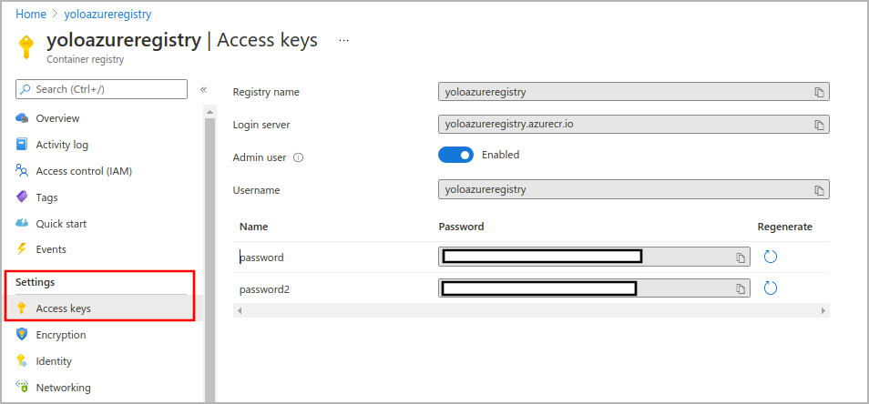](../media/container-registry-access-keys.png#lightbox)

## Download the inference YOLOv4(tiny) TensorFlow Lite model

1. Go to `https://github.com/Azure/live-video-analytics` and download zip in your local machine.

   [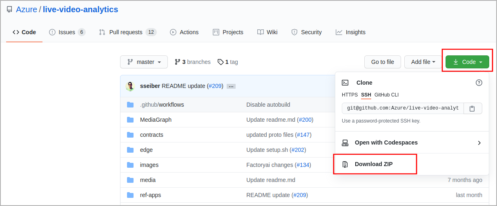](../media/download-zip-file.png#lightbox)

2. Go to the following path in the downloaded folder.

   ```
   live-video-analytics-master/utilities/video-analysis/yolov4-tflite-tiny
   ```

   [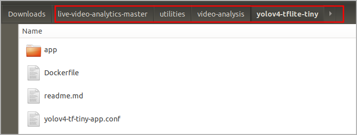](../media/project-folder.png#lightbox)

3. Create a new directory on your machine and copy all the files (including the sub-folders) from this GitHub folder to new directory.

## Build a container image with the YOLO model

1. You will see Dockerfile that provides build instructions for the container image.

   [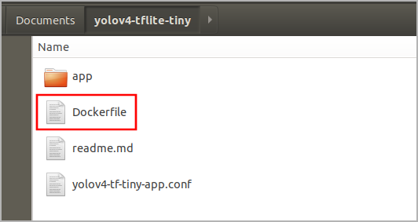](../media/build-instructions.png#lightbox)

2. Open the terminal in this directory. Run the following docker command from a command window in that directory to build the container image.

   ```
   docker build . -t yolov4-tflite-tiny:latest
   ```

   [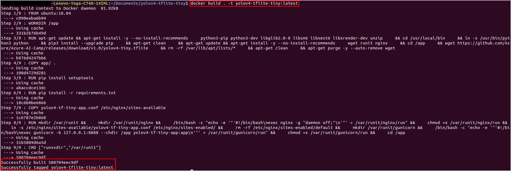](../media/build-docker-image.png#lightbox)

## Push the docker image to the Azure Container Registry

Now, you have a docker image with the YOLO model. Before you can push an image to your registry, you must tag it with the fully qualified name of your registry login server. The login server name is in the format ***azurecr.io*** (must be all lowercase).

1. In your local machine, log in to Azure with the Azure CLI.

   ```
   az login
   ```

2. Log in to ACR with the Azure CLI (docker may also be used).
   
   ```
   docker login <replace-with-your-acr-login-server>
   ```

   [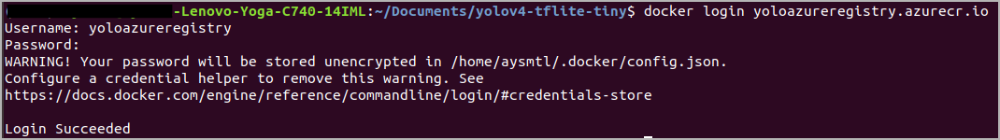](../media/docker-login.png#lightbox)

3. Tag the image using the **docker tag** command. Replace
\<login-server\> with the login server name of your ACR instance.

   ```
   docker tag <original-image-name:tag> <registry-name>.azurecr.io/<image-name:tag>
   ```

   [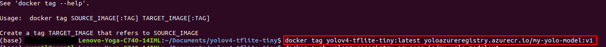](../media/tag-image.png#lightbox)

4. Use **docker push** to push the image to the registry instance. Replace \<login-server\> with the login server name of your registry instance.

   ```
   docker push <registry-name>.azurecr.io/<image-name:tag>
   ```

   [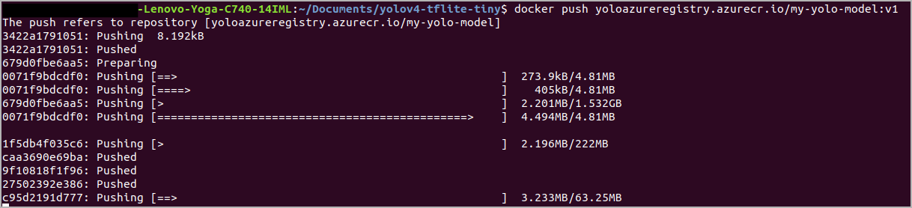](../media/docker-push.png#lightbox)

5. It will take some time to push your containerized model to Azure container registry. After pushing the image to your container registry, your image URI would be:

   ```
   <registry-name>.azurecr.io/<image-name:tag>
   ```

6. To verify if the image is pushed, you will go to the Container registry resource and navigate the repository.

   [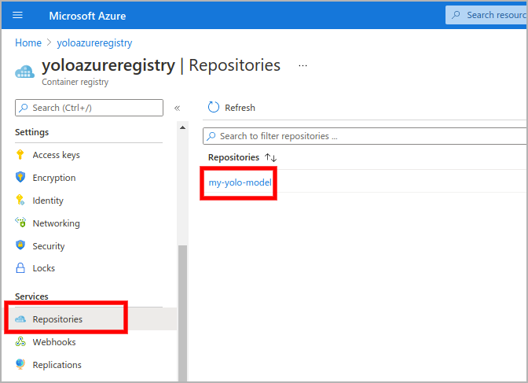](../media/container-registry-repositories.png#lightbox)

## Deploy the YOLO model as an Azure IoT Edge module

1. In the Azure portal, go to your IoT Hub resource.

2. On the left pane, select IoT Edge under Automatic Device Management.

3. Select the IoT Edge device that is to receive the deployment.

4. On the upper bar, select Set Modules.

5. Provide the following.

   - **Name:** Replace with registry name of your Azure container registry

   - **Address:** Replace with login server of your Azure container registry

   - **Username:** Replace with the username of your Azure container registry

   - **Password:** Replace with the password of your Azure container registry

   [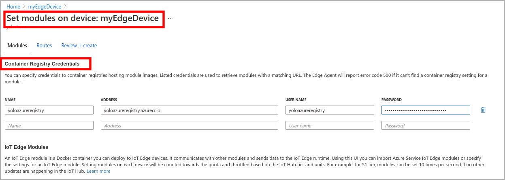](../media/set-modules.png#lightbox)

6. Select **Add**.

7. In the IoT Edge Modules section, select Add, and select IoT Edge Module from the drop-down menu.

   [](../media/add-edge-module.png#lightbox)

8. Give a name to your IoT Edge module and enter the image URL, which is the path as below.

   ```
   <registry-name>.azurecr.io/<image-name:tag>
   ```

9. Select **Add.**

   [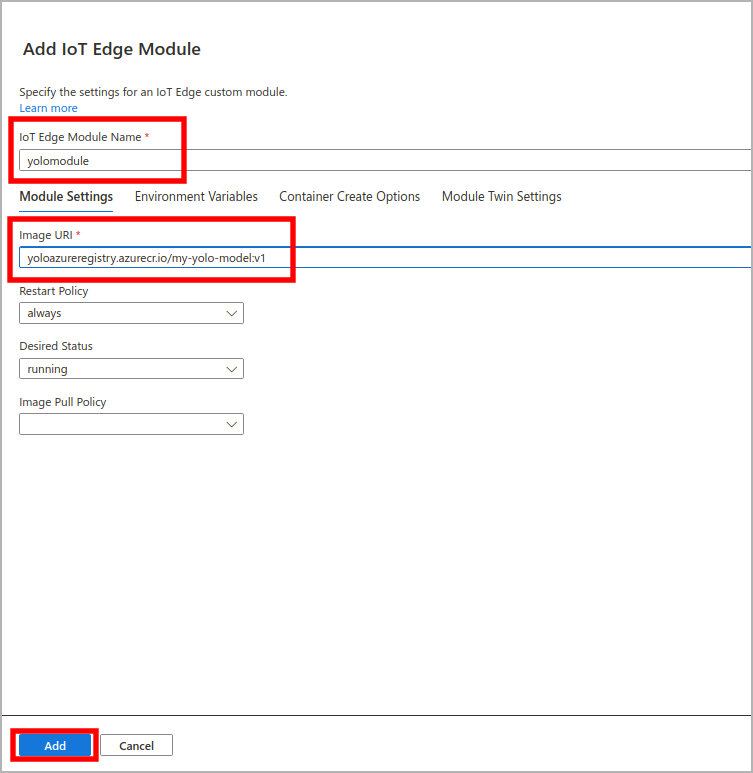](../media/add-iot-edge-module.png#lightbox)

## Review + create

After setting your module, select **Review + create**. The review section shows you the JSON deployment manifest that was created based on the modules you set. Check whether the module you set in the previous section is defined in the manifest.

   [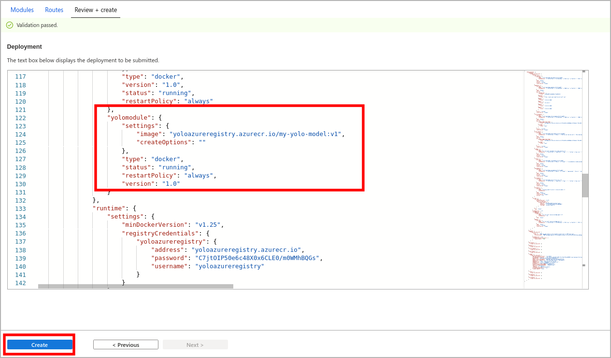](../media/review-deployment.png#lightbox)

## Check the deployed module in your edge device

After the deployment, you can check the module in your edge device. Connect to your virtual machine and run the **docker ps** command.

   ```
   docker ps
   ```

Now you have your own inference module in the edge device, and the prediction endpoint can be accessed through **/score** with port **80** if your image is built from the Tiny YOLOv4 TensorFlow Lite model.

Make a note of predict endpoint that is in the form of **http://{module-name}:80/score** and can be accessed only within your edge device.
