Before you start, choose the build path that matches your environment.

- **Common prerequisites:** Install the [Azure CLI](/cli/azure/install-azure-cli) on the machine or shell where you'll sign in to Azure Container Registry. Install [curl](https://curl.se/download.html) only if your build workflow requires it.
- **ACR Tasks path:** Use `az acr build` to build and push in Azure. This path doesn't require a local Docker CLI or Docker daemon.
- **Local Docker path:** [Install Docker](https://docs.docker.com/desktop) on the machine where you'll run `docker buildx build --platform <target-platform> --load`, `docker tag`, and `docker push`, and make sure the Docker daemon is running.

> [!NOTE]
> Run the Bash snippets in this unit from Azure Cloud Shell, WSL, macOS, or Linux. If you're using PowerShell on Windows, set variables with `$VarName = '<value>'` and capture command output with `$VarName = az ... --query ... --output tsv`.

> [!IMPORTANT]
> The original exercise told learners to download `https://github.com/Azure/live-video-analytics` and use `utilities/video-analysis/yolov4-tflite-tiny`. That repository URL is no longer available, and the historical LVA sample assets and `tag.txt` file can't be obtained from the stated source. The remaining build sections are a historical walkthrough of the original workflow. Use them to understand the registry, build, and push process, but use maintained model assets from your own repository for any current lab.

## Create an Azure container registry

The original walkthrough created the registry from Azure Cloud Shell or another Bash terminal with the Azure CLI.

1. Azure Cloud Shell was opened from the Azure portal by selecting the Cloud Shell icon.

   [](../media/shell-icon.png#lightbox)

2. The Bash session defined variables for your resource group and registry. The registry name had to be unique within Azure and contain 5-50 lowercase alphanumeric characters.

   ```bash
   RESOURCE_GROUP=<replace-with-resource-group>
   ACR_NAME=<unique-lowercase-registry-name>
   ```

3. The container registry was created.

   ```azurecli
   az acr create --resource-group $RESOURCE_GROUP --name $ACR_NAME --sku Standard
   ```

4. The registry login server returned by Azure was captured.

   ```azurecli
   ACR_LOGIN_SERVER=$(az acr show --name $ACR_NAME --query loginServer --output tsv)
   echo $ACR_LOGIN_SERVER
   ```

5. Because Azure Cloud Shell doesn't provide a Docker daemon, `az acr login` wasn't run there. The Docker sign-in happened later from a Docker-enabled local terminal. The **Access keys** page wasn't needed unless the admin account was intentionally enabled for a short testing scenario.

   [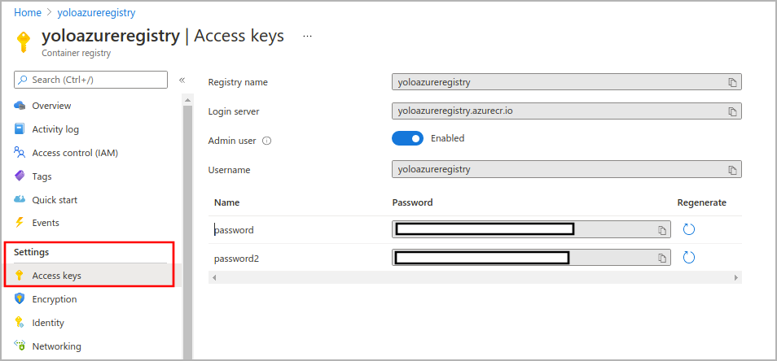](../media/container-registry-access-keys.png#lightbox)

## Prepare model container assets

1. The historical sample expected a model container project that included a Dockerfile, model files, service code, and any label file the app required.

   [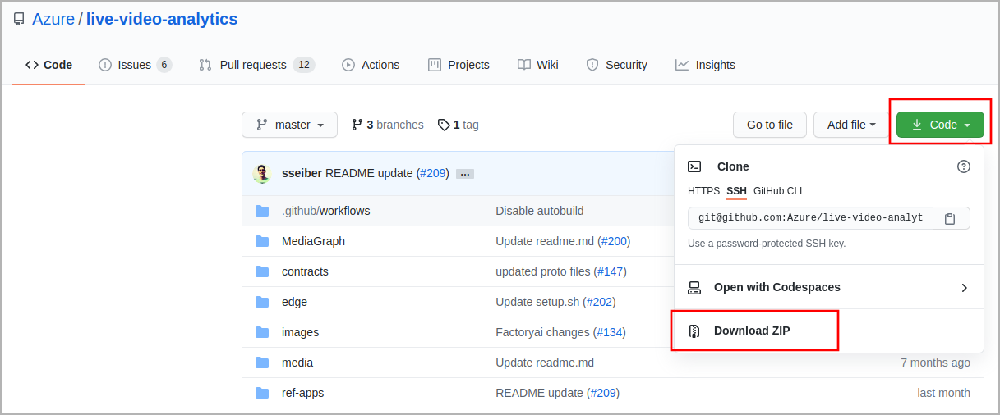](../media/download-zip-file.png#lightbox)

2. The walkthrough then opened the directory that contained the Dockerfile.

   [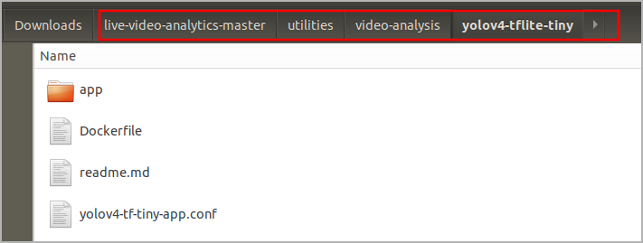](../media/project-folder.png#lightbox)

3. All required files had to be available in that directory or in the source context that'd be sent to the build.

## Build a container image with the model

1. The project included a Dockerfile that provided build instructions for the container image.

   [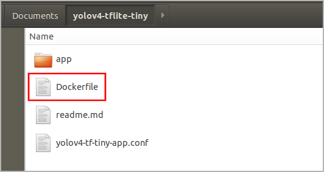](../media/build-instructions.png#lightbox)

2. From a Docker-enabled local terminal, the image was built for the target edge architecture from the directory that contained the Dockerfile.

   ```bash
   docker buildx build --platform <target-platform> --load -t yolo-model:latest .
   ```

   Use `linux/amd64` when the target IoT Edge VM is AMD64, which is the common Ubuntu VM path in unit 4. Use `linux/arm64` when the target IoT Edge host is ARM64.

   [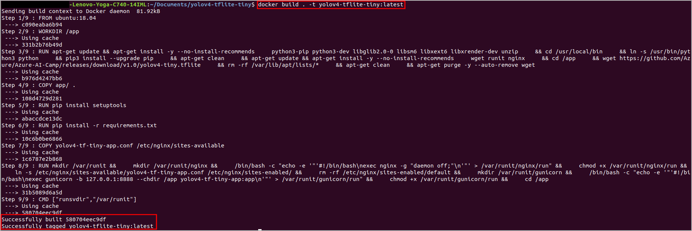](../media/build-docker-image.png#lightbox)

> [!NOTE]
> For a Cloud Shell-friendly alternative, [ACR Tasks](/azure/container-registry/container-registry-tutorial-quick-task) can build and push the image in Azure:
>
> ```azurecli
> az acr build --platform <target-platform> --registry $ACR_NAME --image yolo-model:latest <context>
> ```
>
> For a registry that uses **RBAC Registry + ABAC Repository Permissions**, specify source-registry authentication explicitly when the quick build should use the caller's repository permissions for source registry access:
>
> ```azurecli
> az acr build --platform <target-platform> --registry $ACR_NAME --image yolo-model:latest --source-acr-auth-id [caller] <context>
> ```
>
> Use `--source-acr-auth-id none` only when the quick build intentionally needs no source-registry access. This command doesn't require a local Docker daemon or `az acr login`. To queue and run quick builds or runs, the Azure identity needs `Container Registry Tasks Contributor` or a broader role that includes ACR Tasks actions. That role doesn't grant image push or pull permissions. For registries that use **RBAC Registry + ABAC Repository Permissions**, also assign `Container Registry Repository Catalog Lister` with the needed repository role: `Container Registry Repository Writer` or `Container Registry Repository Contributor` for the target repository, and `Container Registry Repository Reader` for any source repository that the task reads. If the registry uses **RBAC Registry Permissions** instead, use `AcrPush` or `AcrPull` as appropriate.

## Push the Docker image to Azure Container Registry

The separate push steps applied only when the image was built locally. If `az acr build` was used instead, ACR Tasks already pushed the image to the registry.

1. In a Docker-enabled local terminal, the workflow signed in to Azure and to the registry. If the registry was created in a different shell, `ACR_NAME` was set again manually and `ACR_LOGIN_SERVER` was captured again with the actual value. The identity used for this sign-in needed `Container Registry Repository Writer` if the registry used **RBAC Registry + ABAC Repository Permissions**, or `AcrPush` if it used **RBAC Registry Permissions**. Docker CLI pushes don't require `Container Registry Tasks Contributor`. For more information, see [Microsoft Entra-based repository permissions](/azure/container-registry/container-registry-rbac-abac-repository-permissions).

   ```azurecli
   az login
   ACR_NAME=<registry-name>
   ACR_LOGIN_SERVER=$(az acr show --name $ACR_NAME --query loginServer --output tsv)
   az acr login --name $ACR_NAME
   ```

   [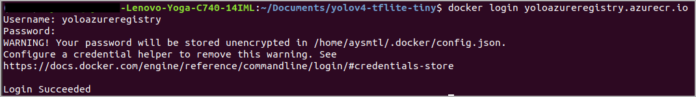](../media/docker-login.png#lightbox)

2. The image was tagged by using the registry login server.

   ```bash
   docker tag yolo-model:latest $ACR_LOGIN_SERVER/yolo-model:latest
   ```

   [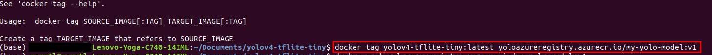](../media/tag-image.png#lightbox)

3. The image was pushed to the registry instance.

   ```bash
   docker push $ACR_LOGIN_SERVER/yolo-model:latest
   ```

   [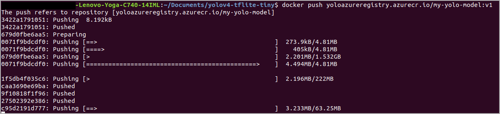](../media/docker-push.png#lightbox)

4. After the image was pushed, the image URI was:

   ```text
   <login-server>/yolo-model:latest
   ```

5. The push could then be verified in the Container Registry resource under **Repositories**, or by showing the tags for the `yolo-model` repository with the Azure CLI.

   ```azurecli
   az acr repository show-tags --name $ACR_NAME --repository yolo-model --output table
   ```

   [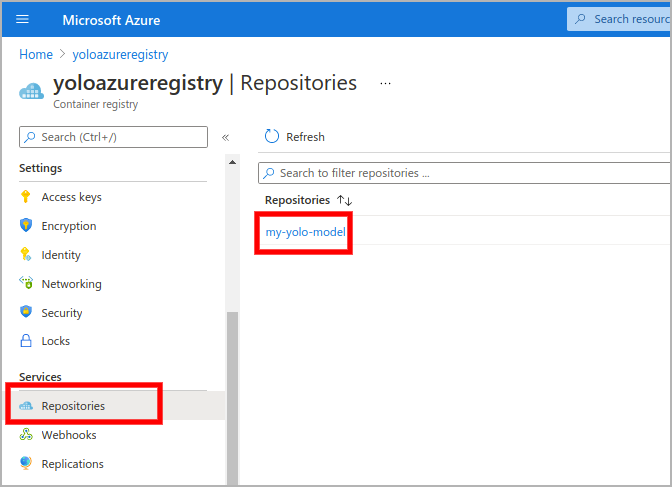](../media/container-registry-repositories.png#lightbox)

## Create pull credentials for IoT Edge

Before you open **Set Modules**, create the pull credentials that you'll enter in **Container Registry Credentials**. Store the password securely, such as in Azure Key Vault, because you can't retrieve the same generated value later.

1. Choose one of these options:

   - **Service principal (AcrPull role):** If your registry uses **RBAC Registry Permissions**, create a service principal for pull access.

     ```bash
     SP_NAME=<unique-service-principal-name>
     ```

     ```azurecli
     ACR_ID=$(az acr show --name $ACR_NAME --query id --output tsv)
     az ad sp create-for-rbac --name $SP_NAME --scopes $ACR_ID --role acrpull
     ```

     Use the returned `appId` as **Username** and `password` as **Password** in **Container Registry Credentials**.

   - **ACR token with a repository scope map:** Create repository-scoped pull credentials for the `yolo-model` repository.

     ```bash
     SCOPE_MAP_NAME=<scope-map-name>
     TOKEN_NAME=<token-name>
     ```

     ```azurecli
     az acr scope-map create --name $SCOPE_MAP_NAME --registry $ACR_NAME --repository yolo-model content/read metadata/read
     TOKEN_PASSWORD=$(az acr token create --name $TOKEN_NAME --registry $ACR_NAME --scope-map $SCOPE_MAP_NAME --query "credentials.passwords[0].value" --output tsv)
     echo $TOKEN_PASSWORD
     ```

     Use `$TOKEN_NAME` as **Username** and `$TOKEN_PASSWORD` as **Password** in **Container Registry Credentials**.

2. Keep the registry login server value for the **Address** field.

   ```bash
   echo $ACR_LOGIN_SERVER
   ```

For more information, see [Azure Container Registry authentication with service principals](/azure/container-registry/container-registry-auth-service-principal) and [Non-Microsoft Entra token-based repository permissions in Azure Container Registry](/azure/container-registry/container-registry-token-based-repository-permissions).

## Deploy the model as an Azure IoT Edge module

> [!NOTE]
> The following steps reflect the current IoT Edge 1.5 portal workflow. They deploy a container module when you provide your own compatible image, but they don't make the retired LVA-based Vision on Edge solution runnable.

1. In the Azure portal, go to your IoT Hub resource.

2. On the left pane, select **Devices** under **Device management**.

3. Select the target IoT Edge device.

4. On the upper bar, select **Set Modules**.

5. In **Container Registry Credentials**, enter the values from the pull-credential option you created in the previous section. Managed identity authentication to ACR is for supported Azure hosts that sign in directly to ACR, not for the username/password fields shown here. If you use the registry admin account for a short test, enable it explicitly and disable it after the lab.

   - **Name:** A friendly name for the registry credential entry.
   - **Address:** The value of `$ACR_LOGIN_SERVER`, such as `<login-server>`.
   - **Username:** The service principal `appId` or the token name created earlier.
   - **Password:** The corresponding service principal password or generated token password.

   [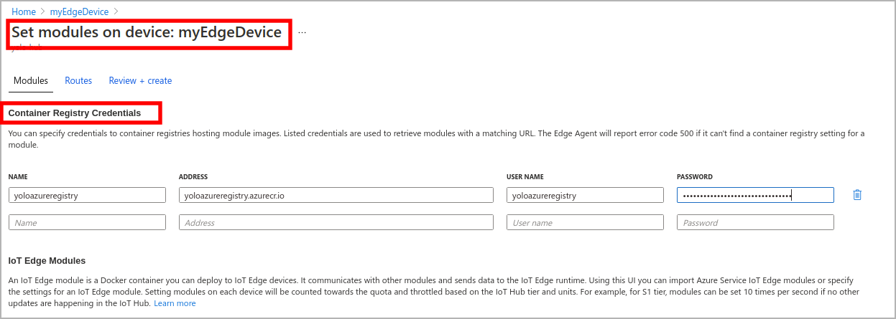](../media/set-modules.png#lightbox)

6. In the **IoT Edge Modules** section, select **Add**, and then select **IoT Edge Module**.

   [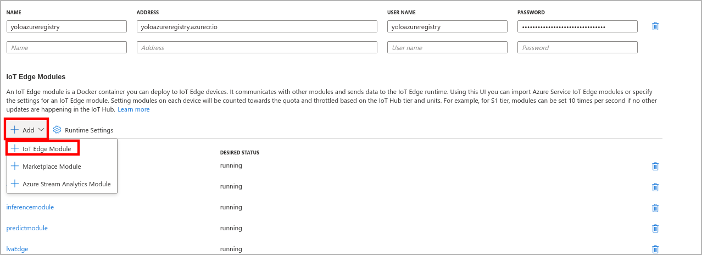](../media/add-edge-module.png#lightbox)

7. Give your IoT Edge module a name and enter the image URI.

   ```text
   <login-server>/yolo-model:latest
   ```

8. Select **Add**.

   [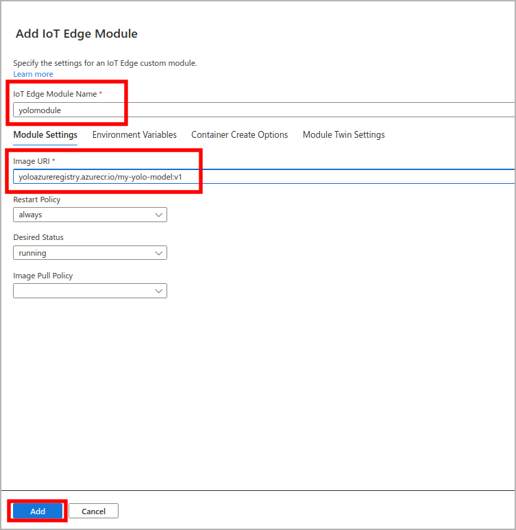](../media/add-iot-edge-module.png#lightbox)

9. Select **Next: Routes**. Keep the default route if messages from modules should go upstream to IoT Hub, or add only the routes your solution requires.

10. Select **Next: Review + create**. The review section shows the JSON deployment manifest that was created based on your module and route settings. Confirm that your module image URI and registry settings are correct.

    [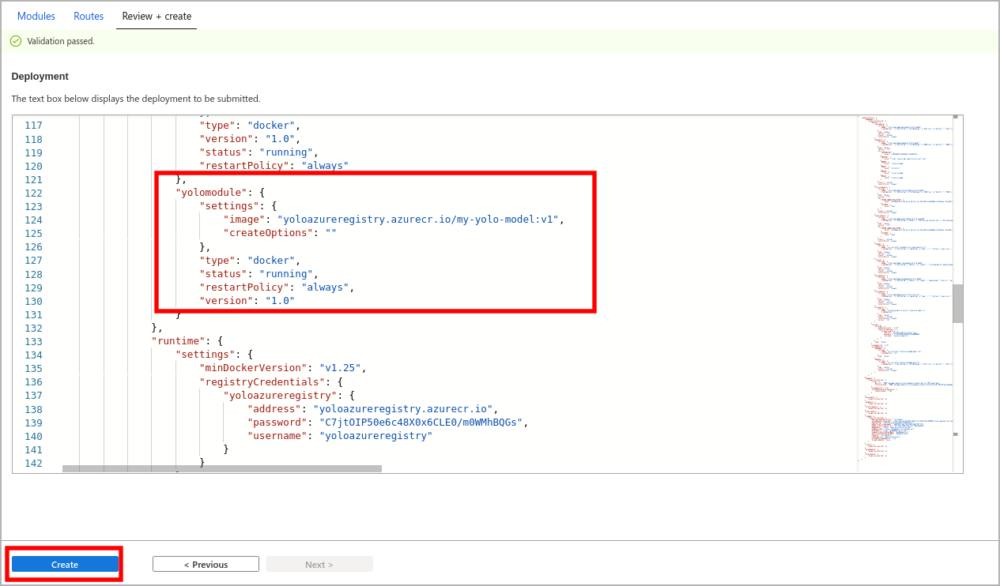](../media/review-deployment.png#lightbox)

11. Select **Create** to apply the deployment.

## Check the deployed module on your edge device

After the deployment is applied, verify module status from the IoT Edge device page in IoT Hub. You can also connect to your virtual machine and run one of these commands:

```bash
sudo iotedge list
sudo docker ps
```

If your image implements the historical Tiny YOLO scoring interface, the prediction endpoint is available only within the edge module network in this form:

```text
http://<module-name>:80/score
```

Make a note of the endpoint for private lab use only. Don't expose the scoring endpoint directly to the internet.
