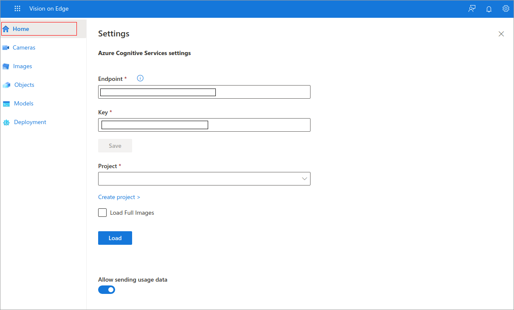
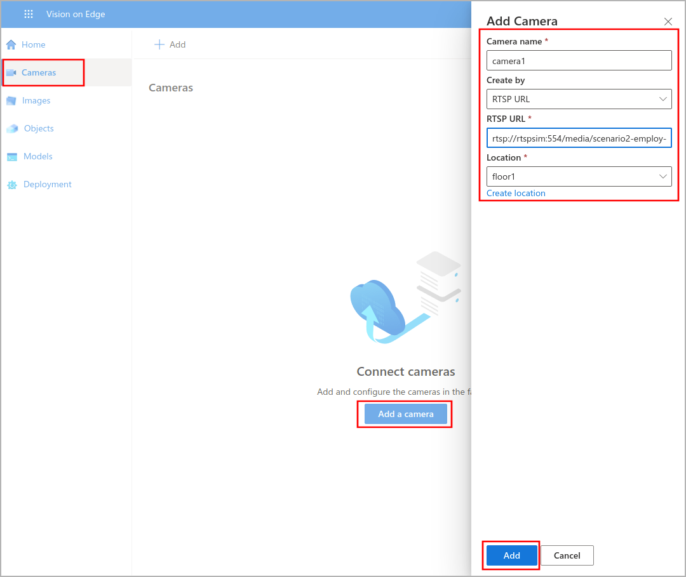
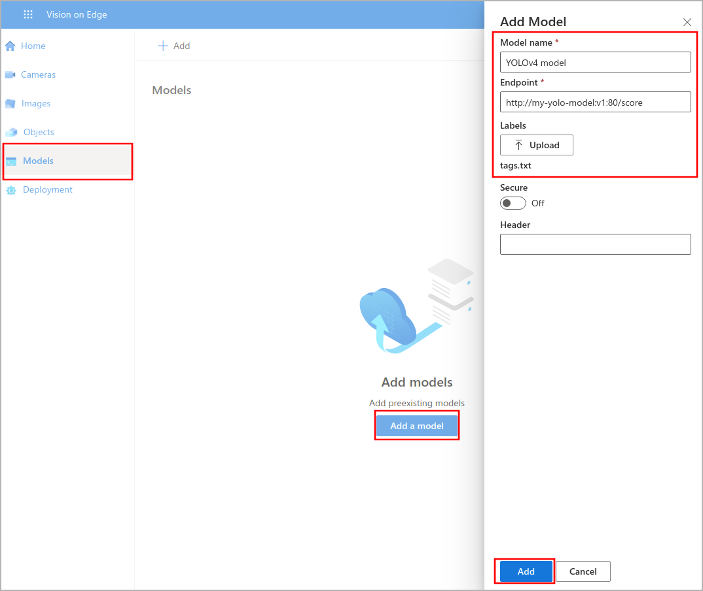

Now that you have deployed the YOLO model to the edge device, you can deploy the Vision on Edge solution model.

Make sure that you have the followings:
- Prediction endpoint that has form http://{module-name}:80/score
- tag.txt file downloaded that has object labels
- RTSP URL that has form rtsp://rtspsim:554/media/\<video-name\>

## Connect to web application
In this exercise, you'll connect to the Vision on Edge solution web application. Firstly, you'll add a camera that streams out the video.

1. Open your browser, connect to **http://<replace_your_public_ip_address>:8181**. 

2. To find your Public IP address, go to the overview page of your virtual machine and copy it.

   

3. When you connect to Vision on Edge solution, select the Home page.

   

## Add a camera

1. In this step, you'll add a camera that streams out the video feed.
2. Navigate to the Cameras page and add a camera.
3. Fill in the required information:
   - Camera name: Give a name to your camera
   - RTSP URL: Enter URL that has form of rtsp://rtspsim:554/media/\<video-name\>
   - Location: Create a location or choose an existing one

   

## Upload your pre-trained YOLO model to the Vision on Edge solution

1. To bring the AI model to the platform, select on the **Models** and select on '+' to start.

2. Fill in the required information:
   - Module name: Give a name to your model
   - Endpoint: Enter prediction endpoint that has form of http://{module name}:80/score
   - Labels: Upload tag.txt file
   - Header: Leave it empty if not necessary

3. Select **Add**.

   

## Create a solution deployment

1. Navigate the Deployment page.
2. To deploy a task, fill in the required information:
   - Give a name to your deployment
   - Choose Model
   - Select Camera
   - Select Objects
3. Select Deploy.
4. You'll see that the gaps will be identified in the video stream.

   
