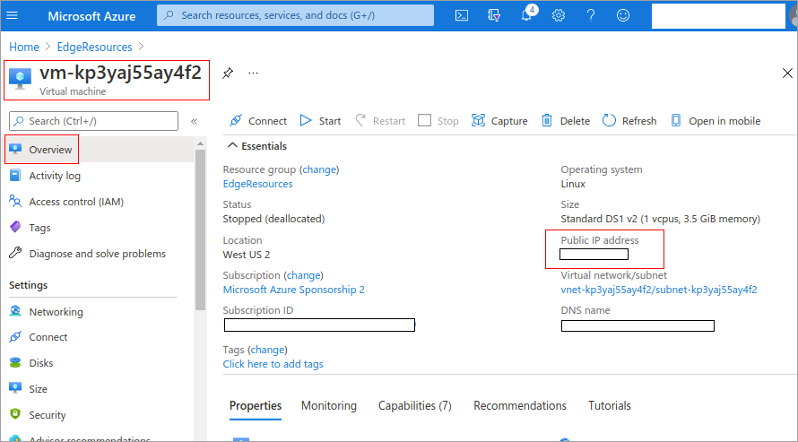
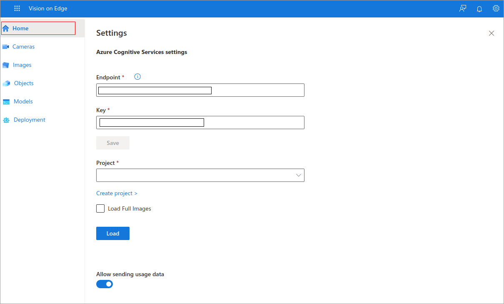
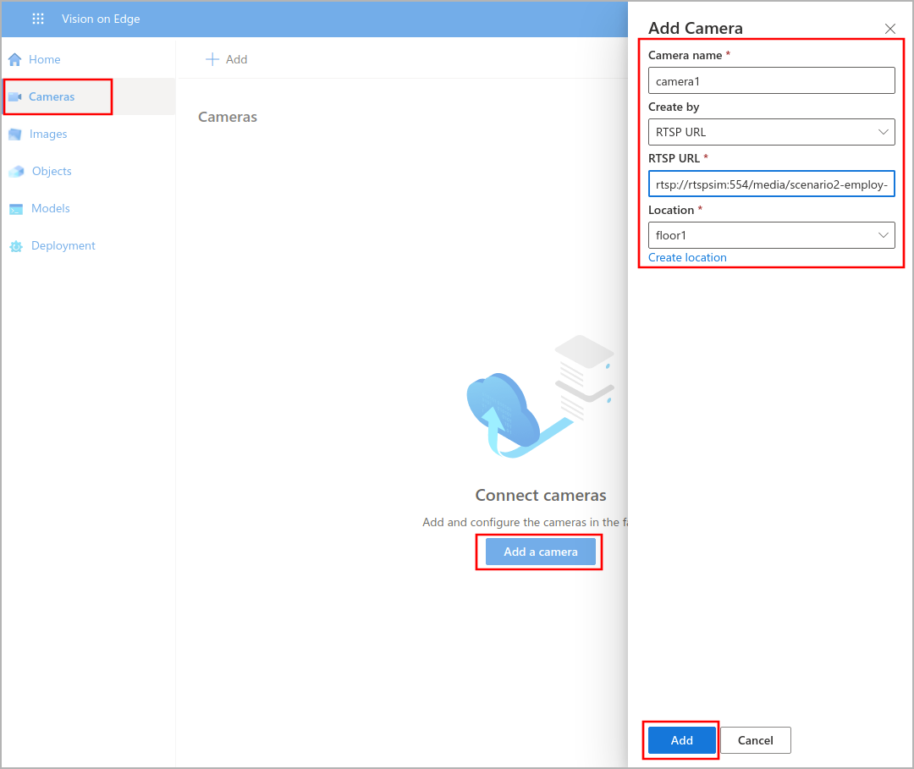
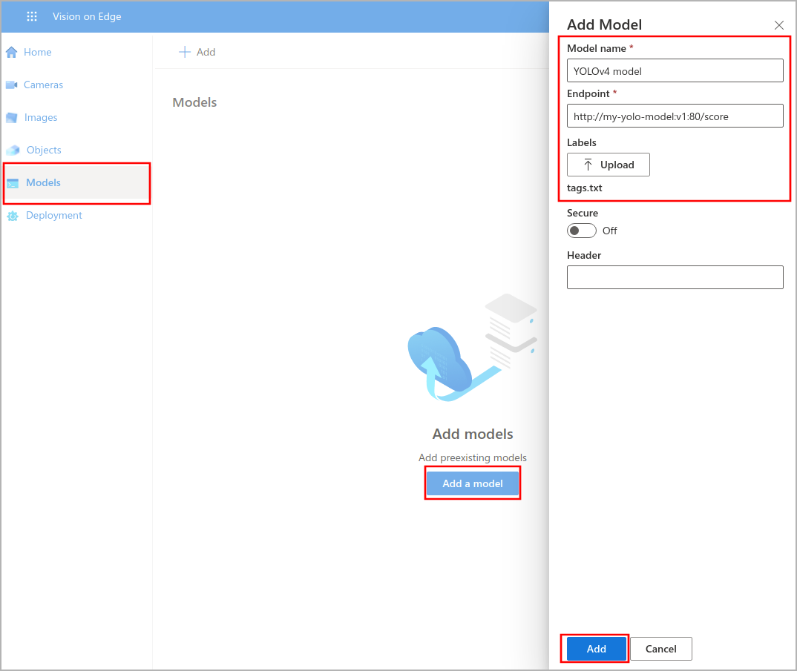
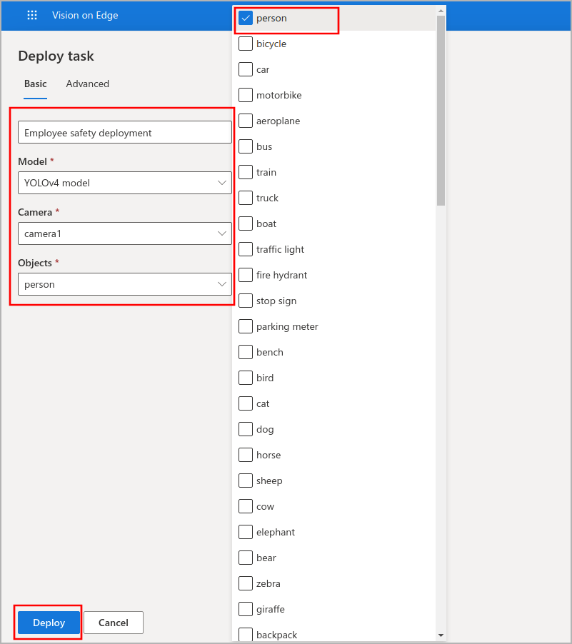

This exercise originally connected to the Vision on Edge web application and deployed a task that combined a camera stream, a model endpoint, and object labels.

> [!IMPORTANT]
> Don't run this exercise as a current deployment. The Vision on Edge web app and LVA-based workflow depend on archived sample assets and retired services. The `tag.txt` label file referenced by the historical YOLO sample isn't available from the stated Live Video Analytics repository. Use this unit as a historical walkthrough only.

## Before you begin

The original exercise expected these values:

- A prediction endpoint in the form `http://<module-name>:80/score`
- A `.txt` label file that contains one object label per line and whose order matches the exact model output classes
- An RTSP URL in the form `rtsp://rtspsim:554/media/<video-name>`

For a current lab, provide these values from your own supported model container, label source, and streaming component. The labels file must be exported or generated from the same model, or from documented class-index order that matches the exact model outputs. Keep model endpoints and RTSP URLs on a private edge network unless you've implemented a production-grade security design.

## Connect to web application

The original exercise opened the web application in a browser at `http://<public-ip-address>:8181`.

> [!CAUTION]
> Don't expose an unauthenticated HTTP web UI on a public IP address. Prefer VPN/private network access or SSH local port forwarding over an approved SSH path. Azure Bastion can provide SSH/RDP access to the VM, but it isn't a direct HTTP relay for browsing `http://<vm>:8181`. If you create a temporary inbound rule for a lab, restrict the source to your trusted public IP address or private CIDR range and delete the rule when finished.

1. In a private lab with a supported replacement application, connect through your protected access path.

2. If you need the VM IP address, go to the overview page of your virtual machine and copy the appropriate private or restricted address.

   [](../media/vm-overview.png#lightbox)

3. The archived Vision on Edge solution displayed a Home page after connection.

   [](../media/vision-on-edge.png#lightbox)

## Add a camera

1. In the historical web application, the learner added a camera that streamed the video feed.
2. The learner navigated to the **Cameras** page and added a camera.
3. Required information included:
   - **Camera name:** A name for the camera
   - **RTSP URL:** A private URL such as `rtsp://rtspsim:554/media/<video-name>`
   - **Location:** A new or existing location

   [](../media/add-camera.png#lightbox)

## Upload your pre-trained model to the web application

1. In the archived web module, the learner selected **Models**, selected **Create custom**, and then entered a model **Name** and the prediction **Endpoint**.

2. Required information included:
   - **Name:** A display name for the model
   - **Endpoint:** A private prediction endpoint such as `http://<module-name>:80/score`
   - **Labels:** A `.txt` file that contains one class label per line. Use labels exported or generated from the same model, or a documented class-index mapping that matches the model output tensor exactly. For example:

     ```text
     person
     hardhat
     vest
     ```
   - **Header:** Optional request headers, if required by the model service

3. The learner selected **Add**.

   > [!NOTE]
   > The endpoint host in `http://<module-name>:80/score` is the IoT Edge module DNS name. It's separate from the model **Name** shown in the web application. The historical `tag.txt` source isn't available, so provide your own labels file from the same model or a documented matching class-index order.

4. The following screenshot is a historical UI capture from the archived web module.

   [](../media/add-model.png#lightbox)

## Create a solution deployment

1. In the historical web application, the learner navigated to the **Deployment** page.
2. To deploy a task, the learner entered:
   - A deployment name
   - A model
   - A camera
   - Objects to detect
3. The learner selected **Deploy**.
4. After **Deploy**, verify that:
   - The **Deployment** page opens.
   - The selected camera feed renders.
   - The **Insights** pane begins returning metrics such as **Object Count** or **Inference Metrics**.
5. If detection isn't visible, recheck:
   - The RTSP URL matches the value used in the earlier camera setup steps in this module.
   - The model endpoint host and port.
   - The labels file format (`.txt`, one label per line) and class order match the exact model outputs.

   [](../media/deploy-task.png#lightbox)

For a current implementation, validate the same conceptual flow with supported services and private access: camera or stream ingestion, model inference, routing, visualization, and alerting.
