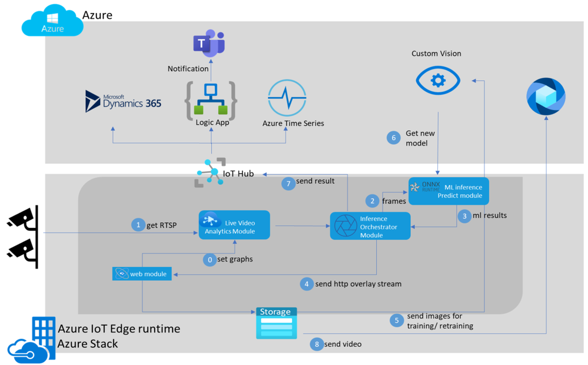

In this module, you'll learn how to use the AI extensibility capability of Azure Live Video Analytics on Azure IoT Edge. You'll deploy a model on edge for detecting a person on the factory floor. You'll also learn about the capabilities of Live Video Analytics. You'll be able to seamlessly deploy a custom model as a container on the edge and analyze a simulated live video feed. You'll use a pre-trained YOLO model and deploy the model as a container to your video analytics solution.

You'll see how to:

- Set up the Azure resources
- Set up edge workloads to the edge device
- Bring and deploy inference YOLO model to the edge device
- Deploy your solution
- Examine and interpret the results

You use an Azure virtual machine (VM) as an IoT Edge device, and the video analytics solution is based on the sample in the [GitHub repository](https://github.com/Azure-Samples/azure-intelligent-edge-patterns/tree/master/factory-ai-vision). 

## Sample

This module uses an [employee safety video](https://github.com/Azure-Samples/azure-intelligent-edge-patterns/blob/master/factory-ai-vision/EdgeSolution/modules/CVCaptureModule/videos/scenario5-total-customer-counting.mkv) file to simulate a live stream. To play back the video, you can use an application such as [a VLC media player](https://www.videolan.org/vlc/). Copy the video link and paste it. While you watch the video, you'll notice the movement of people in the video.

## Solution workflow

Firstly, in this module, you need to set up an edge device with the IoT Edge runtime installed. After you configure your device to IoT Hub, you'll send the deployment manifest to your edge device. After the deployment manifest is sent to the edge, the IoT Edge agent running on your edge device gets new containers from the container registry and starts them on your edge device. The following modules will be deployed:

- **Web Module**: The Web Module represents the leading web application that the user interacts with. For example, when you add your camera, the Web Module will manage the camera settings to the live video analytics module. When deployed, based on user setting, the web module can capture images automatically and send them to retrain using the customvision.ai application protocol interface(API). 

- **Live Video Analytics (LVA)**: This module will parse frames from all the cameras and send them to the Inference Module.

- **Inference Orchestrator:** This module sends frames to Predict module and gets results. It also overlays results on the camera feed and sends an HTTP video stream out to Web Module, and sends ML results to the Azure IoT hub.

- **ML Predict Module:** The ML Predict module runs a trained YOLO model using onnxruntime; it takes frames over HTTP or gRPC and sends JSON results.

- With **Live Video Analytics**, users can also allow Web Module to store videos based on inference results and push them to their provided media service account on Azure.

## Architecture

Here is the end-to-end Video Analytics solution architecture.

## Define Azure products

You'll use the following components in the design of the solution:

- **Azure IoT Hub:** Azure IoT Hub provides a cloud-hosted solution back end to connect most devices.

- **Azure IoT Edge virtual machine:** The runtime installs the Azure IoT Edge virtual machine. In this module, you'll open network port 8181 to enable communication between your virtual machine and web application.

- **Live Video Analytics on IoT Edge:** An [IoT Edge module](https://azure.microsoft.com/blog/introducing-live-video-analytics-on-iot-edge-now-in-preview/) that has the functionality to be combined with other Azure edge modules such as Stream Analytics on IoT Edge, Azure AI services on IoT Edge and Azure services in the cloud such as Media Services and Event Hub.

- **Custom Vision Service:** Custom Vision lets you build, deploy, and improve your image classifiers. An image classifier is an AI service that applies labels (representing classes) to images based on their visual characteristics.

- **Media Services:** Azure Media Services is a collection of cloud and edge media workflow services that enable you to build solutions that require live and batch video analytics, transcoding, multi-device delivery services, content protection, and live event broadcasting at scale.

## Steps to follow

The overall module steps are for this solution:

1. Create an IoT Hub
2. Create a virtual machine as an edge device
3. Register an edge device to the IoT Hub
4. Install and run Azure Shell Installer
   1. Set up Azure resources for Live Video Analytics on IoT Edge
   2. Set workloads to the IoT Edge device
5. Upload sample video to the edge device
6. Create an Azure container registry
7. Get a pre-trained YOLO model
8. Build a container image with YOLO model
9. Push the container image to the Azure container registry
10. Deploy YOLO model to the edge device
11. Connect the web application
    1. Add a camera to feed the sample video
    2. Add model endpoint and labels
12. Deploy the solution
13. Examine the results

## Conclusion

After completing the module, your vision solution will be deployed to your edge device. You'll run a simulated live video stream. The solution will be deployed on the edge device to detect a person in real time using a YOLO model and Live Video Analytics.

Watch the following video to see brief introduction and understand Vision on Edge solution.

>[!VIDEO https://channel9.msdn.com/Shows/Internet-of-Things-Show/Rapidly-move-your-Vision-AI-project-to-production-with-VisionOnEdge/player]
