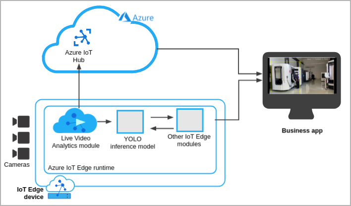

Live Video Analytics (LVA) on IoT Edge was formerly used by IoT developers to build live video analytics solutions that captured, processed, and analyzed video from existing cameras. That LVA-based workflow is now historical: LVA client packages are no longer maintained, Azure Video Analyzer Edge is retired, and Azure Media Services retired on June 30, 2024.

> [!IMPORTANT]
> Don't run this module as a current deployment guide. Use it to understand the original edge video analytics pattern. For new real-time edge analysis, evaluate Microsoft-documented alternatives separately from IoT Edge 1.5 deployment guidance. Azure AI Video Indexer enabled by Arc is a generally available Azure Arc-enabled Kubernetes service; its real-time analysis capability is currently in preview and runs as an Azure Arc extension. It isn't an IoT Edge module or drop-in replacement for LVA, and real-time analysis is subject to gated subscription approval, hardware requirements, preview limitations, and other feature limitations. For custom image classification or object detection, Microsoft recommends Azure Machine Learning AutoML. If you're evaluating broader generative or custom-solution options, review Azure AI Foundry separately.

Suppose you want to build a real-time monitoring solution for safety in a factory. The solution uses live feeds from cameras and detects if a person is standing too close to a machine.

Your manufacturing plant has raised safety concerns for personnel working on safety-critical systems on the factory floor, especially when someone works near a power source. Safety incidents can cause harm, lost work time, higher insurance costs, and workers' compensation claims.

Maintaining employee safety is critical. A supported edge video analytics design can capture a live video stream from a camera, analyze images in real time at the edge, and raise an alert if a person is detected in a risky area. The historical module demonstrates this pattern with an archived sample and a YOLO model, but the original LVA, Azure Media Services, and installer dependencies shouldn't be used for new deployments.

## Prerequisites

- An Azure subscription
- Ability to use Azure Cloud Shell
- Basic knowledge of Azure IoT Edge 1.5 LTS
- Basic knowledge of containers
- Ability to use Docker in a local environment or build host that has a Docker daemon
- Awareness that Custom Vision is a legacy dependency with a planned retirement, and Live Video Analytics and Azure Media Services are no longer supported for this scenario

## Learning objectives

In this module, you'll:

- Review how a historical Live Video Analytics on IoT Edge solution was structured
- Identify the Azure resources and IoT Edge modules used by the archived Vision on Edge sample
- Understand how a containerized inference model was intended to run on an IoT Edge virtual machine
- Recognize why retired or archived dependencies must be replaced before building a current solution
- Compare the historical IoT Edge pattern with current alternatives, including Azure AI Video Indexer enabled by Arc as a separate, generally available Azure Arc-enabled Kubernetes service, with real-time video analysis currently in preview
