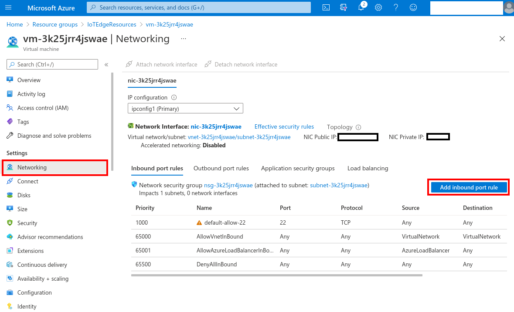
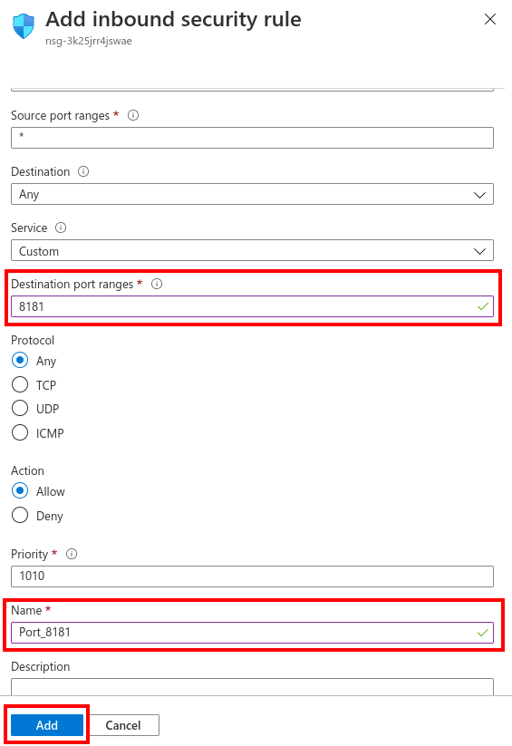
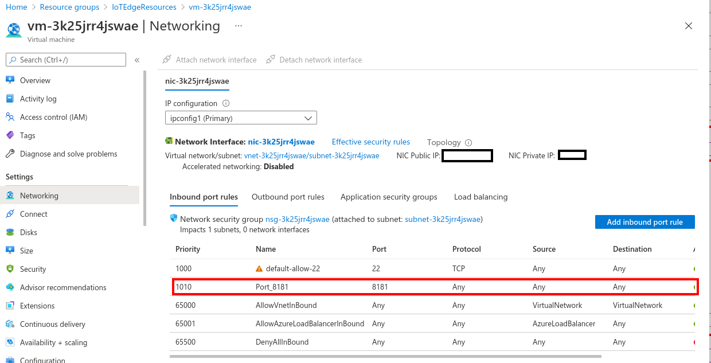

Use Azure Cloud Shell for the Azure CLI resource-creation steps in this unit. Accessing and installing software on a private VM requires a VM access path such as portal-based Azure Bastion, a local SSH client through Bastion native client or VPN, or a temporary public SSH rule restricted to your trusted IP address. Before you start, you need an Azure account for this learning module. If you don't have an Azure account, create a free account. If you're a student, sign up for a free [Azure for Students account](https://azure.microsoft.com/free/students/?cid=msft_learn) (no credit card required). Otherwise, sign up for a free [Azure account](https://azure.microsoft.com/pricing/purchase-options/azure-account?cid=msft_learn).

> [!IMPORTANT]
> The later video analytics exercises in this module are historical and shouldn't be run as a current end-to-end solution. This unit shows IoT Edge setup concepts that you can adapt to current IoT Edge 1.5 LTS guidance.

From your web browser, navigate to https://portal.azure.com and sign in.

## Create cloud resources

1. Add or upgrade the Azure IoT extension in the Cloud Shell instance.

   ```azurecli
   az extension add --upgrade --name azure-iot
   ```

   > [!NOTE]
   > This module uses the current Azure IoT extension, called `azure-iot`. You should only have one IoT extension installed at a time. Use `az extension list` to validate the currently installed extensions. To remove the legacy version of the extension, use `az extension remove --name azure-cli-iot-ext`.

2. Create a resource group to manage all the resources you use for this module. Replace `{resource_group_name}` with your resource group name, and use that same name throughout the exercise.

   ```azurecli
   az group create --name {resource_group_name} --location westus2
   ```

## Create an IoT hub

Create a free **F1** hub in the resource group. Replace `{hub_name}` with a unique name for your IoT hub. It might take a few minutes to create an IoT Hub.

   ```azurecli
   az iot hub create --resource-group {resource_group_name} --name {hub_name} --sku F1 --partition-count 2
   ```

   > [!NOTE]
   > If you get an error because there's already one free hub in your subscription, change the SKU to **S1**. Each subscription can only have one free IoT hub. If you get an error that the IoT Hub name isn't available, someone else already has a hub with that name. Try a new name.

## Register an IoT Edge device

Register an IoT Edge device with your newly created IoT hub.

1. Create a device named **myEdgeDevice** in your hub.

   ```azurecli
   az iot hub device-identity create --device-id myEdgeDevice --edge-enabled --hub-name {hub_name}
   ```

   > [!TIP]
   > If your organization uses IoT Hub data-plane RBAC, you can add `--auth-type login` to the device identity commands in this section if your account has the **IoT Hub Data Contributor** role on the hub.

2. View the connection string for your device, which links your physical device with its identity in IoT Hub. It contains the name of your IoT hub, the name of your device, and a shared key that authenticates connections between the two.

   ```azurecli
   az iot hub device-identity connection-string show --device-id myEdgeDevice --hub-name {hub_name} --query connectionString -o tsv
   ```

3. Make a temporary note of the device connection string, which looks like:

   ```text
   HostName={YourIoTHubName}.azure-devices.net;DeviceId=myEdgeDevice;SharedAccessKey={YourSharedAccessKey}
   ```

   > [!CAUTION]
   > The device connection string is a secret. Don't share it, screenshot it, write it to logs, or commit it to source control. Store it only long enough to configure the lab device. Rotate the IoT device keys or delete the device identity when you finish the lab. For production, prefer X.509 certificate authentication or Device Provisioning Service patterns.

## Configure your IoT Edge device

1. You'll need to create an SSH key for your deployment using Cloud Shell. The following command creates an SSH key pair using RSA encryption and a bit length of 4096:

   ```bash
   ssh-keygen -m PEM -t rsa -b 4096
   ```

2. You can display your public key with the following command, replacing `~/.ssh/id_rsa.pub` with the path and filename of your public key file if needed:

   ```bash
   cat ~/.ssh/id_rsa.pub
   ```

3. A typical public key value looks like this example:

   ```text
   ssh-rsa AAAAB3NzaC1yc2EAABADAQABAAACAQC1/KanayNr+Q7ogR5mKnGpKWRBQU7F3Jjhn7utdf7Z2iUFykaYx+MInSnT3XdnBRS8KhC0IP8ptbngIaNOWd6zM8hB6UrcRTlTpwk/SuGMw1Vb40xlEFphBkVEUgBolOoANIEXriAMvlDMZsgvnMFiQ12tD/u14cxy1WNEMAftey/vX3Fgp2vEq4zHXEliY/sFZLJUJzcRUI0MOfHXAuCjg/qyqqbIuTDFyfg8k0JTtyGFEMQhbXKcuP2yGx1uw0ice62LRzr8w0mszftXyMik1PnshRXbmE2xgINYg5xo/ra3mq2imwtOKJpfdtFoMiKhJmSNHBSkK7vFTeYgg0v2cQ2+vL38lcIFX4Oh+QCzvNF/AXoDVlQtVtSqfQxRVG79Zqio5p12gHFktlfV7reCBvVIhyxc2LlYUkrq4DHzkxNY5c9OGSHXSle9YsO3F1J5ip18f6gPq4xFmo6dVoJodZm9N0YMKCkZ4k1qJDESsJBk2ujDPmQQeMjJX3FnDXYYB182ZCGQzXfzlPDC29cWVgDZEXNHuYrOLmJTmYtLZ4WkdUhLLlt5XsdoKWqlWpbegyYtGZgeZNRtOOdN6ybOPJqmYFd2qRtb4sYPniGJDOGhx4VodXAjT09omhQJpE6wlZbRWDvKC55R2d/CSPHJscEiuudb+1SG2uA/oik/WQ== username@domainname
   ```

4. Before you create the VM, choose a secure management path. Prefer Azure Bastion for SSH/RDP, VPN, or another private IP connection. Use the private-access command only when the VM subnet is reachable through your approved private path, such as an existing VNet/subnet with Azure Bastion configured or a VPN/private network route. If you use an existing VNet/subnet, add the appropriate `--vnet-name` and `--subnet` values. The following command creates a supported Ubuntu Server 22.04 LTS virtual machine, attaches the SSH public key that you generated in the previous steps, avoids creating a default open SSH NSG rule, and prevents Azure CLI from creating a public IP address by default. Replace `{vm_name}` with a name for your virtual machine.

   ```azurecli
   az vm create --resource-group {resource_group_name} --name {vm_name} --image Ubuntu2204 --admin-username azureuser --ssh-key-values @$HOME/.ssh/id_rsa.pub --public-ip-address "" --nsg {vm_name}NSG --nsg-rule NONE
   ```

   A private-access VM still needs outbound internet access for the `wget` and `apt-get` commands used later unless you prepare an offline installation path. Provide controlled egress through a NAT Gateway, firewall or network virtual appliance route, or a deliberately configured Standard public IP address. Don't rely on default outbound access for new designs.

   If you're using a temporary public SSH connection instead of Bastion, VPN, or private access, create the VM with a named public IP address deliberately, but still avoid the default open SSH rule.

   ```azurecli
   az vm create --resource-group {resource_group_name} --name {vm_name} --image Ubuntu2204 --admin-username azureuser --ssh-key-values @$HOME/.ssh/id_rsa.pub --public-ip-address {vm_name}PublicIP --public-ip-sku Standard --nsg {vm_name}NSG --nsg-rule NONE
   ```

   Then add a restricted inbound rule before connecting. Replace `{your_public_ip_or_cidr}` with your client IP address or a trusted CIDR range.

   ```azurecli
   az network nsg rule create --resource-group {resource_group_name} --nsg-name {vm_name}NSG --name Allow_SSH_From_MyIP_Temporary --priority 1000 --destination-port-ranges 22 --protocol Tcp --access Allow --direction Inbound --source-address-prefixes {your_public_ip_or_cidr} --source-port-ranges '*'
   ```

   Delete this SSH rule when the lab is complete. The `az vm create` command returns JSON that includes the VM's `publicIpAddress` if you created a public IP address.

5. Connect to the virtual machine by using your chosen secure access path. For the private-access path, use portal-based Bastion, Bastion native client from a local machine, VPN, or the VM's private IP address through an approved network route. Cloud Shell can run the Azure CLI resource commands, but it isn't a substitute for a network path to a private VM. For a temporary public SSH rule restricted to your IP address, use the public IP address from the previous command.

   ```bash
   ssh azureuser@{public_ip_address}
   ```

6. On the Ubuntu 22.04 VM, add the Microsoft package repository, then install the Moby engine and the IoT Edge runtime.

   ```bash
   wget https://packages.microsoft.com/config/ubuntu/22.04/packages-microsoft-prod.deb -O packages-microsoft-prod.deb
   sudo dpkg -i packages-microsoft-prod.deb
   rm packages-microsoft-prod.deb

   sudo apt-get update
   sudo apt-get install moby-engine
   sudo apt-get update
   sudo apt-get install aziot-edge
   ```

7. Optional but recommended for lab VMs, configure the Moby engine to use the local logging driver with size limits so container logs don't fill the OS disk. If `/etc/docker/daemon.json` already exists, merge these settings instead of overwriting the file. Restarting the container engine is safest before you deploy lab modules.

   ```bash
   sudo mkdir -p /etc/docker
   sudo tee /etc/docker/daemon.json >/dev/null <<'EOF'
   {
     "log-driver": "local",
     "log-opts": {
       "max-size": "10m",
       "max-file": "3"
     }
   }
   EOF
   sudo systemctl restart docker
   ```

8. Configure the IoT Edge runtime with the device connection string that you retrieved earlier, then apply the configuration. Replace the placeholder with your full device connection string and keep it protected as a secret.

   ```bash
   sudo iotedge config mp --connection-string 'HostName={YourIoTHubName}.azure-devices.net;DeviceId=myEdgeDevice;SharedAccessKey={YourSharedAccessKey}'
   sudo iotedge config apply
   ```

### Verify the IoT Edge runtime

Before you change any network settings, verify that the runtime is installed and that the device can run the local IoT Edge services.

1. Check that the IoT Edge system services are running.

   ```bash
   sudo iotedge system status
   ```

2. List the modules that are currently running.

   ```bash
   sudo iotedge list
   ```

   Right after configuration, you should see `edgeAgent` running.

3. Run the built-in configuration and connectivity checks.

   ```bash
   sudo iotedge check
   ```

   > [!NOTE]
   > `iotedge check` can return **OK**, **Warning**, or **Error** results. On a newly provisioned device, you might also see an `edgeHub`-related error until the device receives a module deployment in a later exercise.

## Optional: Open network port 8181

Only complete this section if you intentionally continue the historical Vision on Edge web-app path in an isolated lab. Otherwise, skip it.

> [!CAUTION]
> Opening `http://<public-ip>:8181` on an internet-facing VM exposes a plain HTTP lab web UI. Prefer VPN/private network access or SSH local port forwarding over an approved SSH path. Azure Bastion is for SSH/RDP connectivity to the VM and isn't a direct HTTP relay for browsing `http://<vm>:8181`. If you temporarily create an inbound NSG rule, restrict **Source** to your trusted public IP address or private CIDR range. Delete the rule when the lab is complete.

1. Go to the resource group you created or selected, then select the virtual machine you created in the previous step.

2. Go to **Networking** and select **Add inbound port rule**.

   [](../media/add-port-rule.png#lightbox)

3. Fill out the rule with these lab-only values:

   - **Source:** Your public IP address, a trusted CIDR range, or a private network range. Don't use **Any**.
   - **Destination port ranges:** `8181`
   - **Protocol:** `TCP`
   - **Action:** `Allow`
   - **Name:** `Allow_8181_From_MyIP_Temporary`

   [](../media/create-security-rule.png#lightbox)

4. Confirm that port 8181 is added only for the trusted source that you specified.

   [](../media/port-8181.png#lightbox)

5. When you finish the lab, remove the inbound rule and rotate or delete the lab credentials.
