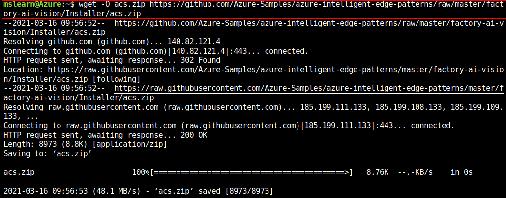
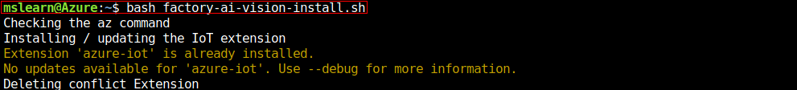
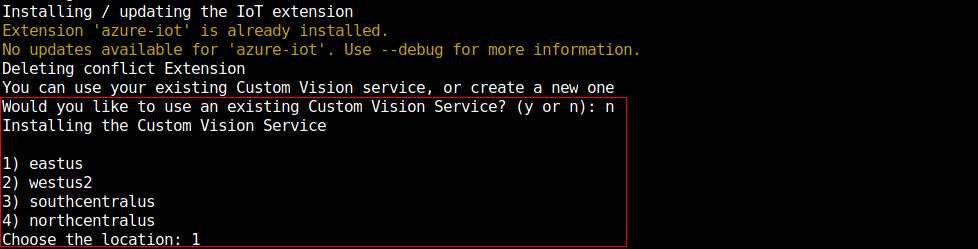
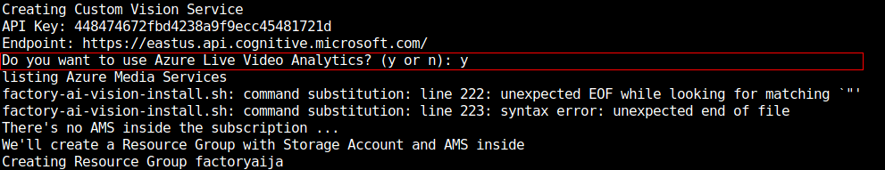
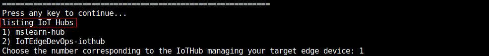
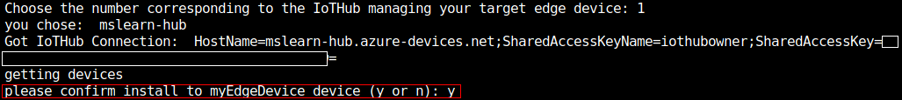
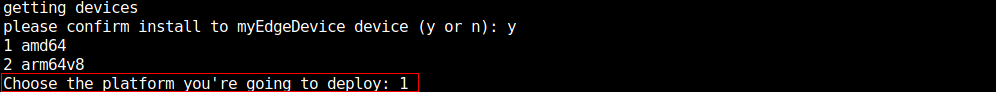
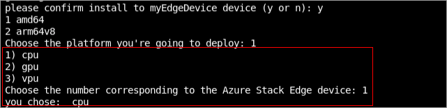
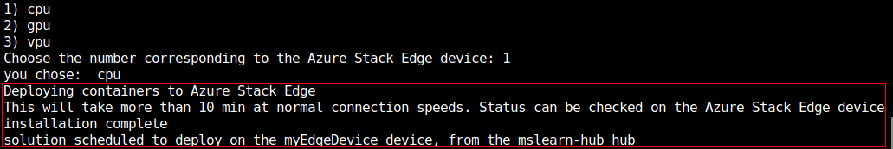
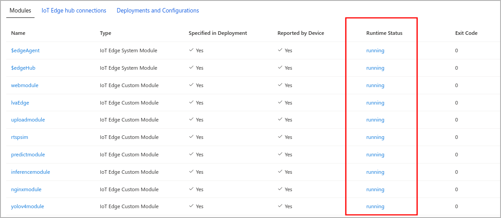

This exercise originally installed the Vision on Edge Solution Accelerator from the archived Azure-Samples repository.

> [!IMPORTANT]
> Don't run this installer in a current Azure subscription. The installer and screenshots are historical. The sample repository's archived, Live Video Analytics and Azure Video Analyzer Edge are no longer supported for this workflow, Azure Media Services retired on June 30, 2024, and Custom Vision is supported for existing customers until September 25, 2028; after that date, API calls fail. Microsoft recommends creating a transition plan by September 25, 2026. For new object-detection work, plan to use Azure Machine Learning AutoML. For new edge video designs, evaluate Microsoft-documented alternatives separately from IoT Edge 1.5 deployment guidance. Azure AI Video Indexer enabled by Arc runs as an Azure Arc extension-enabled service on Azure Arc-enabled Kubernetes, and its real-time analysis capability is currently in preview. It isn't an IoT Edge module or LVA drop-in replacement, and it's subject to gated subscription approval, hardware requirements, preview limitations, and other feature limitations.

## Historical installer flow

The original exercise used these commands in Azure Cloud Shell to download and expand `acs.zip`:

```bash
wget -O acs.zip https://github.com/Azure-Samples/azure-intelligent-edge-patterns/raw/master/factory-ai-vision/Installer/acs.zip
unzip -o acs.zip
bash factory-ai-vision-install.sh
```

These commands are shown only to explain the historical flow. Don't run them for a current lab because the archived assets and generated deployment manifest aren't validated against current services or IoT Edge 1.5 LTS runtime images.

> [!WARNING]
> The archived Vision on Edge installer (`factory-ai-vision-install.sh`) calls `az iot hub connection-string show` without `--policy-name`, so it defaults to the high-privilege `iothubowner` shared-access policy. It also writes secrets such as the Custom Vision training key, IoT Hub connection string, and Azure Video Analyzer provisioning token into plaintext config files under `factoryai_configs/factoryai_cfgs/`, then substitutes those values into the generated `deploy.modules.json` file before running `az iot edge set-modules`. That command submits the generated manifest to IoT Hub as IoT Edge deployment and module-twin desired configuration, so the secrets can exist in both local artifacts and the applied IoT Edge configuration. Terminal output, command logs, scrollback, and screenshots from a reproduction can also expose connection strings and generated config values. Treat this as historical sample behavior. For any current implementation, prefer Microsoft Entra ID for IoT Hub access. If you still need a connection string, use a least-privilege shared-access policy or role assignment matched to the exact operations needed instead of `iothubowner`, don't persist secrets to disk, delete generated files such as `deploy.modules.json` and reproduction logs after a lab reproduction, and rotate or delete lab credentials when you finish.

The current archived installer also doesn't reproduce the Live Video Analytics and Azure Media Services prompts shown in these screenshots. Its script now switches between `deployment.ava.json` and `deployment.opencv.json`, so the archived flow won't match the original LVA and Azure Media Services prompts captured in this unit.

### Historical prerequisites

Before the archived installer could finish, it also required:

- Azure CLI in Azure Cloud Shell or another shell, plus the Azure IoT extension. The script explicitly ran `az extension add --name azure-iot`.
- An existing Azure IoT Hub and a registered IoT Edge device.
- Access to run `az iot hub connection-string show` to retrieve the IoT Hub connection string.
- Permission to apply the deployment manifest with `az iot edge set-modules`.

That dependency chain is one reason the archived installer isn't a self-contained current lab flow. The later Custom Vision, Azure Media Services, and `SERVICE-PRINCIPAL-SECRET` prompts in this unit belong to the historical LVA path.

[](../media/download-installer.png#lightbox)

[](../media/unzip-installer.png#lightbox)

[](../media/execute-installer.png#lightbox)

## Historical prompts and resources

> [!CAUTION]
> Treat API keys, endpoints shown together with keys, service principal secrets, and IoT Edge device connection strings as sensitive information. Don't share them, include real values in terminal output, scrollback, screenshots, or logs, or commit them to source. If you create documentation or screenshots, redact real values first or replace them with placeholders such as `<custom-vision-training-key>` and `<service-principal-secret>`. Store lab secrets only temporarily in a secure location, preferably in Azure Key Vault for real applications. After any reproduction, clear or delete exposed logs and rotate or delete lab credentials. For production, prefer managed identities, certificate credentials, X.509 device authentication, and least-privilege access.

The original installer prompted for several resources and secrets:

1. It asked whether to use an existing Custom Vision service or create a new one.

   [](../media/create-custom-vision-service.png#lightbox)

2. It displayed a Custom Vision **Training API key** and **Training endpoint**. Use placeholders or redacted output only:

   ```text
   Training API key: <custom-vision-training-key>
   Training endpoint: https://<custom-vision-training-endpoint>
   ```

3. In the original LVA path, it asked whether to use Azure Live Video Analytics and then created Azure Media Services resources.

   [](../media/create-azure-media-service.png#lightbox)

4. It displayed a `SERVICE-PRINCIPAL-SECRET` value for later use. Use a placeholder or redacted value in any notes, logs, or screenshots:

   ```text
   SERVICE-PRINCIPAL-SECRET: <redacted>
   ```

The original installer then listed IoT hubs, IoT Edge devices, platform choices, and CPU/GPU options before creating a deployment.

[](../media/list-iot-hubs.png#lightbox)

[](../media/device-list.png#lightbox)

[](../media/choose-platform.png#lightbox)

[](../media/choose-device.png#lightbox)

[](../media/create-deployment.png#lightbox)

## Historical web application access

The original exercise then checked module status in the Azure portal and opened the web application by using a public-IP HTTP URL on port 8181.

[](../media/deployment-status.png#lightbox)

[](../media/vm-overview.png#lightbox)

[](../media/vision-on-edge.png#lightbox)

> [!CAUTION]
> Don't expose an unauthenticated HTTP web UI on a public IP address. If you build a temporary lab web UI, prefer VPN/private network access or SSH local port forwarding over an approved SSH path. Azure Bastion can provide SSH/RDP access to the VM, but it doesn't directly relay the `http://<vm>:8181` web UI. If an inbound rule's unavoidable, restrict the source to your trusted public IP address or private network and delete the rule after the lab. Production endpoints require TLS, authentication, and a supported current architecture.
