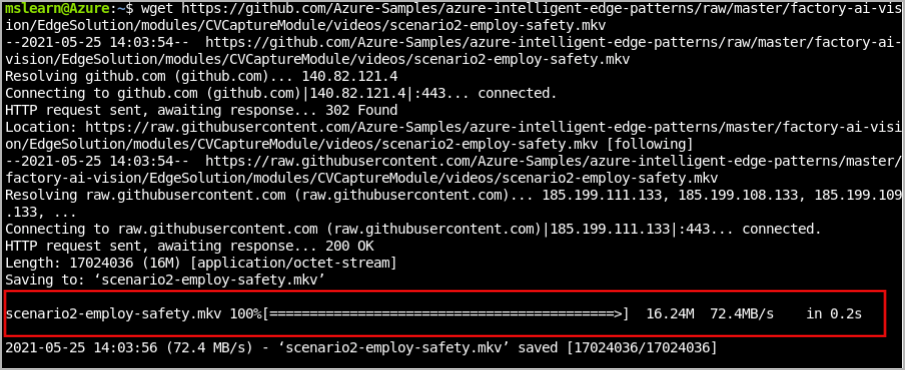
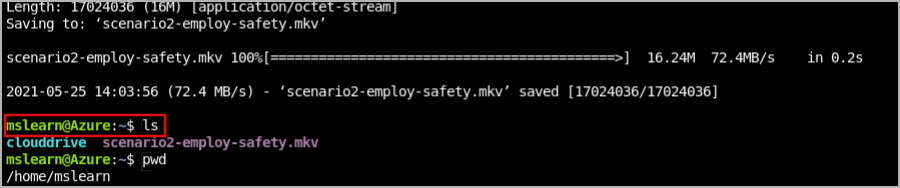
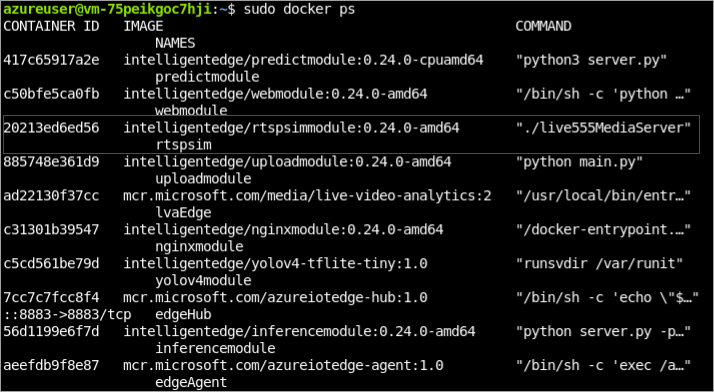

Perform the following steps in Azure Cloud Shell.

## Upload the video to your edge device

1. Open Cloud Shell.

2. Run the following command to download the [ Employee safety video](https://github.com/Azure-Samples/azure-intelligent-edge-patterns/raw/master/factory-ai-vision/EdgeSolution/modules/CVCaptureModule/videos) from GitHub.

   ```
   wget https://github.com/Azure-Samples/azure-intelligent-edge-patterns/raw/master/factory-ai-vision/EdgeSolution/modules/CVCaptureModule/videos/scenario2-employ-safety.mkv
   ```
   
   [](../media/download-video.png#lightbox)

3. Check the path of your video.

   ```
   ls
   ```
   
   [](../media/check-video-path.png#lightbox)   

4. To upload the video for further analysis, first you would have to upload the video file to your IoT Edge device through ***scp*** command. Replace with username of your virtual machine and IP address of your virtual machine.

   ```
   scp <path to your video> <edge username>@<edge device IP>:
   ```

   [](../media/upload-video-edge-device.png#lightbox)

5. Then the video file would be copied to your edge device.

## Copy the video file to RTSP simulator

1. Connect to virtual machine. Replace username and IP address with your information.

   ```
   ssh <username>@<public_ip_address>
   ```

2. Check the video you just uploaded on your virtual machine that running as an edge device.

   ```
   ls
   ```
   [](../media/check-video-uploaded.png#lightbox)

3. There would be an RTSP simulator container installed on your edge device. You can first check whether the container exists by running the command below on your edge device:

   ```
   sudo docker ps
   ```
 
   [](../media/rtsp-simulator.png#lightbox)

4. Since the RTSP simulator would only host the video in the specific location in its container. So you would have to put your video file into the container of the RTSP simulator. On your IoT Edge device, you can copy the video file you just upload into the RTSP simulator container through ***docker cp*** command:

   ```
   sudo docker cp <path_to_your_video_on_edge> rtspsim:/live/mediaServer/media/
   ```

   [](../media/copy-video-container.png#lightbox)

5. The video would then be copied into the RTSP simulator container.

## Analyze the RTSP stream of your video

After uploading the video to RTSP simulator, you can access the RTSP stream of your video through ***rtsp://rtspsim:554/media/<video_name>***. 

For this example, it will be ***rtsp://rtspsim:554/media/scenario2-employ-safety.mkv***. Make a note of RTSP URL.