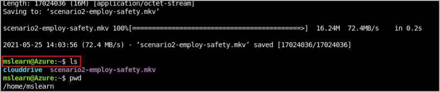
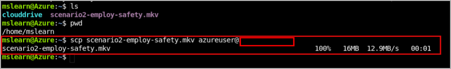
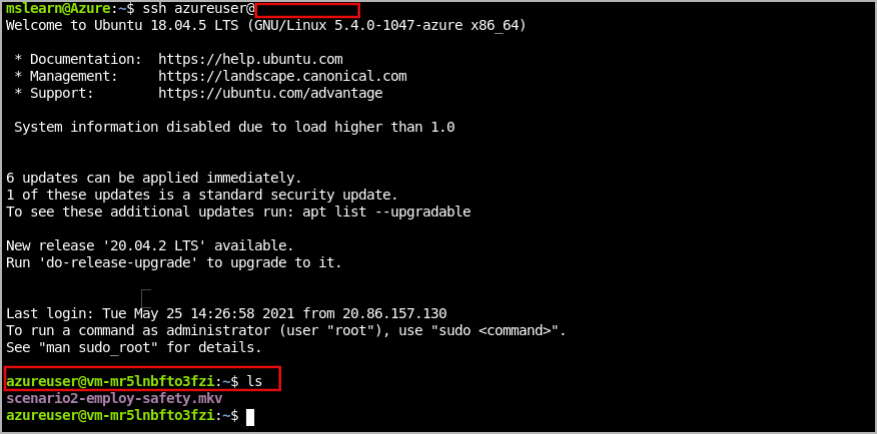
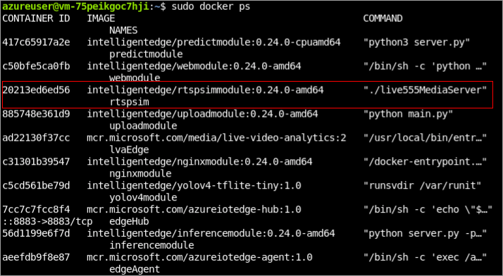
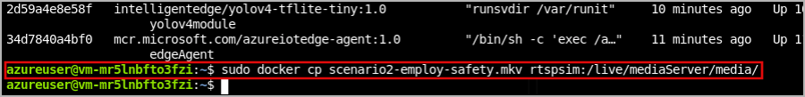

Perform these steps only in a private lab that uses a supported IoT Edge runtime and a maintained RTSP simulator or camera component. The original Vision on Edge sample assets are archived and might not be available.

## Upload the video to your edge device

1. Open Cloud Shell or a local terminal that can reach your edge device over a secure network path.

2. Prepare a video file you're authorized to use. The original module downloaded an employee-safety video from the archived Azure-Samples repository, but that repository isn't maintained and shouldn't be a required dependency for a current lab.

3. Check the path of your video.

   ```bash
   ls
   ```

   [](../media/check-video-path.png#lightbox)

4. Upload the video file to your IoT Edge device with `scp`, replacing the placeholders with your file path, VM username, and VM address.

   > [!NOTE]
   > Before you run `scp`, make sure your client can reach the edge device over SSH. Use a private IP address with TCP port 22 allowed from your client, a private network path, or an Azure Bastion native-client tunnel. On Windows, use the OpenSSH client included with current Windows or Azure Cloud Shell for the direct `scp` and `ssh` commands when it can reach the edge device.

   ```bash
   scp <path-to-your-video> <edge-username>@<edge-device-ip>:
   ```

   If your edge device uses SSH key authentication, specify the private key explicitly:

   ```bash
   scp -i <private-key> <path-to-your-video> <edge-username>@<edge-device-ip>:
   ```

   [](../media/upload-video-edge-device.png#lightbox)

   **Azure Bastion native-client alternative**

   If you prefer Azure Bastion for file transfer, use a local terminal with Azure CLI 2.62.0 or higher. The `az network bastion` commands are provided by the `bastion` Azure CLI extension, which auto-installs on first use. If it doesn't install automatically, run `az extension add --name bastion` or `az extension update --name bastion`. This workflow requires an Azure Bastion host on Standard SKU or higher with **Native Client Support** enabled, and it isn't supported in Cloud Shell. For more information, see [File transfer using a native client](/azure/bastion/vm-upload-download-native) and [Configure Bastion for native client connections](/azure/bastion/native-client).

   ```azurecli
   az network bastion tunnel --name <bastion-name> --resource-group <rg> --target-resource-id <vm-id> --resource-port 22 --port 50022
   ```

   In a second terminal, upload the file through the tunnel:

   ```bash
   scp -P 50022 <path-to-your-video> <edge-username>@127.0.0.1:
   ```

5. Confirm that the video file was copied to your edge device.

## Copy the video file to an RTSP simulator

1. Connect to the virtual machine. Replace the username and IP address with your information.

   ```bash
   ssh <edge-username>@<edge-device-ip>
   ```

   If your edge device uses SSH key authentication, specify the private key explicitly:

   ```bash
   ssh -i <private-key> <edge-username>@<edge-device-ip>
   ```

   If you're still using the Azure Bastion tunnel from the previous section, connect through the local tunnel instead of the VM IP address. Add `-i <private-key>` here too if your client doesn't automatically pick up the correct key.

   ```bash
   ssh <edge-username>@127.0.0.1 -p 50022
   ```

2. Check the video you uploaded to your virtual machine.

   ```bash
   ls
   ```

   [](../media/check-video-uploaded.png#lightbox)

3. Confirm that a supported RTSP simulator or camera component's running on your edge device. If you deployed it as an IoT Edge module through a deployment manifest or the Azure portal, use the IoT Edge CLI for module status:

   ```bash
   sudo iotedge list
   ```

   The archived sample used a container named `rtspsim`. Use `sudo docker ps` only for low-level container inspection or troubleshooting, not as the primary IoT Edge module-status check.

   [](../media/rtsp-simulator.png#lightbox)

4. Copy the video file into the simulator location expected by your maintained component. Follow that component's documentation for volume mounts or configuration and redeploy the IoT Edge module if required. The following command is a historical Docker-specific example for the archived `rtspsim` container only; don't use it as a current instruction unless your maintained simulator uses the same container name and path:

   ```bash
   sudo docker cp <path-to-your-video-on-edge> rtspsim:/live/mediaServer/media/
   ```

   [](../media/copy-video-container.png#lightbox)

5. Confirm that the simulator can access the video file.

## Analyze the RTSP stream of your video

After uploading the video to a supported simulator, use the simulator's internal RTSP URL from edge modules. In the archived sample, the URL format was:

```text
rtsp://rtspsim:554/media/<video-name>
```

For example:

```text
rtsp://rtspsim:554/media/scenario2-employ-safety.mkv
```

Make a note of the RTSP URL only for your private lab. Don't expose RTSP or web endpoints to the public internet unless they're protected by an appropriate production security design.
