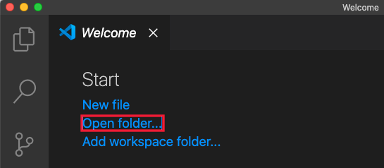
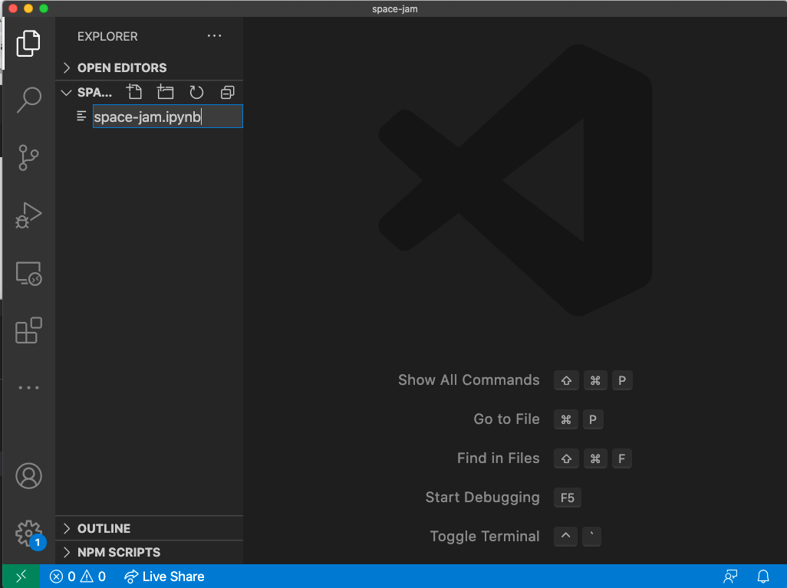
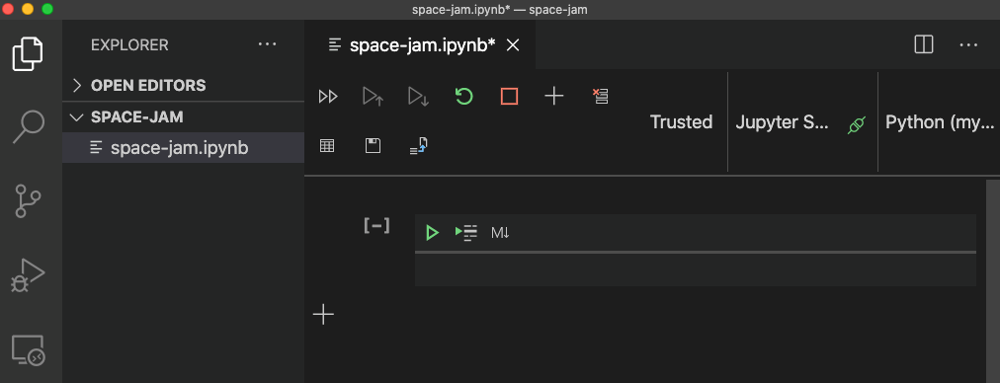
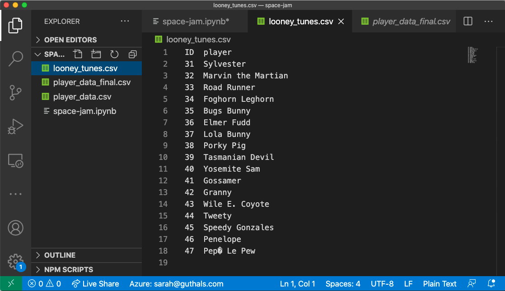
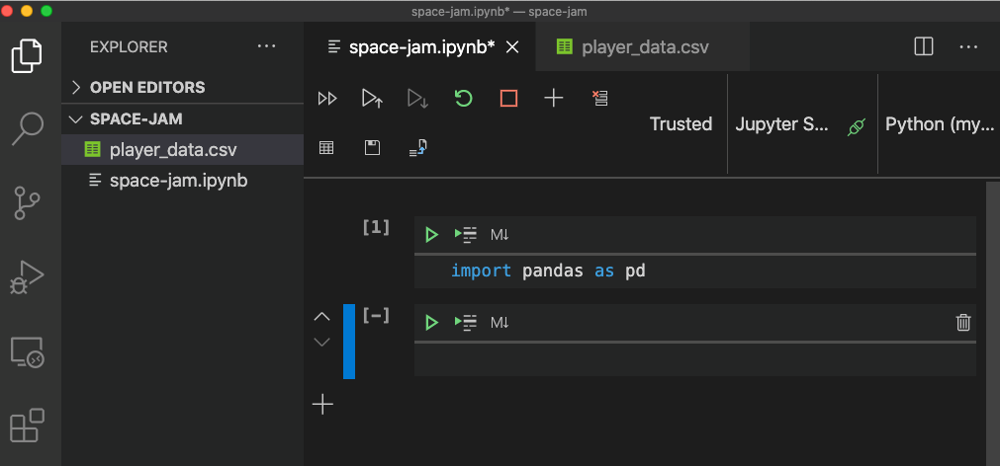
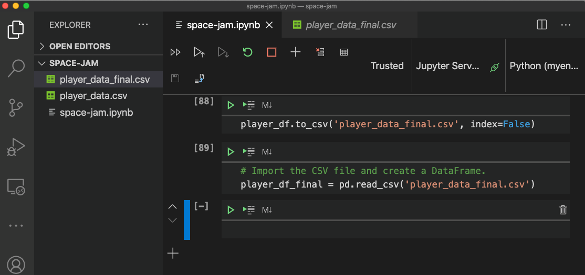
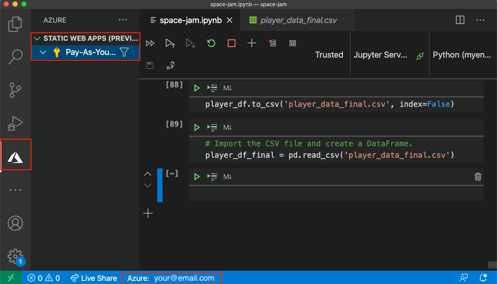
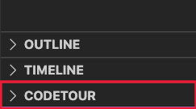

In *Space Jam: A New Legacy* we know that superstar LeBron James's teammates, the Tune Squad, are coming back in full force with their singular basketball skills and unique cartoon powers to have fun on the court. Their coach has been preparing to lead the team to victory against any opponent, but he doesn't have a ton of experience coaching a basketball team, so we're going to build a simple app to help him out. 

Before jumping into the module, be sure to make sure your environment is setup and ready to go. For this module, you will need Visual Studio Code, with the [Python](https://marketplace.visualstudio.com/items?itemName=ms-python.python?azure-portal=true) and [Azure Static Web App](https://marketplace.visualstudio.com/items?itemName=ms-azuretools.vscode-azurestaticwebapps?azure-portal=true) extensions installed. You will also need an [Azure account](/learn/modules/create-an-azure-account?azure-portal=true) and a [GitHub account](/learn/modules/introduction-to-github?azure-portal=true). 

If you haven't yet installed Visual Studio Code, you can find guides on the [Visual Studio Code Learn to Code site](https://aka.ms/LearnOnVSCode?azure-portal=true). Here, you can also find a Coding Pack for Python for Windows that will install everything you need for this module. If you're not on Windows, you can find a guide for seeting up your environment on the [Data Science in Visual Studio Code docs page](https://code.visualstudio.com/docs/python/data-science-tutorial?azure-portal=true).

## Setting up Visual Studio Code with a new Jupyter file

Once you have your environment setup, you should create a folder called space-jam-anl wherever you store code on your computer. This can be anywhere, for example, on your Desktop. You might already have this folder if you are contuining on from the [previous *Space Jam: A New Legacy* inspired module](/learn/modules/predict-basketball-player-efficiency-ratings?azure-portal=true).

:::image type="content" source="../media/new-folder.png" alt-text="Screenshot showing The new space-jam-anl folder created on the desktop.":::

Open Visual Studio Code, and from the Welcome tab, click "Open Folder". You can also do this by clicking File -> Open... and navigating to the folder you just created.



Create a new file in the space-jam-anl folder called space-jam-anl.ipynb by clicking on the new file icon next to the folder name in the Explorer.



>[!Note] 
>You can also just continue using the space-jam-anl.ipynb file that you created in the [previous *Space Jam: A New Legacy* inspired module](/learn/modules/predict-basketball-player-efficiency-ratings?azure-portal=true) if you already have that.

Make sure the file opens into a notebook and that the Jupyter server is connected and the kernel is pointing to the desired Python version.



## Downloading data with basketball stats and Tune Squad character names

Next, you will need some data. You might already have this data from the [previous *Space Jam: A New Legacy* inspired module](/learn/modules/predict-basketball-player-efficiency-ratings?azure-portal=true), but if you don't, you can download a clean copy from [player_data_final.csv on GitHub](https://aka.ms/LearnWithDrG/Basketball/Data2?azure-portal=true) and downloading the CSV file. Make sure you save the data in a file called player_data_final.csv and save it in the space-jam-anl folder you just created. 

Then, you will need the Tune Squad character names, which is stored in [tune_squad.csv on GitHub](https://aka.ms/LearnWithDrG/Basketball/Data3?azure-portal=true). Make sure you save the data in a file called tune_squad.csv and save it in the space-jam-anl folder you just created. 

Visual Studio Code should show you this data if you click on the CSV file. 



## Checking local setup with Python libraries

Now that you have your local environment and data ready to go, you should check to make sure everything is setup properly. 

If this is a new file, in the top cell of the space-jam-anl.ipynb file, import the Pandas library as pd. If you are continuing on with the file created in the [previous *Space Jam: A New Legacy* inspired module](/learn/modules/predict-basketball-player-efficiency-ratings?azure-portal=true), skip this import step, but be sure to re-run your entire notebook to ensure everything is loaded into your python environment. This will allow you to call Pandas functions using `pd.`. 

```python
import pandas as pd
```

If that completes, successfully, you should see a [1] next to the cell and no output. 



Next, you will make sure you can import the data into your coding environment by using the Pandas function `read_csv`. 

```python
# Import the CSV file and create a DataFrame.
player_df_final = pd.read_csv('player_data_final.csv')
```

If that us successful, you should see a `[2]` next to the cell (if you're continuing on with the file created in the [previous *Space Jam: A New Legacy* inspired module](/learn/modules/predict-basketball-player-efficiency-ratings?azure-portal=true) then you might see a different number than 2) and no output.



Now you're ready to start exploring and cleansing your data!

## Checking local setup with Azure Static Web Apps extension

Before continuing on, make sure you are logged in to Azure and you have access to your subscriptions within the Azure Static Web Apps extenion. 

Click on the Azure Extension on the left-hand icon menu and you should see a section for Static Web Apps. Within this section, you should see all of your Azure subscriptions, for example, a Pay-As-You-Go subscription. If you have not created an Azure Static Web App before, there should be nothing listed under the subscription. Make sure that at the bottom of your Visual Studio Code window, you are signed in to the Azure account that you want to create this resource under.



## Checking local setup with CodeTour extension

Finally, make sure you have installed [Visual Studio Code's CodeTour extension](https://aka.ms/codetour-mslearn). If you have, you should see it at the bottom of your Visual Studio Code Explorer. This will come in handy later when you are creating the web app because there are a lot of ways to build a vanilla JavaScript app and we will guide you through how we built ours!



© 2020 Warner Bros. Ent. All Rights Reserved