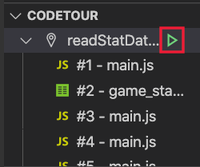
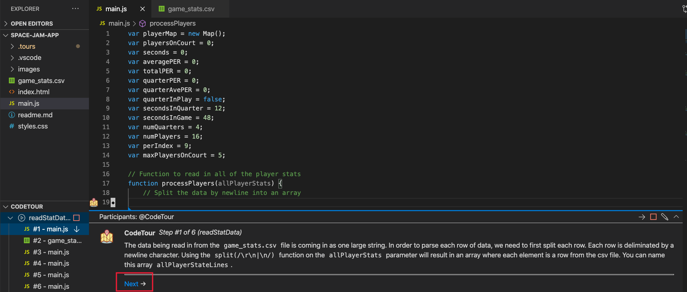

Now that you have your Azure Static Web App project created on GitHub and connected to Azure, you can start making the app functional!

We will be building a *very* simplistic app that really only has the basics. If you want, you can continue building up your web app after you complete the module to make it look better. We're going to focus on the functionality of connecting data with a web app.

While the rest of this module will include explanations for the code that we are writing, in this module, you have two options for actually writing the functionality for this web app:
* Use [CodeTour](https://aka.ms/codetour-mslearn) and be guided through writing the JavaScript from within Visual Studio Code
* Copy and paste code from this module as you did with Python code for the Jupyter notebooks

CodeTour will offer you an opportunity to see how well you can write code given instructions but not the exact code to copy and paste. If you want to challenge yourself, try starting with CodeTour. And you have nothing to worry about because you can always take a look at the code in this module to get you back on track if you get stuck. Whichever learning journey you choose today, you *will* be able to complete this module with a functional app that helps Tune Squad basketball coaches choose which player to give a water break to, while optimizing their chances of winning the game.

## Using CodeTour

Using [CodeTour](https://aka.ms/codetour-mslearn) is super easy, in fact, it's already setup in the repo that you cloned in the last unit!

Open the CodeTour extension in your Explorer in Visual Studio Code and you should see X tours. Each tour has a few steps in it to guide you through your code writing.

To get started with CodeTour, click on the green arrow for the first Tour called `readStatData`. When you do this, a step should pop up on line 19 of your `main.js` file, even if you didn't have it open. Follow the instructions in the step, and then click on the "Next" button at the bottom of the window to go on to the next step.

If at any point you want to stop the CodeTour, you can click on the red square next to the CodeTour name, and then you can resume again by clicking on that green arrow!

Once you have completed a CodeTour, the next one will be available for you to start. Each CodeTour guides you through creating a portion of the functionality for this app without giving you the exact code. If you get stuck, remember you can always take a look at this Learn module, or the `complete-code` branch in the repository you cloned.

© 2020 Warner Bros. Ent. All Rights Reserved