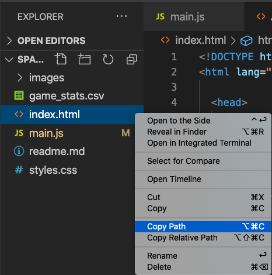

In the next function, `addPlayersToGame`, we are initializing the players on the web app. Since we want our coach to be able to move players from the bench to the court and back depending on each player's PER for a given quarter, we need to create HTML elements for each player that can have actions associated with them. One of the easiest ways to do this is to use buttons. 

Before we create a button for each player, we need to get the div where the players will be displayed in our web app. If we take a look at the `index.html` file we can see that there is a div with the id "bench", and nested in that div is another div called "playersOnBench". This is likely where we want the player buttons to appear.

```JavaScript
    // Get the bench div where the players will be shown
    var bench = document.getElementById("playersOnBench");
```

Now we need to create an HTML button element for each player. This button element needs to have:
- **id:** We will set the ID to the player's name so that it's easy to identify later on
- **className:** In the `styles.css` file we can see there is a `playerButton` class, so we can assign that here
- **onclick:** This will be the function that we want our app to call when the button is clicked
- **style:** There are a couple of style attributes like background color and width that we can set
- **playerImage:** We will add the player's image to the button, rather than their name

Once we have created the button, we can add it to the bench area that we identified above, and repeat this for each player.

```JavaScript
    // For each player, create a button 
    for (let playerName of playerMap.keys()) {
        var newPlayer = document.createElement("button");
        newPlayer.id = playerName;
        newPlayer.className = "playerButton";

        // When the button is clicked, call the movingPlayers function
        newPlayer.onclick = movingPlayers;

        // Style the button
        newPlayer.style.backgroundColor = "#AC6FAA";
        newPlayer.style.width = "32%";
        
        // Add the players image to the button
        var playerImage = document.createElement("img");
        playerImage.src = "images/"+playerName+".png";
        newPlayer.appendChild(playerImage);

        // Add the button to the bench
        bench.appendChild(newPlayer);
    }
```

## Testing our web app locally

Before continuing on, let's make sure our app is working so far. If we were to try to test our app at this point, we should be able to upload our `game_stats.csv` file and then the 16 characters should be added as buttons to the Bench area. 

We can test our app in two ways:
* We can commit our changes to the main branch on GitHub, triggering the GitHub Action, therefore redeploying our code to our Azure Static Web App. We will do this one in a later unit.
* We can save the `main.js` file and open `index.html` locally on a browser. We will do this one this time to save on testing time while we are still building. 

To test your web app locally, right-click on the `index.html` file and choose the Copy Path menu item. 



Then, open a browser and paste the path into the address bar. You should see the same app that we saw when we first deployed it, but this time we can actually start using it!

Click on the Choose File button at the top left of the app and find your `game_stats.csv` file. After it has been uploaded, you should see a couple of things happen:
1. The file name should appear next to the Choose File button
2. Your 16 players should be added to the Bench.

>[!NOTE] 
> If you click on the player buttons, nothing will happen yet because we haven't written the `movingPlayers` function yet.

:::image type="content" source="../media/first-test.png" alt-text="Screenshot showing the tirst functionality test of the web app.":::

## Add the PER for the first quarter to the app

Finally, we can add the PER values for each player for the first quarter to the app. This will happen in the next unit, but we know we need to call the function that will perform this task. 

```JavaScript
    // Call the function to add the PER for each player to the game
    addStatsToGame();
```

We can review the entire `addPlayersToGame` function here:

```JavaScript
// Function to add the players to the bench to start the game
function addPlayersToGame() {
    // Get the bench div where the players will be shown
    var bench = document.getElementById("playersOnBench");

    // For each player, create a button 
    for (let playerName of playerMap.keys()) {
        var newPlayer = document.createElement("button");
        newPlayer.id = playerName;
        newPlayer.className = "playerButton";

        // When the button is clicked, call the movingPlayers function
        newPlayer.onclick = movingPlayers;

        // Style the button
        newPlayer.style.backgroundColor = "#F6FA1B";
        newPlayer.style.width = "32%";
        
        // Add the players image to the button
        var playerImage = document.createElement("img");
        playerImage.src = "images/"+playerName+".png";
        newPlayer.appendChild(playerImage);

        // Add the button to the bench
        bench.appendChild(newPlayer);
    }

    // Call the function to add the PER for each player to the game
    addStatsToGame();
}
```

© 2020 Warner Bros. Ent. All Rights Reserved