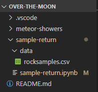

Now it's time to get data from the [Lunar Sample and Photo Catalog](https://curator.jsc.nasa.gov/lunar/samplecatalog/index.cfm) into Visual Studio Code so that you can use Python to quickly gain insight from the thousands of samples collected across the six Apollo missions to have landed on the Moon. 

## Set up your local environment

This module will guide you cleansing and manipulating data related to Moon rock samples. To do this, you will need to have some kind of Python notebook development environment setup. If you haven't done this before, we recommend the following steps to setup your local environment. The easiest way to do this is to follow the [Visual Studio Code data science setup docs](https://code.visualstudio.com/docs/python/data-science-tutorial). The three things you will need are:
- Visual Studio Code
- Python
- Miniconda

> [!NOTE]
> If you have already completed one of the Over the Moon Learn modules, you can open your "over-the-moon" folder in Visual Studio Code and skip to step 3. 

Once you have everything installed, follow these steps to get your environment ready:
1. Create a folder called "over-the-moon". 
2. Open the folder in Visual Studio Code
3. Create a folder inside that folder called "sample-return"
4. Create a folder inside that folder called "data"
5. Create a file called "sample-return.ipynb" in the "sample-return" folder
6. Open the sample-return.ipynb file in Visual Studio Code
7. Make sure you are using the conda environment that you setup above


Your environment should look like this: 
 


## Collect and import data

The data that will be explored during this module is a file full of all of the samples collected from the six Apollo missions to land on the Moon. The [rocksamples.csv]() file was created using information from the [Lunar Sample and Photo Catalog](https://curator.jsc.nasa.gov/lunar/samplecatalog/index.cfm). 

Download the [rocksamples.csv]() and save it in your data folder, your Visual Studio Code environment should look like this:



In the first Python cell in your sample-return.ipynb file, import Pandas and read the data file in as a dataframe:

```python
import pandas as pd 

rock_samples = pd.read_csv('data/rocksamples.csv') 
```

To make sure everything loaded in correctly, you can print the top five lines of the new dataframe with `head()` and the information summary with `info()`:

```python
rock_samples.head()
```

|   | ID | Mission | Type | Subtype | Weight(g) | Pristine(%) |
|---|---|---|---|---|---|---|
| 0 | 10001 | Apollo11 | Soil | Unsieved | 125.8 | 88.36 |
| 1 | 10002 | Apollo11 | Soil | Unsieved | 5629.0 | 93.73 |
| 2 | 10003 | Apollo11 | Basalt | Ilmenite | 213.0 | 65.56 |
| 3 | 10004 | Apollo11 | Core | Unsieved | 44.8 | 71.76 |
| 4 | 10005 | Apollo11 | Core | Unsieved | 53.4 | 40.31 |

```python
rock_samples.info()
```

> [!NOTE]
> Output is truncated to only include the table summary of data

```output
 #   Column       Non-Null Count  Dtype  
---  ------       --------------  -----  
 0   ID           2229 non-null   int64  
 1   Mission      2229 non-null   object 
 2   Type         2229 non-null   object 
 3   Subtype      2226 non-null   object 
 4   Weight(g)    2229 non-null   float64
 5   Pristine(%)  2229 non-null   float64
```

From this, we can see that there are 2,229 samples that were collected from the Apollo missions. Looking at a sample of the data we can see that each row contains:
- *ID* - The unique ID used to keep track of the sample at NASA
- *Mission* - The mission responsible for retrieving the sample
- *Type* - The type of sample (type of rock or other classification)
- *Subtype* - A more specific type classification
- *Weight(g)* - The original weight of the sample in grams
- *Pristing(%)* - The percentage of the sample that remains (some gets used up during research)