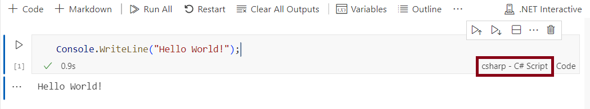
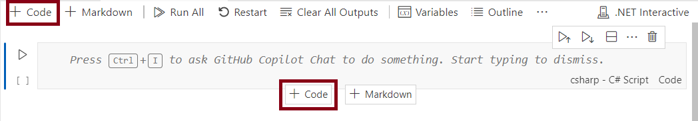
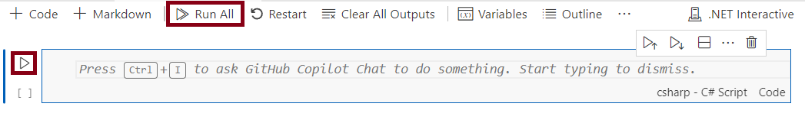

You can install Polyglot Notebooks as an extension for Visual Studio Code. The Polyglot Notebook extension is powered by .NET Interactive. .NET Interactive is a cutting-edge and innovative engine and API built on .NET for running and editing code interactively. 

To get started, you need to install the [latest .NET SDK](https://dotnet.microsoft.com/en-us/download/dotnet). You also need to install the [Polyglot Notebooks](https://marketplace.visualstudio.com/items?itemName=ms-dotnettools.dotnet-interactive-vscode) extension in Visual Studio Code. From there, you can create and run Notebooks and do much more.

## Creating a Notebook

Now that you've installed Polyglot Notebook, let’s talk a little about creating a notebook.

When you install the Polyglot extension, it installs a set of commands available through the Command Palette (**Ctrl + Shift + P**). Each command allows you to carry out a separate activity. Here are some of the commands installed:

- **Polyglot Notebook: Open Notebook**: This command opens a notebook so you can work with it.
- **Polyglot Notebook: Create new blank notebook**: This command creates a new notebook for you and allows you to select your preferred file format and programming language.
- **Polyglot Notebook: Stop all notebook kernels**: This command makes it impossible for you to switch kernels between cells.
- **Polyglot Notebook: Restart the current notebook’s kernel**: This causes all program state and data to be discarded. It's especially useful if the program is in a bad state or hanging. When restarted, you need to rerun all code cells.

When creating a new notebook, you need to go through a series of steps. First, you're asked to select a file format, either .dib or .ipynb. Next, you need to select your preferred language.

## Selecting a kernel

When using the .NET Interactive kernel, you can use different languages from one cell to the next, share variables between languages, and dynamically connect new languages and remote kernels within a notebook.

Selecting the section in the following screenshot lets you seamlessly switch from one language to another.

## File formats: .dib and .ipynb

The Jupyter notebook file format (.ipynb extension) is a plain-text file and retains not only the input cells, but also the output. It's one of the most common formats for notebooks because it makes it easy to share the file with others and not have to run it to see the output. It especially comes in handy because you could share your notebook, have someone else to run it, and then get it back to see the results. Some common examples are creating notebooks for automating or troubleshooting guides. Being a JSON file, it's hard to track and difficult to inspect changes between files.

The interactive notebook file (.dib extension) is a plain-text file that's easy to read, compare, and share. It never saves output values, which is important when notebooks are used to run code that could evaluate and print secret values like API keys and so on.

## Manage a Notebook

Every time you create a new notebook, a new cell is created. You can keep adding cells to your created Notebook. There are two types of cells, markdown or code cells. In code cells, you can input and run code in your preferred language.  

### Adding a code cell

If you need to add a new cell, select **+ Code**, and a new cell appears underneath the existing cell.

### Running a code cell

Whenever you need to run your code, just select the **Run** ▶️ icon (marked in red on the left-hand side). If you need to run all cells at the same time, you can select **Run All** (marked in red at the top.)

Whenever you need to clear the output out all cells, just select the **Trash** icon in the right-hand side of the cell.
