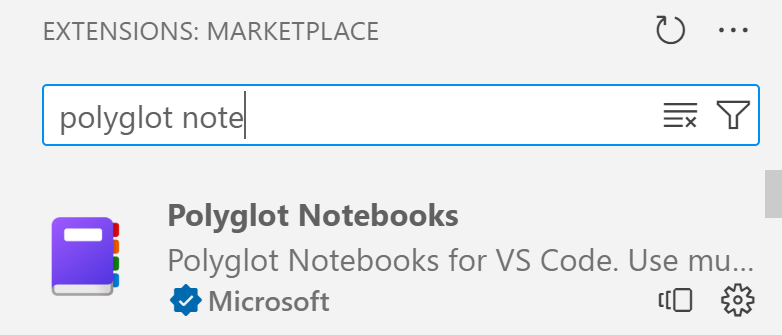
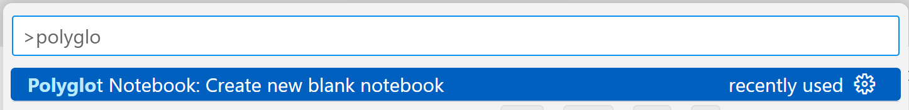
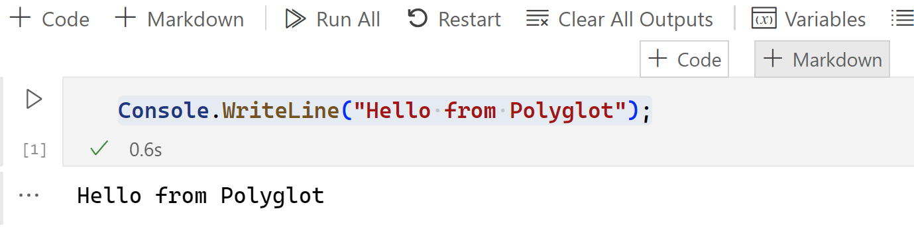
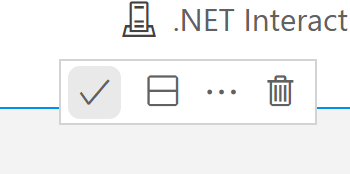
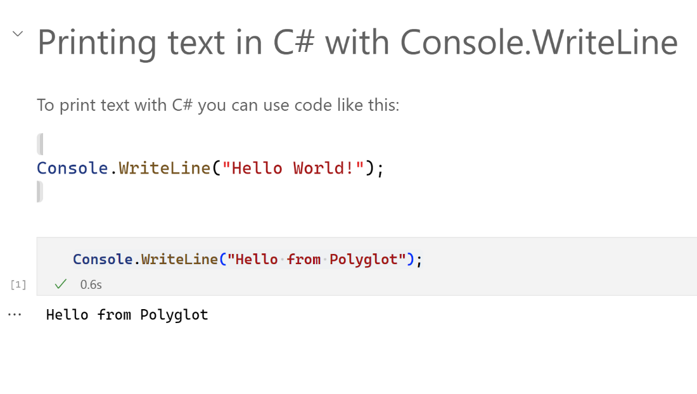

In this exercise, you learn how to set up your environment and run your first notebook created via the Polyglot Notebook extension.

## Set up environment

There are two things you need to be able to use Polyglot Notebooks, Visual Studio Code, .NET runtime and a Visual Studio Code extension.

- [Install Visual Studio Code](https://code.visualstudio.com/)
- [Install .NET runtime](https://dotnet.microsoft.com/download/dotnet/8.0)
- Install the "Polyglot Notebook" extension in Visual Studio Code. You can also select and [install the extension](https://marketplace.visualstudio.com/items?itemName=ms-dotnettools.dotnet-interactive-vscode).



Congratulations! You successfully installed all the tools you need to begin building with Polyglot Notebooks.

## Create and run a Notebook

Next, let’s create our first Notebook and let's learn to work with both text and code.

Via the command palette, type Polyglot and select the command "Polyglot Notebook: Create new blank notebook".



> [!NOTE]
> When you run this for the first time, you might see a message on the bottom right that says begins with “Installing .NET Interactive..”. Don't panic, that’s normal. 

You’re presented with choosing a file format, .dib or .ipynb as format, select **.ipynb**

Next it shows dialog for choosing default language. Select **C#**. At this point, it created a Notebook with a code cell in it. Let’s type and run code next.

Type the code into the code cell. To run the code, select the 'play' icon next to the cell.

```csharp
Console.WriteLine("Hello from Polyglot");
```


You should see the text "Hello from Polyglot" below the cell as indicated by the image.

## Create markdown cell

So far, you created a Notebook, wrote some code, and ran it successfully. Notebooks are great as it allows for the blending of both text and code, so let’s create markdown cell next to add some text.

Hover over the code cell until the commands +Markdown and +Code appears and select +Markdown like so:



You should now see a markdown cell in your code cell.

> [!NOTE]
> You can also hover below an element to create either a code or markdown cell. You decide if you want to add a cell at the top or below an element to best fit your use case.

Type the following text in the markdown cell you created:

```markdown
## Printing text in C# with Console.WriteLine
To print text with C#, you can use code like this:
Console.WriteLine("Hello World!");
```

To confirm the changes, select the 'check' icon on the top right of the cell like so:



Your Notebook should now look like the one in the image, consisting of a markdown cell on top and code element underneath:



Congrats, you managed to successfully install Polyglot Notebooks, created a Notebook, authored text and code cells and even ran code. In future sections, we explore more advanced features.
