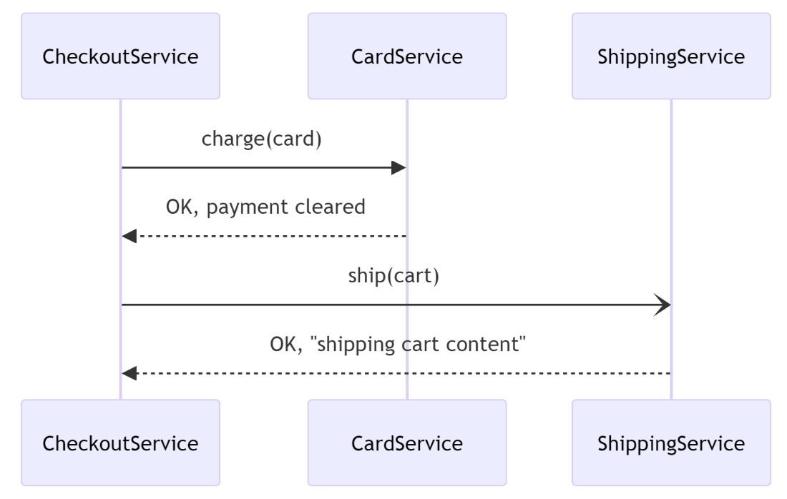

Asides writing text or code, Polyglot Notebooks is capable of rendering Mermaid diagrams. But what is Mermaid? Mermaid is a language that allows you express different types of charts and diagrams using text. Polyglot can take code written for Mermaid and rendering it. A good use case is to show how your code works.

Let’s work on an example that would document a purchase flow.

Imagine you want to document how your API works when a payment is processed from a purchase. Here’s the Mermaid code from a checkout method where code is called in steps through various layers:

``` mermaid 
class CheckoutService {
    private \_cart;
    private \_cardService;
    private \_shippingService;

    public CheckoutService(
        Cart cart,
        CardService cardService,
        ShippingService shippingService) {
        this.\_cart = cart;
        this.\_cardService = cardService;
        this.\_shippingService = shippingService;
    }

    public void Checkout() {
        if(this.\_cart.GetTotal() > 0) {
            let responseCode = this.\_cardService.Charge(new Card("Visa", "1234"));

            if (responseCode != 200) {
                throw new Exception("Unable to charge card");
            }
        
            this.\_shippingService.Ship("123 Main St", this.\_cart);
        }
    }
}
 ```

What you want is to quickly show through a visual how this code works, so therefore you use a Mermaid code like so:

```mermaid
sequenceDiagram
    CheckoutService ->> CardService: Charge(card)
    CardService -->> CheckoutService: OK, payment cleared
    CheckoutService -) ShippingService: Ship(cart)
    ShippingService -->> CheckoutService: OK, "shipping cart content"
```

And finally, by putting the mermaid code in a code cell you get a nice rendering like so:



The above visual from the Mermaid rendering is easier to comprehend at first glance and can also be shared with nontechnical stakeholders to show how the system works.
