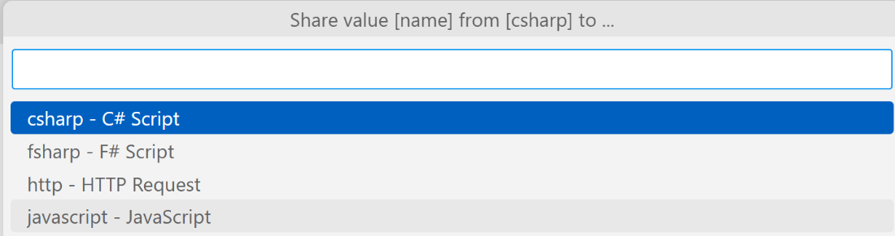

In this exercise, you'll try out some of the more advanced features in Polyglot Notebooks.

## Value sharing

Let's show how valuable it can be to share variables between cells using different kernels.  

1. Create a cell using the **+ Code** button.
1. In the drop-down list on the right side, select **csharp C# Script**.
1. Type the following code into the code cell:

    ```csharp
    var products = new []{"Saab", "Volvo", "BMW"};
    foreach(var product in products)
    {
        Console.WriteLine(product);
    }
    ```

1. Run the code cell using the **Run** icon.
1. Select the **Variables** menu option on in the toolbar at the top of the screen.
1. Select the **Share** icon in the Actions column.
1. Next, select the **javascript – JavaScript** option.

    

    You should see a new code cell being created, with JavaScript as kernel and containing the following code:

    ```javascript
    #!set --value @csharp:products --name products
    ```

    Now you have code in place that lets you use a C# variable.

1. Add the following code to your JavaScript cell:

    ```javascript
    console.log(products); // it should print Saab, Volvo, Fiat 
    ```

## Working with value storage

Let's try another case of variable sharing. This time, we'll work with JSON data.  

1. Create a new code cell by selecting **+ Code**, then select **value – Raw Value Storage** for kernel.

1. In the new cell, paste the following JSON:

    ```json
    #!value --name data
    [
        {
            "id": 1, "name": "video game", "price": 59.99
        }

        {
            "id": 2, "name": "book", "price": 9.99
        }

        {
            "id": 3, "name": "movie", "price": 19.99
        }
    ]
    ```

1. Run the cell and **data** should show up in the variables table, which should still be open from the previous section. If you need to reopen it, select **Variables** in the toolbar at the top of the screen.

1. Select the share icon in the **Actions** column for the **data** variable.

1. Select **csharp C# Script** as target cell. Your new C# cell should now have the following code:

    ```csharp
    #!set --value @value:data --name data
    ```

1. Next, paste the following code into the cell:

    ```csharp
    // import JSON in C#
    using System.Text.Json;

    // parse JSON in C#
    class Product
    {

        public int Id {get; set;}
        public string Name {get; set;}
        public decimal Price {get; set;}
    }

    // deserialize JSON, ignore case for property names
    JsonSerializerOptions options = new JsonSerializerOptions
    {
        PropertyNameCaseInsensitive = true
    }

    var products = JsonSerializer.Deserialize\<Product[]>(data, options);

    foreach(var product in products)
    {
        Console.WriteLine(product.Name);
    }
    ```

Congrats, you successfully learned more about working with variable sharing.
