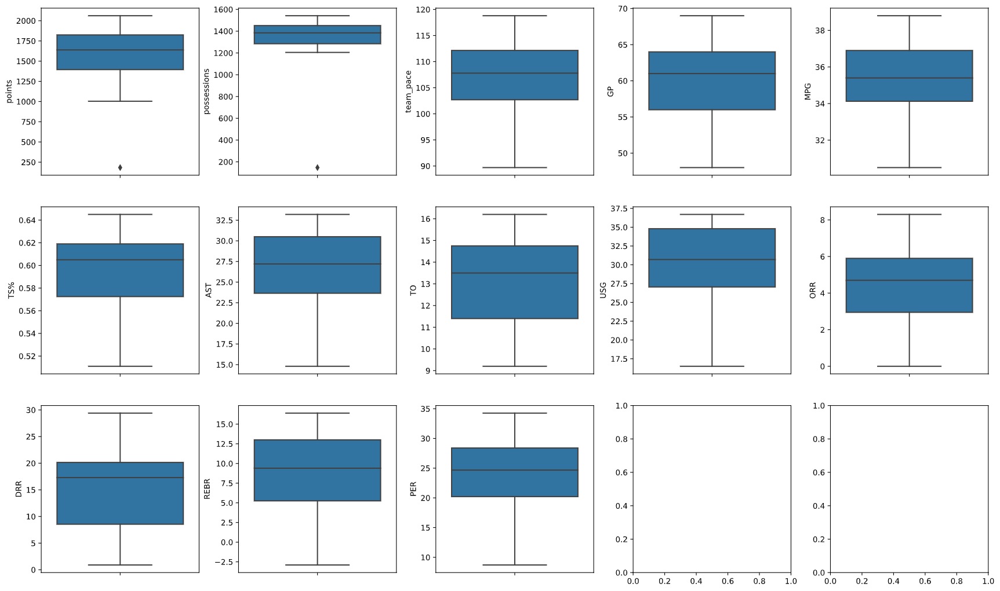

While we still have some lingering missing values, let's set those aside for a moment; we might want to impute replacement values for them and if we have any outliers in our dataset, those outliers might skew the values we end up using for to replace the null values.

*Outliers* refer to data values so far outside of the distribution of other data values in the dataset that they bring into question whether they even belong in the dataset. Outliers often arise from data errors or other undesirable noise and they are something we always need to check for and deal with before analyzing our data.

A quick way to identify if you might have outliers is to use the pandas `describe()` function:

```python
player_df.describe()
```

**Output**

 | | ID | points | possessions | team_pace | GP | MPG | TS% | AST | TO | USG | ORR | DRR | REBR | PER |
 |---|---|---|---|---|---|---|---|---|---|---|---|---|---|---|
 | count | 43.000000 | 43.000000 | 43.000000 | 43.000000 | 37.000000 | 38.000000 | 43.000000 | 43.000000 | 43.000000 | 43.000000 | 43.000000 | 43.000000 | 43.000000 | 34.000000 |
 | mean | 24.279070 | 1592.651163 | 1350.513953 | 106.711628 | 60.054054 | 35.331579 | 0.597209 | 26.267442 | 13.081395 | 30.565116 | 4.323256 | 14.946512 | 8.679070 | 22.926471 |
 | std | 14.114035 | 347.666978 | 213.708586 | 6.707963 | 5.622109 | 1.922851 | 0.029468 | 5.145859 | 2.013911 | 4.893187 | 2.067876 | 7.218176 | 5.077427 | 7.402536 |
 | min | 1.000000 | 183.000000 | 147.300000 | 89.700000 | 48.000000 | 30.500000 | 0.511000 | 14.800000 | 9.200000 | 16.500000 | 0.000000 | 0.900000 | -2.900000 | 8.710000 |
 | 25% | 12.500000 | 1395.500000 | 1284.800000 | 102.700000 | 56.000000 | 34.125000 | 0.572500 | 23.650000 | 11.400000 | 27.050000 | 2.950000 | 8.550000 | 5.250000 | 20.212500 |
 | 50% | 24.000000 | 1639.000000 | 1384.700000 | 107.800000 | 61.000000 | 35.400000 | 0.605000 | 27.200000 | 13.500000 | 30.700000 | 4.700000 | 17.300000 | 9.400000 | 24.675000 |
 | 75% | 36.500000 | 1824.500000 | 1451.550000 | 112.150000 | 64.000000 | 36.900000 | 0.619000 | 30.500000 | 14.750000 | 34.800000 | 5.900000 | 20.150000 | 13.000000 | 28.395000 |
 | max | 47.000000 | 2062.000000 | 1542.000000 | 118.800000 | 69.000000 | 38.800000 | 0.645000 | 33.200000 | 16.200000 | 36.700000 | 8.300000 | 29.400000 | 16.400000 | 34.260000 |

 Here we can see, for example, that the mean points for all 43 players is 24.27. But looking at the minimum (1), 25% (12.5), 50% (24), 75% (36.5), and max (47) numbers we can see that the min points (1) looks like it might be an outlier. We can use box plots to visualize this and determine for sure what might be an outlier.

## Create box plots for columns

The traditional tools for probing for outlying data values is the box plot. The 'box' in 'box plot' refers to the box that we draw that encloses the range of data from the 25th to the 75th percentiles (because these percentiles demarcate important quarters of the data, it is also call the interquartile range). This is the middle 50% of our data values for a given variable (a column in a DataFrame); we mark the median of the data (the 50th percentile) with another line.

The box plot is often also called a box-and-whisker plot because we draw a T shape above and below the box to encompass the maximum and minimum values of the data *excluding outliers*. This last part is important for our purposes here because it will let us graphically identify our outliers.

Ideally, we would produce the box plots for our columns in a single matrix that we could easily scan. Unfortunately, there is no single function to produce multiple box plots, so we will write a simple for loop to do this. Given how the Seaborn library in Python works, we need to explicitly state which cell in the matrix we want to render each box plot, so we will use the Python floor-division operator (`//`) to divide our 13 columns of interest (we don't need to look at `ID`) into rows and the modulo operator (`%`) to derive the column.

First, we need to import the MatplotLib and Seaborn libraries into our notebook:

```python
import matplotlib.pyplot as plt
import seaborn as sns
```

>[!NOTE]
>If you get an error when importing matplotlib or seaborn, you may need install the libraries. You can find instructions on how to install [MatplotLib here](https://matplotlib.org/3.3.2/users/installing.html?azure-portal=true) and [Seaborn here](https://seaborn.pydata.org/installing.html?azure-portal=true).

You should see no output, indicating that the libraries were successfully imported. Now, you can:

- Create a list of the column names, exlcuding ID, to use that as a way to find specific values within each row
- Create a matrix of subplots so that you can have one figure that shows all 13 columns
- Create padding around the subplots so that they are easier to read
- For each column, create a box plot based on the data in that column across all of the rows

```python
# Create a list of all column names (except for 'ID').
cols = list(player_df.iloc[:, 1:])

# Create a 3x5 matrix of subplots.
fig, axes = plt.subplots(3, 5, figsize=(18, 11))

# Create padding around subplots to make the axis labels readable.
fig.tight_layout(pad=2.0)

# Loop over the columns of the DataFrame and create a box plot for each one.
for i in range(len(cols)):
    sns.boxplot(ax=axes[i//5, i%5], y=player_df[cols[i]])
```

**Output**


Sure enough, we can see that we have two outliers in `points` and `possessions`. You can see these outliers represented as diamonds towards the bottom of the first two box plots that represent the `points` and `possessions` columns. These are so far out of the range of the other data that they are likely to represent garbage data and not a seriously underperforming player.

This is where subject matter expertise becomes important, in this case, knowledge of basketball. The likelihood of a player only ever scoring one point is extremely small because that player wouldn't likely be on a professional team. Similarly, the likelihood of a player having over 1,400 fewer possessions than the average number of possessions is also extremely unlikely. In this case, we are confident that these are incorrect data, but given another data set it may not be the case, so stopping to really evaluate outliers is critical to the data science journey.

## Identify and remove the rows containing the outlier values

We could dig into the data if we needed to. We it mistyped data? Corrupted in some form. With enough subject matter expertise or familiarity with how the data was gathered, we might attempt to correct the erroneous values. But there is also the danger of doing so that we introduce our own bias or pre-conceived notions about the data into the dataset, which could ultimate hurt our analysis. Given that we have 43 records remaining in the data, we are probably safest removing the offending row or rows.

The box plot only tells us that these outlying values exist, however. We now need to figure out in which row these values occur. Because the values both occur below the minimum value of their respective columns, we will use the `idxmin()` method on both columns. This method returns the index number of the row inwhich a minimum value occurs. (Note that we will want to check each value separately).

```python
# Identify the index number of the row with the lowest value in 'points'.
points_outlier = player_df['points'].idxmin()
points_outlier
```

```output
35
```

```python
# Identify the index number of the row with the lowest value in 'points'.
possession_outlier = player_df['possessions'].idxmin()
possession_outlier
```

```output
35
```

Fortunately, the outliers are both on the same row. We will now use the `drop()` function again to manually remove the row.

Note, we could manually enter the index number for the row, but this introduces the possibility of mistyping. Instead, we will use the variable we created to house the minimum value.

```python
# Drop the row with the outlying values for 'points' and 'possessions'.
player_df.drop(player_df.index[points_outlier], inplace=True)

# Check the end of the DataFrame to ensure that the correct row was dropped.
player_df.tail(10)
```

**Output**

| | ID | points | possessions | team_pace | GP | MPG | TS% | AST | TO | USG | ORR | DRR | REBR | PER |
|---|---|---|---|---|---|---|---|---|---|---|---|---|---|---|
| 32 | 37 | 1845.0 | 1435.7 | 113.1 | 69.0 | 36.9 | 0.634 | 33.2 | 14.0 | 36.5 | 4.1 | 21.5 | 16.4 | 34.26 |
| 33 | 38 | 1778.0 | 1526.4 | 109.3 | 66.0 | 34.9 | 0.612 | 30.6 | 15.9 | 35.9 | 5.5 | 18.8 | 13.7 | 28.65 |
| 34 | 39 | 1901.0 | 1444.1 | 109.7 | 67.0 | 36.5 | 0.609 | 27.2 | 14.8 | 35.5 | 5.0 | 21.8 | 8.9 | 20.12 |
| 36 | 41 | 2030.0 | 1431.0 | 112.3 | 68.0 | 37.0 | 0.618 | 32.5 | 15.3 | 34.5 | 5.7 | 15.7 | 13.2 | 30.07 |
| 37 | 42 | 1631.0 | 1465.7 | 110.1 | 66.0 | 37.5 | 0.613 | 28.4 | 14.4 | 35.7 | 6.5 | 20.7 | 14.0 | 28.40 |
| 38 | 43 | 1828.0 | 1507.2 | 112.7 | 64.0 | 36.5 | 0.618 | 31.3 | 14.0 | 34.9 | 5.9 | 21.3 | 14.5 | NaN |
| 39 | 44 | 1821.0 | 1443.7 | 118.8 | 66.0 | 36.6 | 0.609 | 27.3 | 13.5 | 35.8 | 7.0 | 23.8 | 11.5 | 22.96 |
| 40 | 45 | 1604.0 | 1526.5 | 114.5 | 67.0 | 37.6 | 0.633 | 28.2 | 13.0 | 34.2 | 6.1 | 19.0 | 16.3 | 33.89 |
| 41 | 46 | 1740.0 | 1443.9 | 114.1 | 68.0 | 37.1 | 0.611 | 26.6 | 15.2 | 29.3 | 8.3 | 17.7 | 11.1 | 21.22 |
| 42 | 47 | 1993.0 | 1459.0 | 112.5 | NaN | 36.9 | 0.627 | 30.4 | 15.0 | 33.7 | 6.3 | 19.3 | 14.1 | 28.76 |

Like `head()`, the `tail()` function shows the last five values of a DataFrame and, sure enough, we have removed the row we needed to (Row index 35).

We can reset the index for the DataFrame again to ensure accuracy within our data:

```python
# Renumber the DataFrame index to reflect the dropped rows.
player_df.reset_index(drop=True, inplace=True)
```

If you were to execute `player_df.tail(10)` again you would see the indices in order now until row 41.

© 2020 Warner Bros. Ent. All Rights Reserved