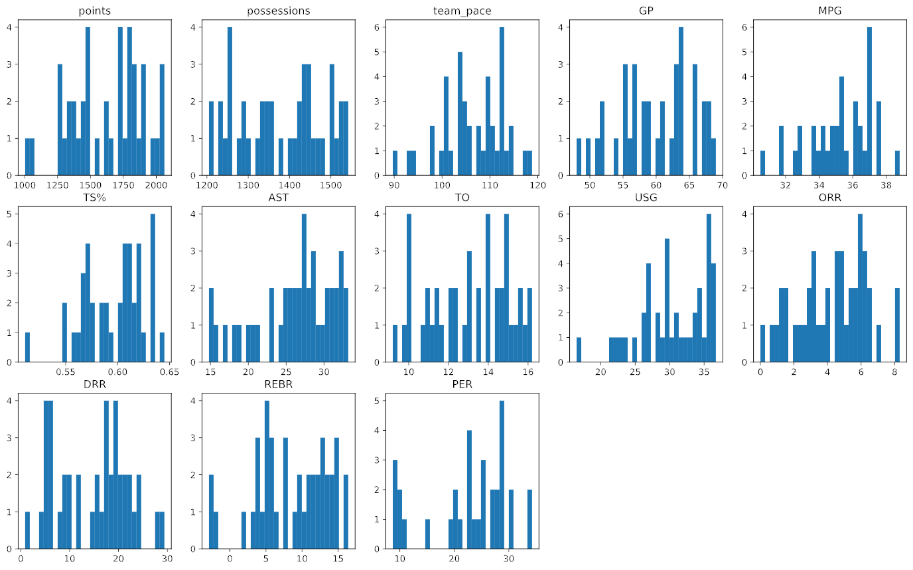
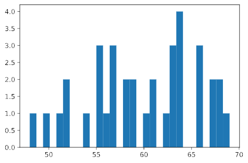
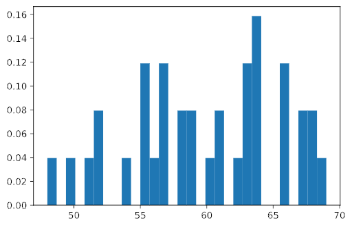
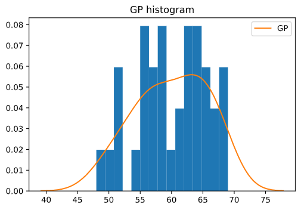
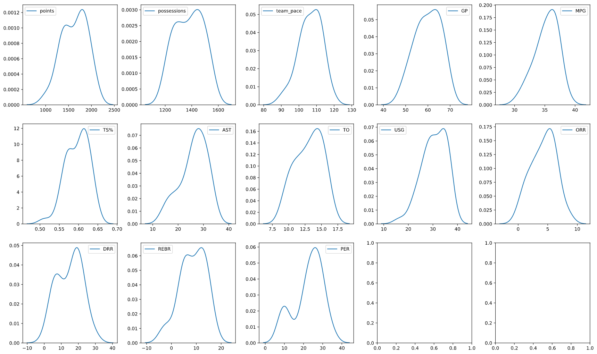

We removed the row that had the outliers in the `points` and `possessions` columns, but we still have scattered missing values to deal with. Let's remind ourselves of what those are now.

```python
# Recheck the totals for NaN values by row.
player_df.isna().sum()
```

```output
ID             0
points         0
possessions    0
team_pace      0
GP             6
MPG            5
TS%            0
AST            0
TO             0
USG            0
ORR            0
DRR            0
REBR           0
PER            9
dtype: int64
```

These are a lot of missing values, possibly spanning many more rows and that would be a lot of data to discard. Let's see if we can make some educated guesses about what to fill in for them.

As a review, here is a breakdown of the data we working with in our dataset. The data in different columns can behave quite differently and we will want to apply some domain expertise to the data as we decide how to impute missing values:

| Column Name | Column Description |
|-------------|--------------------|
| ID | a unique identifier for each player in the dataset |
| points | total points scored by a player in a season |
| possessions | total possessions by a player in a season |
| team_pace | the average number of possessions a team uses per game |
| GP | games played by a player in a season |
| MPG | average minutes played by a player per game |
| TS% | True Shooting Percentage, a player's shooting percentage taking free throws and 3-pointers into account |
| AST | Assist Ratio, the percentage of a player's possessions that end in an assist |
| TO | Turnover Ratio, the percentage of a player's possessions that end in a turnover |
| USG | Usage Rate, the number of possessions a player uses per 40 minutes |
| ORR | Offensive rebound rate |
| DRR | Defensive rebound rate |
| REBR | Rebound Rate, the percentage of missed shots that a player rebounds |
| PER | the player efficiency rating (PER), a measure of a player's per-minute productivity on the court |

One common strategy for imputation is to replace missing value with the value immediately above or below it. But given that our missing values are for PACE, points, possessions, and PER (and that we have no idea what the order of players might be in our DataFrame, such as consecutive players being on the same team), this is probably not a good strategy for us.

Another common technique is to replace missing values in a column with the average value of that column. This might be appropriate for these columns, but we should check to see how the data in each of them is distributed.

## Create histograms of the DataFrame data

A common means of visualizing the distribution of data is the histogram, a bar chart of the how many times the data in a dataset appears within a range of values. These ranges are called *bins* and we will produce a pretty granular view of our data by constructing our histograms using 30 bins.

There is no built-in function in Python or in commonly used libraries for plotting multiple histograms, either, so we will use a `for` loop as we did with the box plots to produce them. (Matplotlib is a little more forgiving about this than Seaborn, so we can just plot these sequentially without having to explicitly state a column and row in which to place each histogram.)

```python
# Create a list of all column names (except for 'ID').
cols = list(player_df.iloc[:, 1:])

# Define the size for the plots and add padding around them.
fig = plt.figure(figsize=(18, 11))
fig.tight_layout(pad=5.0)

# Loop over the columns in the DataFrame and create a histogram for each one.
for i in range(len(cols)):
    plt.subplot(3, 5, i+1)
    plt.hist(player_df[cols[i]], bins=30)
    plt.title(cols[i])
```



Most of these don't look normally distributed (the familiar bell curve), but it is tough to be certain with the human eye. We could try using fewer bins, but we might also miss some important information in a lower-resolution histogram. Instead, we will try a different kind of visualization.

Let's look at a single histogram for a moment (in this case, the one for `GP` - games played).

```python
# Create a histogram for the 'GP' column.
plt.hist(player_df['GP'], bins=30);
```



**Note:** Adding the `;` at the end of the `hist()` function call will cause the output to only show the graph and not any additional textual information about the underlying data. For example, if you removed the `;` from the line above you would see:

```output
(array([1., 0., 1., 0., 1., 2., 0., 0., 1., 0., 3., 1., 3., 0., 2., 2., 0.,
        1., 2., 0., 1., 3., 4., 0., 0., 3., 0., 2., 2., 1.]),
 array([48. , 48.7, 49.4, 50.1, 50.8, 51.5, 52.2, 52.9, 53.6, 54.3, 55. ,
        55.7, 56.4, 57.1, 57.8, 58.5, 59.2, 59.9, 60.6, 61.3, 62. , 62.7,
        63.4, 64.1, 64.8, 65.5, 66.2, 66.9, 67.6, 68.3, 69. ]),
 <a list of 30 Patch objects>)
 ```

 before the graph.

Currently it provides the number of counts for each bin. However, we could change the `density` parameter in the function so that the height of each column in the histogram showed that column's share of the overall area of the histogram rather than instance-counts. (In other words, `density=True` means that the area of the columns in the histogram add up to 1.)

```python
# Create a histogram for the 'GP' column, this time as a probability density.
plt.hist(player_df['GP'], density=True, bins=30);
```



## Create kernel-density estimates of the DataFrame data

Furthermore, we don't have to use rectangles in the histogram. We could just as easily render is using triangles, trapezoids, or even tiny Gaussian bell curves. This latter shape is basically what the kernel-density estimate (KDE) does. It essentially creates a histogram of little bells curves, the area under which is 1. Here is what the KDE of `GP` looks like compared to a 15-bin histogram.

```python
# Plot the KDE for 'GP' over the probability-density histogram.
plt.hist(player_df['GP'], density=True, bins=15)
plt.title('GP histogram')
sns.kdeplot(player_df['GP']);
```



The KDE helps us see that more clearly than the histogram does that `GP`'s distribution is kind of bell-shaped but with a bulge on the right side. Let's use a `for` loop to generate a matrix of KDEs for all our columns.

```python
# Create a list of all column names (except for 'ID').
cols = list(player_df.iloc[:, 1:])

# Create a 3x5 matrix of subplots and add padding around them for readability.
fig, axes = plt.subplots(3, 5, figsize=(18, 11))
fig.tight_layout(pad=2.0)

# Loop over the columns of the DataFrame and create a KDE for each one.
for i in range(len(cols)):
    sns.kdeplot(ax=axes[i//5, i%5], data=player_df[cols[i]])
```



Sure enough, many of these columns have KDEs with two very pronounced tops. Each top represents a mode of the data, or a value around which values in the dataset concentrate. The fact that so many of our columns are bimodal indicates that our dataset represents samples from two discrete populations.

© 2020 Warner Bros. Ent. All Rights Reserved