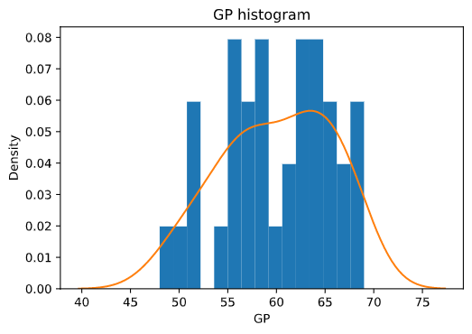
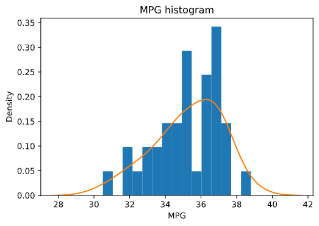
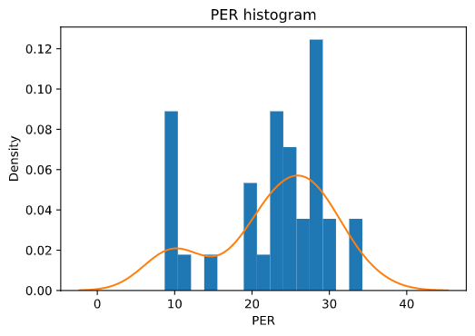

We know that we have missing values throughout our data still, let's remind ourselves which columns are missing values.

```python
# Recheck the totals for NaN values by row.
player_df.isna().sum()
```

```output
ID             0
player         0
points         0
possessions    0
team_pace      0
GP             6
MPG            5
TS%            0
AST            0
TO             0
USG            0
ORR            0
DRR            0
REBR           0
PER            9
dtype: int64
```

First, let's revisit the histograms for `GP` and `MPG`:

```python
# Plot the KDE for 'GP' over the probability-density histogram.
plt.hist(player_df['GP'], density=True, bins=15)
plt.title('GP histogram')
sns.kdeplot(player_df['GP']);
```



```python
# Plot the KDE for 'MPG' over the probability-density histogram.
plt.hist(player_df['MPG'], density=True, bins=15)
plt.title('MPG histogram')
sns.kdeplot(player_df['MPG']);
```



If we squint hard enough, `GP` and `MPG` are both close enough to normally distributed that we can justify impute their missing values using an average value for each respective column. However, this is not the case with `PER`:

```python
# Plot the KDE for 'PER' over the probability-density histogram.
plt.hist(player_df['PER'], density=True, bins=15)
plt.title('PER histogram')
sns.kdeplot(player_df['PER']);
```



So we will have to handle that one differently, in the next unit.

## Impute missing values with average values

In order to impute the missing values in our normally-enough distributed columns, we will use the `fillna()` DataFrame method. In our code, we will state that we are working with only three of our columns (`player_df[['GP','MPG']]`) and that we want to replace `NaN` values in each of those columns with those columns' respective mean values (`fillna(value=player_df[['GP','MPG']].mean())`). (Once again, stringing pandas methods together makes our job much, much easier.)

```python
# Replace the missing values in 'GP' and 'MPG' with the mean values of the respective columns.
player_df[['GP','MPG']] = player_df[['GP','MPG']].fillna(value=player_df[['GP','MPG']].mean())

# Recheck the totals for NaN values by row to ensure that the expected missing values have been filled in.
player_df.isna().sum()
```

```output

ID             0
player         0
points         0
possessions    0
team_pace      0
GP             0
MPG            0
TS%            0
AST            0
TO             0
USG            0
ORR            0
DRR            0
REBR           0
PER            9
dtype: int64
```

We nearly have cleansed data! Only one column left to manipulate.

© 2020 Warner Bros. Ent. All Rights Reserved