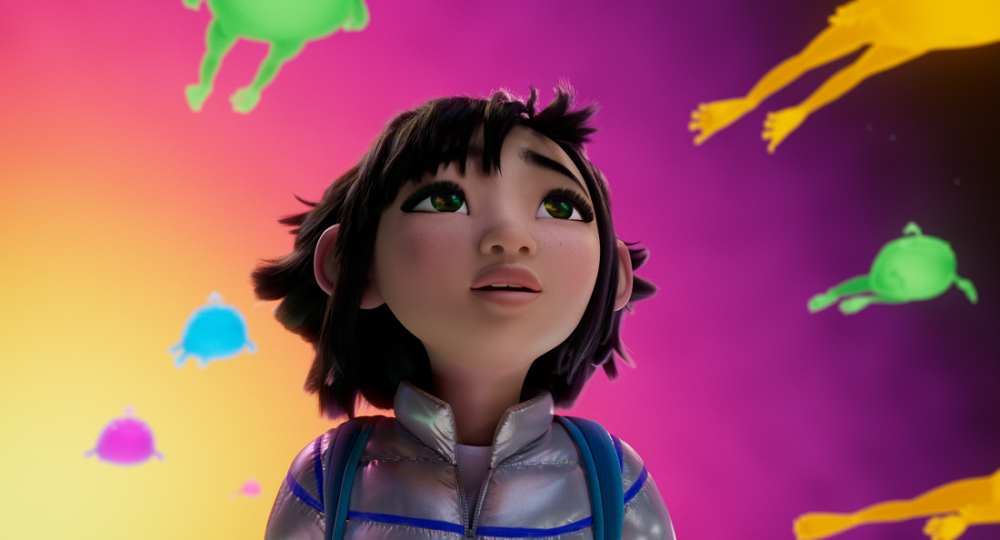

The stories of stars flying through out night skies have been passed down through all cultures and families and through thousands of years. Each intepretation of our participation in this vast universe provides us with an inspirational lens to view new challenges and solutions. 

The story of Fei Fei and Chang'e is no different. Over the Moon delivers a brilliant narrative to events that happen in every night in our shared sky. While we cannot predict the mood of Chang'e, or know if it's really flying frogs we're looking at, we can begin to feel closer to the celestial events through what we do know. 

While the lists and notifications of meteor showers and other space events may seem common place in a world full of apps and websites, the data that goes behind these predictions is still very complex. In this module, we've only begun to tap into the beginning of how we can accurately predict where and when a meteor shower can be viewed. But you are now equipped to start gathering data on other celestial (or Earth-bound) events and start to explore that data through code to gain understanding and new perspectives. This is the first step to creating models that computers can run on their own to make predictions, it all starts with one person's curiosity. 

And remember, this module is a part of a multi-modal approach to learning, meaning you can also follow along with a video tutorial on the [Learn with Dr G Learn TV video series](https://aka.ms/LearnWithDrG).