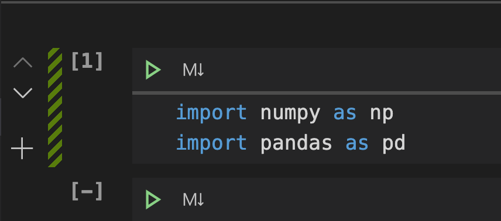

Recall the data science project lifecycle - after you have the data that you want to use to make your predictions, you have to make sure the data is prepared for analysis. Follow this unit to explore the data that you have and make sure it's ready to use in the machine learning model. 

## Exercise: Import data

First, you need to import the csv files into your Python notebook. First, import numpy and pandas:

```python
import numpy as np 
import pandas as pd 
```

Make sure you run the cell to ensure you have your environment setup. Your Visual Studio Code notebook should look like this:

Notice that there is a `[1]` in the top left of the cell where you have your import code. That means that the cell has completed running. There is no output between the first and second cell, meaning it was successful. 

Now you can import all four csv files:

```python
meteor_showers = pd.read_csv('data/meteorshowers.csv')
moon_phases = pd.read_csv('data/moonphases.csv')
constellations = pd.read_csv('data/constellations.csv')
cities = pd.read_csv('data/cities.csv')
```

## Exercise: Explore data

Now you can look through the data. For each of the variables you created, print the head and the info for those dataframes. `head` will allow you to see the first five lines in the csv files and `info` will give you an overview of what data might be missing. 

```python
meteor_showers.head()
```

```python
meteor_showers.info()
```

```python
moon_phases.head()
```

```python
moon_phases.info()
```

```python
constellations.head()
```

```python
constellations.info()
```

```python
cities.head()
```

```python
cities.info()
```

### Convert to numbers

We can see from the calls to `head()` that there is a lot of information that is written in words (strings) instead of numbers (integers). There is some data where it makes sense to have it in strings, like city names or meteor shower names. But there is other data where it makes more sense to have it represented as integers, like months or moon phases.

You can quickly convert all of the month columns to numbers by:
1. Create a map of months to numbers. We can see from the output of `head()` that the months are written all lowercase. 
2. Map the map of months to the columns that have months in them. 
3. Save that back to the dataframe.

```python
months = {'january':1, 'february':2, 'march':3, 'april':4, 'may':5, 'june':6, 'july':7, 'august':8, 'september':9, 'october':10, 'november':11, 'december':12}
meteor_showers.bestmonth = meteor_showers.bestmonth.map(months)
meteor_showers.startmonth = meteor_showers.startmonth.map(months)
meteor_showers.endmonth = meteor_showers.endmonth.map(months)
moon_phases.month = moon_phases.month.map(months)
constellations.bestmonth = constellations.bestmonth.map(months)
```

You can verify that these were modified by adding in calls to `head()` and `info()` to each of the three dataframes that you modified. For example:

```python
meteor_showers.head()
```

| | name | radiant | bestmonth | startmonth | startday | endmonth | endday | hemisphere | preferredhemisphere |
|--|-----|---------|-----------|------------| ---------|----------|--------|------------| --------------------|
| 0 | Lyrids | Lyra | 4 | 4 | 21 | 4 | 22 | northern | northern |
| 1 | Eta Aquarids | Aquarius | 5 | 4 | 19 | 3 | 28 | northern, southern | southern |
| 2 | Orionids | Orion | 10 | 10 | 2 | 11 | 7 | northern, southern | northern, southern |
| 3 | Perseids | Perseus | 8 | 7 | 14 | 8 | 24 | northern | northern |
| 4 | Leonids | Leo | 11 | 11 | 6 | 11 | 30 | northern, southern | northern, southern |

```python
meteor_showers.info()
```

```output
<class 'pandas.core.frame.DataFrame'>
RangeIndex: 5 entries, 0 to 4
Data columns (total 9 columns):
 #   Column               Non-Null Count  Dtype 
---  ------               --------------  ----- 
 0   name                 5 non-null      object
 1   radiant              5 non-null      object
 2   bestmonth            5 non-null      int64 
 3   startmonth           5 non-null      int64 
 4   startday             5 non-null      int64 
 5   endmonth             5 non-null      int64 
 6   endday               5 non-null      int64 
 7   hemisphere           5 non-null      object
 8   preferredhemisphere  5 non-null      object
dtypes: int64(5), object(4)
memory usage: 488.0+ bytes
```

Before continuing, you have months and days in the meteor_showers dataframe that can be converted to a type called `datetime`, which tracks dates.

Create two new columns, startdate and enddate that will contain the month and day (assuming 2020) for that column:

```python
meteor_showers['startdate'] = pd.to_datetime(2020*10000+meteor_showers.startmonth*100+meteor_showers.startday,format='%Y%m%d')
meteor_showers['enddate'] = pd.to_datetime(2020*10000+meteor_showers.endmonth*100+meteor_showers.endday,format='%Y%m%d')
```

You should also do this for the moon_phases:

```python
moon_phases['date'] = pd.to_datetime(2020*10000+moon_phases.month*100+moon_phases.day,format='%Y%m%d')
```

Next, you can convert hemisphere data to numbers using the mapping process from earlier:

```python
hemispheres = {'northern':0, 'southern':1, 'northern, southern':3}
meteor_showers.hemisphere = meteor_showers.hemisphere.map(hemispheres)
constellations.hemisphere = constellations.hemisphere.map(hemispheres)
```

Finally, you can convert Moon phases to numbers that represent the percentage of the moon showing. This time, you will add a new column to represent this data:
1. Create the map of phases to numbers
2. Add a new column called percentage and set it to the moonphase column mapped to the numbers
3. Show the first 5 rows

```python
phases = {'new moon':0,'third quarter':0.5, 'first quarter':0.5,'full moon':1.0}
moon_phases['percentage'] = moon_phases.moonphase.map(phases)
moon_phases.head()
```

| month | day | moonphase | specialevent | date | percentage |
|-------|-----|-----------|--------------|------|-----------|
| 0 | 1 | 1 | NaN | NaN | 2020-01-01 | NaN |
| 1 | 1 | 2 | first quarter | NaN | 2020-01-02 | 0.5 |
| 2 | 1 | 3 | NaN | NaN | 2020-01-03 | NaN |
| 3 | 1 | 4 | NaN | NaN | 2020-01-04 | NaN |
| 4 | 1 | 5 | NaN | NaN | 2020-01-05 | NaN |

Now you have converted all data that makes sense to be in numbers to numbers. But you can see that there are some missing values. 

### Remove unnecessary data

Some of the data from these csv files aren't that useful. You can delete the following data:

| dataframe | columns to remove | reason |
|-----------|-------------------|--------|
| meteor_showers | startmonth, startday, endmonth, endday, hemisphere | The month and day info is captured in the startdate and enddate columns and the preferredhemisphere column is the optimal value |
| moon_phases | month, day, moonphase, specialevent | month and day are captured by date, moonphase is captured by percentage, and specialevent isn't relevant |
| constellations | besttime | It is 21:00 for every row |

You can drop those columns like this:

```python
meteor_showers = meteor_showers.drop(['startmonth', 'startday', 'endmonth', 'endday', 'hemisphere'], axis=1)
moon_phases = moon_phases.drop(['month','day','moonphase','specialevent'], axis=1)
constellations = constellations.drop(['besttime'], axis=1)
```

Now it's time to fill in missing data.

### Missing data

One of the csv files is particularly interesting. The output of `moon_phases.info()` shows us:

```output
<class 'pandas.core.frame.DataFrame'>
RangeIndex: 366 entries, 0 to 365
Data columns (total 2 columns):
 #   Column      Non-Null Count  Dtype         
---  ------      --------------  -----         
 0   date        366 non-null    datetime64[ns]
 1   percentage  50 non-null     float64       
dtypes: datetime64[ns](1), float64(1)
memory usage: 5.8 KB
```

You can see that the cycle of moon phases goes from 0 to 0.5 to 1 to 0.5 then back to 0. So you could conceivably make every value in between 0 and 0.5 be 0.25 and every value in between 0.5 and 1 be 0.75. You could get more detailed by figuring out a more accurate percentage on your own:
1. Import the math Python library
2. Create a variable to save the last phase that you saw
3. Loop through each row and columnt in the moon_phases dataframe
4. If the value in the percentage column of that row is nan (null), replace it with the last phase that you saw
5. If it isn't nan, save that as the last phase that you saw
6. Show the info for the moon_phase dataframe

```python
lastPhase = 0

for index, row in moon_phases.iterrows():
    if pd.isnull(row['percentage']):
        moon_phases.at[index,'percentage'] = lastPhase
    else:
        lastPhase = row['percentage']
        
moon_phases.info()
```

```output
<class 'pandas.core.frame.DataFrame'>
RangeIndex: 366 entries, 0 to 365
Data columns (total 2 columns):
 #   Column      Non-Null Count  Dtype         
---  ------      --------------  -----         
 0   date        366 non-null    datetime64[ns]
 1   percentage  366 non-null    float64       
dtypes: datetime64[ns](1), float64(1)
memory usage: 5.8 KB
```

Now you have your data cleaned and ready to be analyzed!