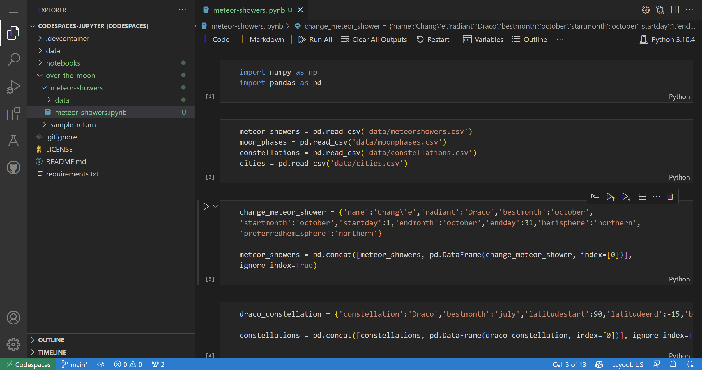

What we have done so far is use real-world data, but we do have one more bit of information from Over the Moon that we could take into account: When Chang'e cries, she created stardust and meteor showers. 

Though we don't know when this might happen, we *do* know there was a moment in the film where this does happen. We can create new data that takes this into account!


## Determine the right data

We know that Fei Fei travels to Lunaria after the Moon Festival. Though we don't know exactly how long it takes her to prototype, test, and build her rocket, we can guestimate. 

The 2020 Chinese Moon Festival is on October 1. Since the rest of the dates we are using in this module are from 2020, let's use that one. 

We need to make sure we have data for each of the dataframes that we are referencing, so let's start with the meteor shower from the film. We chose the Draco constellation for Chang'e's meteor shower because it is where the Draconids meteor shower is likely to radiate from in early October, so we will use that meteor shower as inspiration for our fictional one:
```python
change_meteor_shower = {'name':'Chang\'e','radiant':'Draco','bestmonth':'october','startmonth':'october','startday':1,'endmonth':'october','endday':31,'hemisphere':'northern','preferredhemisphere':'northern'}
```

Next, we need to create a constellation entry for the Draco constellation:
```python
draco_constellation = {'constellation':'Draco','bestmonth':'july','latitudestart':90,'latitudeend':-15,'besttime':2100,'hemisphere':'northern'}
```

Next, we need to append these two entries into the dataframes. Go to the very top of your Python notebook file and add in two new cells after the second cell with the following code:
```python
change_meteor_shower = {'name':'Chang\'e','radiant':'Draco','bestmonth':'october','startmonth':'october','startday':1,'endmonth':'october','endday':31,'hemisphere':'northern','preferredhemisphere':'northern'}

meteor_showers.append(change_meteor_shower, ignore_index=True)
```

```python
draco_constellation = {'constellation':'Draco','bestmonth':'july','latitudestart':90,'latitudeend':-15,'besttime':2100,'hemisphere':'northern'}

constellations.append(draco_constellation, ignore_index=True)
```

Your code should look like this:



Now, rerun all of the code in your notebook by:
1. Click on the clear all output button (stacked rectangles with an x).
1. Click on the restart iPython kernel button (circle arrow). 
1. Click on the Run all cells button (double-right-arrow).

At the very bottom of your Python notebook file, change the city to Beijing:

```python
print(predict_best_meteor_shower_viewing('Beijing'))
```

And with this, you should see your output that includes the Chang'e meteor shower inspired by the film!

```output
In Beijing you can see the following meteor showers:
Lyrids is best seen if you look towards the Lyra constellation on April 22, 2020.
Eta Aquarids is best seen if you look towards the Aquarius constellation on April 22, 2020.
Orionids is best seen if you look towards the Orion constellation on October 16, 2020.
Perseids is best seen if you look towards the Perseus constellation on July 20, 2020.
Chang'e is best seen if you look towards the Draco constellation on October 16, 2020.
```

One last change we have to make our predictive algorithm more accurate to the film: Fei Fei travels to the moon when it is big and bright, so we should change the viewing to be closer to 1. Change the predictive function after you get the moon_date_list and before the return statement:

```python
        if meteor_shower == 'Chang\'e':
            # For the film meteor shower, find the date where the moon is the most visible
            best_moon_date = moon_phases_list.loc[moon_phases_list['percentage'].idxmax()]['date']

            # Add that date to the string to report back to the user
            meteor_shower_string += "Though the moon will be bright, " + meteor_shower + "'s meteor shower is best seen if you look towards the " + constellation + " constellation on " +  best_moon_date.to_pydatetime().strftime("%B %d, %Y") + ".\n"
        else:
            # Find the first date where the moon is the least visible
            best_moon_date = moon_phases_list.loc[moon_phases_list['percentage'].idxmin()]['date']

            # Add that date to the string to report back to the user
            meteor_shower_string += meteor_shower + " is best seen if you look towards the " + constellation + " constellation on " +  best_moon_date.to_pydatetime().strftime("%B %d, %Y") + ".\n"
```

```output
In Beijing you can see the following meteor showers:
Lyrids is best seen if you look towards the Lyra constellation on April 22, 2020.
Eta Aquarids is best seen if you look towards the Aquarius constellation on April 22, 2020.
Orionids is best seen if you look towards the Orion constellation on October 16, 2020.
Perseids is best seen if you look towards the Perseus constellation on July 20, 2020.
Though the moon will be bright, Chang'e's meteor shower is best seen if you look towards the Draco constellation on October 01, 2020.
```

With that, we know that when Fei Fei's family is gathering for the Moon Festival, they might be able to look into the sky to see Chang'e showering them, hopefully with tears of happiness and rememberance instead of sadness.

