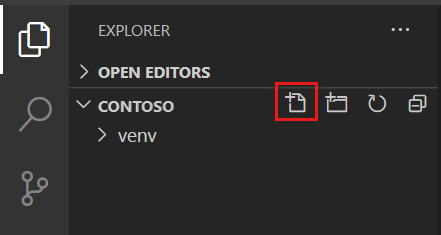

To get started writing our Flask application with Python, we need to set up our development environment, which will require a couple of items to be installed. Fortunately, the tools we'll use are relatively common, so they'll serve you well even beyond this module. You might even have them installed! We'll use these tools to develop and test your application locally.

In this unit, you'll learn how to install Python tooling and create a virtual Python environment. You'll install Flask, which is the framework we'll use for creating the website.

> [!IMPORTANT]
> In this module, you install and configure a variety of software packages and create a Python virtual environment. After the virtual environment is activated in your Command Prompt window or terminal, keep the window or terminal open. If you close your window or terminal, be sure to restart your *same* Python virtual environment in the new window or terminal. It's important to do all of your work in the same Python virtual environment that you create at the beginning of this module.

At a high level, we'll perform the following steps:

1. Install Visual Studio Code (if not already installed)
1. Install Python (if not already installed)
1. Create a directory for your code
1. Create a virtual environment
1. Install Flask and other libraries

## Install Visual Studio Code

Visual Studio Code is an open-source code editor that allows you to create almost any type of application you might like. It's backed by a robust extension marketplace where you can find add-ons to help make your life as a developer easier.

- [Install Visual Studio Code](https://code.visualstudio.com?WT.mc_id=python-11210-chrhar&azure-portal=true)

## Install Python

To complete this unit, you must have Python 3.6 or later installed on your computer. There's a chance you might already have Python installed, especially if you've already used it. You can confirm whether it's installed by executing one of the following commands:

```bash
python --version
```

If Python is installed, the output shows the Python version number. If you need to install Python, follow the steps in the [Install Python 3](/training/modules/python-install-vscode/3-exercise-install-python3?azure-portal=true&WT.mc_id=python-11210-chrhar) documentation for Visual Studio Code. At the top of the article, choose the instructions for your configuration: Windows, Linux, or Mac.

> [!IMPORTANT]
> If you're using Windows, make sure that the folder location where you installed Python is added to your PATH environment variable. If you miss this step you'll receive an error message "Python isn't found", even after performing the installation. To fix this, you would need to follow these steps to add python to your PATH environment variable:
>
> 1. Find the directory with your python.exe file. You can type **python where** in the command prompt terminal to locate the python.exe file
> 1. Copy the path value "C:\\\<python path>", you will add it to the **Path** variable in step 6
> 1. Click the Start menu and type **Edit the system environment variables**, which opens up a System Properties window.
> 1. Under the Advanced tab, click on the **Environment Variables** button.
> 1. Under the user variables, double click on the variable called **Path**, which will pop up a window with a list of paths
> 1. Click **New** and paste in the copied path.
> 1. Once inserted, click **Ok** and Python should now be reachable from any location in your computer

>[!NOTE]
>To verify the path configuration was successful, open a new command prompt terminal and type python to see the python version info. In case you are unable to still run a python command, restart your computer for the changes to be effected.

## Create the project directory

Create a directory in the location of your choice. This directory will be your **project directory**, and will contain all of the code we'll create. You can create a directory from a command or terminal window with one of the following commands:

```bash
# Windows, macOS or Linux
mkdir contoso
cd contoso
```

> [!IMPORTANT]
> Keep your command or terminal window open for the entirety of the module.

## Create a Python virtual environment

A Python virtual environment isn't necessarily as complex as it sounds. Rather than creating a virtual machine or container, a virtual environment is a folder that contains all of the libraries we need to run our application, including the Python runtime itself. By using a virtual environment, we make our applications modular, allowing us to keep them separate from one another and avoid versioning issues. As a best practice you should always use virtual environments when working with Python.

To use a virtual environment, we'll create and activate it. We create it by using the `venv` module, which you installed as part of your Python installation instructions earlier. When we activate it, we tell our system to use the folder we created for all of its Python needs.

```bash
# Windows, macOS or Linux
# Create the environment
python -m venv venv
```

The process of creating a virtual environment may take a few seconds. Wait for the terminal prompt to appear again before activating the environment.

```bash
# Windows
# Activate the environment
./venv/scripts/activate

# macOS or Linux
# Activate the environment
source ./venv/bin/activate
```

## Install Flask and other libraries

With our virtual environment created and activated, we can now install Flask, the library we need for our website. We'll install Flask by following a common convention, which is to create a **requirements.txt** file. The **requirements.txt** file isn't special in and of itself; it's a text file where we list the libraries required for our application. But it's the convention typically used by developers, and makes it easier to manage applications where numerous libraries are dependencies. 

During later exercises, we'll use a couple of other libraries, including **requests** (to call Translator service) and **python-dotenv** (to manage our keys). While we don't need them yet, we're going to make our lives a little easier by installing them now.

1. In the command or terminal window, run the following command to open the directory in Visual Studio Code:

   ```bash
   code .
   ```

2. In Visual Studio Code, in the **Explorer** window, select **New File** next to the **contoso** directory

   > [!div class="mx-imgBorder"]
   > 

3. Name the file **requirements.txt**, and add the following text:

   ```text
   flask
   python-dotenv
   requests
   ```

4. Save the file by clicking **Ctrl-S**, or **Cmd-S** on a Mac
5. Return to the command or terminal window and perform the installation by using **pip** to run the following command:

   ```bash
   pip install -r requirements.txt
   ```

The command downloads the necessary libraries and their dependencies.

> [!NOTE]
> You may receive an error message if your version of **pip** is not the most recent. Follow the instructions on the error message to perform the upgrade. The upgrade isn't required for this module.

Congratulations! You've now setup your environment for development!
