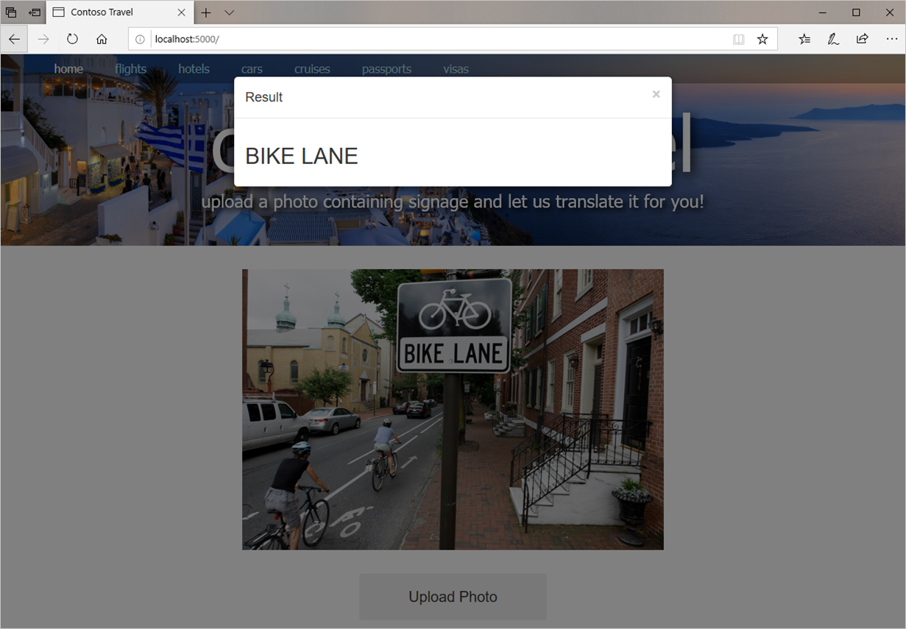

[Azure Cognitive Services](https://azure.microsoft.com/services/cognitive-services/) is a set of more than 20 services and APIs for infusing intelligence backed by machine learning and neural networks into the applications that you write. One member of the Cognitive Services family is the [Computer Vision API](https://azure.microsoft.com/services/cognitive-services/computer-vision/), which can analyze images uploaded to it and:

- Identify objects in the images
- Generate captions for the images (for example, "A woman riding a bicycle")
- Use Optical Character Recognition (OCR) to extract text from the images
- Find faces in the images and identify attributes of the faces, such as age and gender
- Generate "smart thumbnails" centered around the subjects of the images 
- Recognize famous people and landmarks in the images

Like all Cognitive Services APIs, the Computer Vision API is invoked by placing calls over the Internet to a REST endpoint. Rather than place those calls directly, you can use the [Python SDK for the Computer Vision API](https://pypi.org/project/azure-cognitiveservices-vision-computervision/) to simplify your code. The SDK abstracts calls to the Computer Vision API and handles JSON payloads so you don't have to write code to generate and consume JSON.

It is the OCR feature of the Computer Vision API that will enable the Contoso Travel site to extract text from images. In this unit, you will modify Contoso Travel to use the Computer Vision API to extract text from photos uploaded to the site.

Resources that are used in this exercise are located in a [Git code samples repository](https://github.com/MicrosoftDocs/mslearn-build-ai-web-app-with-python-and-flask). 

## Subscribe to the Computer Vision API

In order to call the Computer Vision API, you must first obtain an API key. This key travels in each request you place to the Computer Vision API in an HTTP header named `Ocp-Apim-Subscription-Key`. It is Azure's way of authenticating the caller and determining which Azure subscription to bill calls to. Most Azure Cognitive Service APIs have free tiers for which no billing is performed, but if you plan to place thousands of calls a day to a Cognitive Services API, you will be billed for it through your Azure subscription.

You can obtain a Computer Vision API key using the [Azure CLI](https://docs.microsoft.com/cli/azure/get-started-with-azure-cli?view=azure-cli-latest) or the [Azure portal](https://portal.azure.com). In this exercise, you will obtain an API key and a corresponding URL for placing calls to the Computer Vision API with that key using the Azure CLI.

1. If you haven't already installed the Azure CLI and logged into it for the first time, follow the instructions in an earlier unit for doing so.

1. Open a Command Prompt window or terminal and use the following command to create a resource group named "contoso-travel-rg" in Azure's North Central US region to hold all the Azure resources you create in this module:

	```
	az group create --name contoso-travel-rg --location northcentralus
	```

	Resource groups are an incredibly important feature of Azure. They act as containers for other Azure resources and serve to group those resources together so you can view billing information for them as a group, apply security rules as a group, and even delete them as a group. *Every* Azure resource that you create must be part of a resource group.

1. Now use the following command to subscribe to the Computer Vision API and place the resulting resource named "computer-vision" in the resource group created in the previous step:

	```
	az cognitiveservices account create --resource-group contoso-travel-rg --name computer-vision --location northcentralus --kind ComputerVision --sku F0 --yes
	```

	The `--sku F0` parameter subscribes to the free tier of the Computer Vision API that allows up to 20 calls per minute and a maximum of 5,000 calls per month. This is fine for development, but in production, you would want to subscribe to one of the paid tiers that supports more traffic. For a summation of pricing tiers for the Computer Vision API, see [Cognitive Services Pricing - Computer Vision API](https://azure.microsoft.com/pricing/details/cognitive-services/computer-vision/).

1. Use the following command to obtain an API key for the Computer Vision API:

	```
	az cognitiveservices account keys list --resource-group contoso-travel-rg --name computer-vision --query key1 --output tsv
	```

	The output from the command is a string containing numbers and letters. **This is your Computer Vision API key**. Copy the key into a text file and save it so you can easily retrieve it later. You will need it later in this unit and in a subsequent unit.

1. Use the following command to obtain an endpoint URL for calling the Computer Vision API:

	```
	az cognitiveservices account keys list --resource-group contoso-travel-rg --name computer-vision --query endpoint --output tsv
	```

	Once more, save the URL output from the command in a text file so you can easily retrieve it later. This URL is the one that you will use to call the Computer Vision API. 

The choice of North Central US as the region for your Computer Vision API resource and the resource group that holds it isn't arbitrary. You can locate a resource group and its resources in any of the more than 50 regions that Azure supports. However, it is desirable to locate all the resources that comprise a resource group in the same region in order to minimize cost and maximize performance. The Computer Vision API isn't supported in all regions, but it is supported in North Central US. For a list of regions in which Cognitive Services is available, refer to [Products available by region](https://azure.microsoft.com/global-infrastructure/services/?products=cognitive-services).

## Modify the site to use the Computer Vision API

You have now subscribed to the Computer Vision API and obtained an endpoint and an API key for calling it. The next step is to modify the Contoso Travel site to use these values to call the Computer Vision API and extract text from photos.

1. Open **app.py** and replace its contents with the following:

	```python
	import os, base64
	from flask import Flask, render_template, request, flash
	
	from azure.cognitiveservices.vision.computervision import ComputerVisionClient
	from azure.cognitiveservices.vision.computervision.models import ComputerVisionErrorException
	from msrest.authentication import CognitiveServicesCredentials
	
	# Create a ComputerVisionClient for calling the Computer Vision API
	vision_key = os.environ["VISION_KEY"]
	vision_endpoint = os.environ["VISION_ENDPOINT"]
	vision_credentials = CognitiveServicesCredentials(vision_key)
	vision_client = ComputerVisionClient(vision_endpoint, vision_credentials)
	
	app = Flask(__name__)
	app.secret_key = os.urandom(24)
	
	@app.route("/", methods=["GET", "POST"])
	def index():
	    if request.method == "POST":
	        # Display the image that was uploaded
	        image = request.files["file"]
	        uri = "data:image/jpg;base64," + base64.b64encode(image.read()).decode("utf-8")
	        image.seek(0)
	
	        # Use the Computer Vision API to extract text from the image
	        lines = extract_text_from_image(image, vision_client)
	        
	        # Flash the extracted text
	        for line in lines:
	            flash(line)
	
	    else:
	        # Display a placeholder image
	        uri = "/static/placeholder.png"
	
	    return render_template("index.html", image_uri=uri)
	
	# Function that extracts text from images
	def extract_text_from_image(image, client):
	    try:
	        result = client.recognize_printed_text_in_stream(image=image)
	        lines=[]
	
	        if len(result.regions) == 0:
	            lines.append("Photo contains no text to translate")
	
	        else:
	            for line in result.regions[0].lines:
	                text = " ".join([word.text for word in line.words])
	                lines.append(text)
	
	        return lines
	
	    except ComputerVisionErrorException as e:
	        return ["Computer Vision API error: " + e.message]
	
	    except:
	        return ["Error calling the Computer Vision API"]
	```

	The modified **app.py** defines a function named `extract_text_from_image()` that accepts an image and a `ComputerVisionClient` instance. It calls `ComputerVisionClient.recognize_printed_text_in_stream()` to pass the image to the Computer Vision API and returns one or more lines of text representing the text extracted from the image, a message indicating no text was found, or an error message indicating that something went wrong.

	The `index()` function calls `extract_text_from_image()` each time a photo is uploaded and uses Flask's `flash()` function to "flash" the results.

	`ComputerVisionClient` comes from the Python SDK for the Computer Vision API. An instance is created and initialized with your Computer Vision API endpoint and API key when the application starts up. The endpoint and API key are read from environment variables using Python's `os.environ` mapping object.

1. Now open **index.html** and insert the following code and markup before the `<script>` element at the bottom of the page:

	```html
	<div class="container">	
	    <div class="row">
	        <div id="myModal" class="modal fade" role="dialog">
	            <div class="modal-dialog">
	                <div class="modal-content">
	                    <div class="modal-header">
	                        <button type="button" class="close" data-dismiss="modal">&times;</button>
	                        <h4 class="modal-title">Result</h4>
	                    </div>
	                    <div class="modal-body"></div>
	                </div>
	            </div>
	        </div>
	    </div>
	</div>

	
	    
	        <script type="text/javascript">
	            // If flash messages are queued up, show them in a modal dialog
	            var messages = {{ messages | safe }};
	            body = $(".modal-body");
	            body.empty();
	
	            for (i=0; i<messages.length; i++) {
	                body.append("<h2>" +  messages[i] + "</h2>");
	            }
	            
	            $("#myModal").modal("show");
	        </script>
	    
	 
	```

	The first section defines a modal dialog box using Bootstrap. The second section populates the dialog box with the lines of text returned by `extract_text_from_image()` and flashed by `index()` and displays the dialog box in the page.

Finish up by saving your changes to **index.html** and **app.py**.

## Extract text from photos

Now let's run the modified site, upload a few photos, and see if the Computer Vision API lives up to its billing.

1. If you are running Windows, execute the following commands to create environment variables containing the API key and endpoint you retrieved for the Computer Vision API, replacing `computer_vision_api_key` with the API key and `computer_vision_endpoint` with the endpoint URL:

	```
	set VISION_KEY=computer_vision_api_key
	set VISION_ENDPOINT=computer_vision_endpoint
	```

	If you are running Linux or macOS, use these commands instead:

	```
	export VISION_KEY=computer_vision_api_key
	export VISION_ENDPOINT=computer_vision_endpoint
	```

	When the site is running locally, calls to `os.environ` load these variables from the environment. Later, when you deploy the site to Azure, the same variables will come from application settings in Azure—no code changes required.

1. Navigate to http\:\//localhost\:5000 in your browser. Select the **Upload Photo** button and upload a picture that contains text. Confirm that after a brief pause, the text extracted from the photo appears in a modal dialog. Then dismiss the dialog.

	

	_Extracting text from a photo_

Repeat this process with other photos to gauge the Computer Vision API's ability to extract text from the photos you upload. It isn't perfect, but it should get it right—or almost right—most of the time.