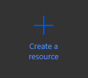
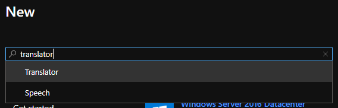
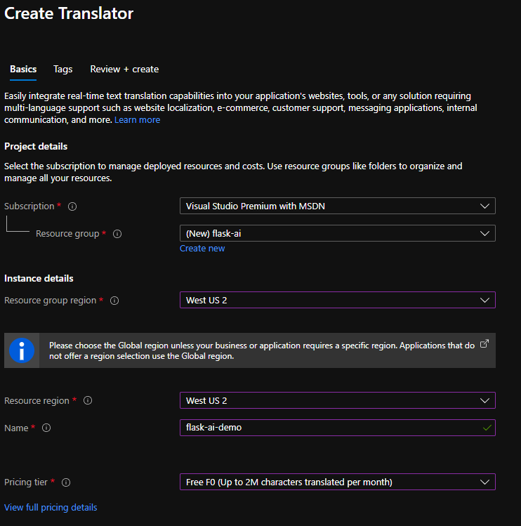
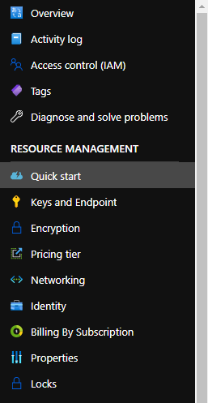
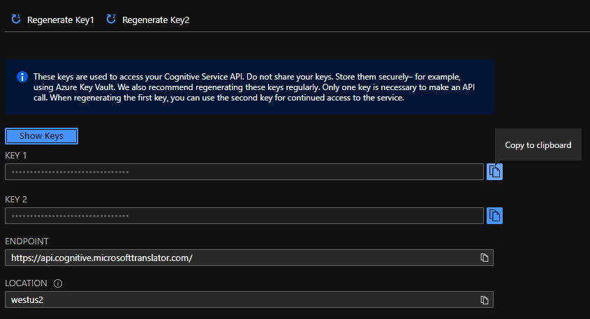

Let's get keys for the Translator service. As mentioned previously, we'll need an [Azure account](https://azure.microsoft.com/free/?WT.mc_id=python-11210-chrhar&azure-portal=true). We'll create the key using the Azure portal and store it in a **.env** file in our application.

## Get Translator service key

1. Browse to the [Azure portal](https://portal.azure.com?azure-portal=true)
2. Select **Create a resource**

   > [!div class="mx-imgBorder"]
   > 

3. In the **Search** box, enter **Translator**
4. Select **Translator**

   > [!div class="mx-imgBorder"]
   > 

5. Select **Create**

   > [!div class="mx-imgBorder"]
   > 

6. Complete the Create Translator form with the following values:
   - **Subscription**: *Your subscription*
   - **Resource group**:
     - Select **Create new**
     - Name: **flask-ai**
   - **Resource group region**: *Select a region near you*
   - **Resource region**: *Select the same region as above*
   - **Name**: *A unique value, such as ai-yourname*
   - **Pricing tier**: **Free F0**

   > [!div class="mx-imgBorder"]
   > 

7. Select **Review + create**
8. Select **Create**
9. After a few moments the resource will be created
10. Select **Go to resource**
11. Select **Keys and Endpoint** on the left side under **RESOURCE MANAGEMENT**

    > [!div class="mx-imgBorder"]
    > 

12. Next to **KEY 1**, select **Copy to clipboard**

    > [!div class="mx-imgBorder"]
    > 
    
    > [!NOTE]
    > There's no difference between Key 1 and Key 2. By providing two keys you have the opportunity to migrate to new keys, by regenerating one while using the other.

13. Make a note of the **endpoint** and **location** values

## Create .env file to store the key

1. Return to Visual Studio Code and create a new file in the root of the application by selecting **New file** and naming it **.env**

   > [!IMPORTANT]
   > The **.** at the beginning of the file is required.

2. Paste the following text into **.env**

    ```text
    KEY=your_key
    ENDPOINT=your_endpoint
    LOCATION=your_location
    ```

3. Replace the placeholders
    - **your_key** with the key you copied above
    - **your_endpoint** with the endpoint from Azure
    - **your_location** with the location from Azure

4. Your **.env** file should look like the following (with your values):

    ```text
    KEY=00d09299d68548d646c097488f7d9be9
    ENDPOINT=https://api.cognitive.microsofttranslator.com/
    LOCATION=westus2
    ```

## Next steps

Now that our Translator service is configured and variables are set in **.env**, we can turn our attention to adding the necessary code!
