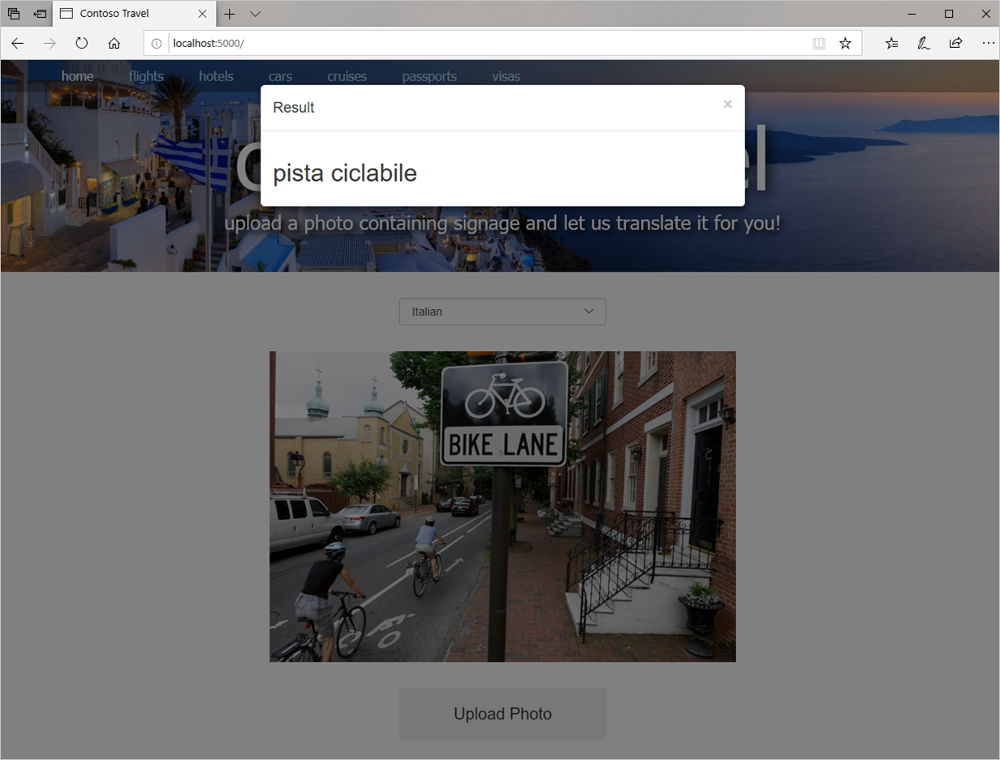

The Translator Text API is the member of Azure Cognitive Services that translates text from one language to another. It relies on state-of-the-art Neural Machine Translation (NMT) to work its magic and supports more than 60 languages.

Like the Computer Vision API, the Translator Text API is invoked using REST calls over the internet. Unlike the Computer Vision API, the Translator Text API currently has no Python SDK available. That doesn't mean that you can't use it from a Python application. It means that you must invoke the API using raw HTTP requests and write code to parse the JSON payloads that are returned.

It's not as hard as it sounds, as you will prove when you modify the Contoso Travel site to pass text extracted from photos by the Computer Vision API to the Translator Text API for translation into another language.

Resources that are used in this exercise are located in a [Git code samples repository](https://github.com/MicrosoftDocs/mslearn-build-ai-web-app-with-python-and-flask).

## Subscribe to the Translator Text API

In order to call the Translator Text API, you must obtain an API key. As with the Computer Vision API, this key travels in each request you place to the Translator Text API in an `Ocp-Apim-Subscription-Key` header and maps calls to Azure subscriptions.

1. In a Command Prompt window or terminal, use the following command to subscribe to the Translator Text API and place the resulting resource named "translator-text" in the resource group you created earlier:

    ```bash
    az cognitiveservices account create --resource-group contoso-travel-rg --name translator-text --location global --kind TextTranslation --sku F0 --yes
    ```

    Unlike the Computer Vision API, which requires you to specify an Azure region, the Translator Text API is a "global" API that doesn't live in a specific region. That's the reason for the `--location global` parameter. Among other things, this means that you don't have to retrieve an endpoint URL for the Translator Text API as you do for the Computer Vision API. One endpoint, <https://api.cognitive.microsofttranslator.com/translate?api-version=3.0>, serves all regions.

1. Use the following command to obtain an API key for the Translator Text API:

    ```bash
    az cognitiveservices account keys list --resource-group contoso-travel-rg --name translator-text --query key1 --output tsv
    ```

    The output from the command is a string containing numbers and letters. **This is your Translator Text API key**. Copy the key into a text file and save it so you can easily retrieve it later. You will need it later in this unit and in a subsequent unit.

This API key uses the Text Translator API's free tier (`--sku F0`), which supports translating up to 2,000,000 characters of text per month. In a production environment, you would want to subscribe to one of the paid tiers documented [here](https://azure.microsoft.com/pricing/details/cognitive-services/translator-text-api/).

## Modify the site to use the Translator Text API

You have now subscribed to the Translator Text API and obtained an API key for calling it. The next step is to modify the Contoso Travel site to use the Translator Text API to translate text extracted from photos with the Computer Vision API.

1. Open **index.html** and insert the following statements at line 42, just before the `` element:

    ```html
    <select id="language" class="form-control" name="language">
        <option value="en">English</option>
        <option value="zh-Hant">Chinese (simplified)</option>
        <option value="zh-Hans">Chinese (traditional)</option>
        <option value="fr">French</option>
        <option value="de">German</option>
        <option value="it">Italian</option>
        <option value="ja">Japanese</option>
        <option value="ko">Korean</option>
        <option value="pt">Portugese</option>
        <option value="es">Spanish</option>
    </select>
    ```

    Here's the modified markup showing the correct positioning of the new block:

    ```html
    <div class="container">
        <div class="row">
            <div class="col-sm-12 text-center">
                <form method="POST" enctype="multipart/form-data">
                    <div style="display: none">
                        <input type="file" id="upload-file" name="file" accept=".jpg,.jpeg,.png,.gif">
                        <input type="submit" id="submit-button" value="Upload">
                    </div>
                    <select id="language" class="form-control" name="language">
                        <option value="en">English</option>
                        <option value="zh-Hant">Chinese (simplified)</option>
                        <option value="zh-Hans">Chinese (traditional)</option> 
                        <option value="fr">French</option>
                        <option value="de">German</option>
                        <option value="it">Italian</option>
                        <option value="ja">Japanese</option>
                        <option value="ko">Korean</option>
                        <option value="pt">Portugese</option>
                        <option value="es">Spanish</option>
                    </select>
                    
                    <input type="button" id="upload-button" class="btn" value="Upload Photo">
                </form>
            </div>
        </div>
    </div>
    ```

    The added markup defines a drop-down list (an HTML `<select>` element) with a selection of languages that can text can be translated into.

1. Also in **index.html**, add the following statement to the `<script>` block at the bottom of the page:

    ```javascript
    $("#language").val("{{ language }}");
    ```

    Here's how the modified `<script>` block should look:

    ```javascript
    <script type="text/javascript">
        $(function() {
            $("#upload-button").click(function() {
                $("#upload-file").click();
            });

            $("#upload-file").change(function() {
                $("#submit-button").click();
            });

            $("#language").val("{{ language }}");
        });
    </script>
    ```

    The purpose of the added statement is to initialize the drop-down list with the currently selected language. Without this statement, the drop-down list would revert back to the default ("English") each time a photo is uploaded.

1. Open **app.py** and replace the first line with this one:

    ```python
    import os, base64, json, requests
    ```

1. Next, add the following statements right after the statements that create a `ComputerVisionClient` instance near the top of the file to fetch the Translator Text API key:

    ```python
    # Retrieve the Translator Text API key 
    translate_key = os.environ["TRANSLATE_KEY"]
    ```

1. Replace the ```index()``` function with this one:

    ```python
    @app.route("/", methods=["GET", "POST"])
    def index():
        language="en"

        if request.method == "POST":
            # Display the image that was uploaded
            image = request.files["file"]
            uri = "data:image/jpg;base64," + base64.b64encode(image.read()).decode("utf-8")
            image.seek(0)

            # Use the Computer Vision API to extract text from the image
            lines = extract_text_from_image(image, vision_client)

            # Use the Translator Text API to translate text extracted from the image
            language = request.form["language"]
            translated_lines = translate_text(lines, language, translate_key)

            # Flash the translated text
            for translated_line in translated_lines:
                flash(translated_line)

        else:
            # Display a placeholder image
            uri = "/static/placeholder.png"

        return render_template("index.html", image_uri=uri, language=language)
    ```

    The new `index()` function reads the language selected in the drop-down list from the request and passes it to `translate_text()`, which translates the text into the specified language. Then it flashes the translated text so **index.html** will present it to the user.

1. Finally, add the `translate_text()` function to the end of **app.py**:

    ```python
    # Function the translates text into the specified language
    def translate_text(lines, language, key):
        uri = "https://api.cognitive.microsofttranslator.com/translate?api-version=3.0&to=" + language

        headers = {
            'Ocp-Apim-Subscription-Key': key,
            'Content-type': 'application/json'
        }

        input=[]

        for line in lines:
            input.append({ "text": line })

        try:
            response = requests.post(uri, headers=headers, json=input)
            response.raise_for_status() # Raise exception if call failed
            results = response.json()

            translated_lines = []

            for result in results:
                for translated_line in result["translations"]:
                    translated_lines.append(translated_line["text"])

            return translated_lines

        except requests.exceptions.HTTPError as e:
            return ["Error calling the Translator Text API: " + e.strerror]

        except Exception as e:
            return ["Error calling the Translator Text API"]
    ```

    This function calls the Translator Text API to translate the text passed to it. It returns the translated text, or an error message if something went wrong.

An interesting aspect of this code is that if the call to the Computer Vision API returns an error message or a message indicating that no text was detected in the photo, the message itself is translated into the language that the user selected.

## Translate text extracted from photos

The final step is to test the changes that you made by uploading photos to the site and allowing the Translator Text API to translate the text in them.

1. If you are running Windows, use the following command to create an environment variable containing the API key you retrieved for the Translator Text API, replacing `translator_text_api_key` with your key:

    ```bash
    set TRANSLATE_KEY=translator_text_api_key
    ```

    If you are running Linux or macOS, use this command instead:

    ```bash
    export TRANSLATE_KEY=translator_text_api_key
    ```

1. Go to <http://localhost:5000/> in your browser. Confirm that the page now contains a drop-down list for selecting a language, as pictured below.

    

    _Selecting a language_

1. Select the language that you want to translate text into from the drop-down list. Then click **Upload Photo** and upload a picture containing text.

1. Confirm that after a brief pause, the text extracted from the photo and translated into the language you specified appears in a modal dialog. Then dismiss the dialog.

    

    _Extracting text from a photo_

Repeat this process with other photos to gauge the Translator Text API's ability to translate text submitted to it.
