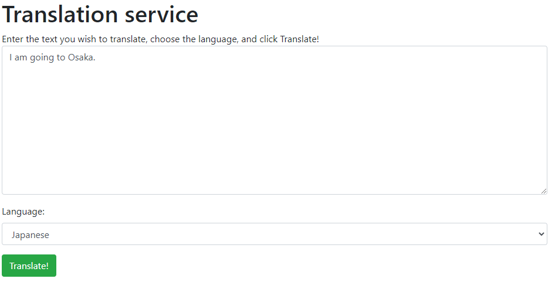

With our back-end Translator service created on Azure and the variables stored ready to go, let's turn our attention to adding the necessary logic and template to our application to translate the text. We'll work through the following steps:

1. Add code to call the service
1. Create the template to display results
1. Test our application

## Add code to call the service

**app.py** contains the logic for our application. We'll add a couple of required imports for the libraries we'll use, followed by the new route to respond to the user.

1. At the *very top* of **app.py**, add the following lines of code:

    ```python
    import requests, os, uuid, json
    from dotenv import load_dotenv
    load_dotenv()
    ```

The top line will import libraries that we'll use later, when making the call to the Translator service. We also import `load_dotenv` from `dotenv` and execute the function, which will load the values from **.env**.

2. At the *bottom* of **app.py**, add the following lines of code to create the route and logic for translating text:

    ```python
    @app.route('/', methods=['POST'])
    def index_post():
        # Read the values from the form
        original_text = request.form['text']
        target_language = request.form['language']
    
        # Load the values from .env
        key = os.environ['KEY']
        endpoint = os.environ['ENDPOINT']
        location = os.environ['LOCATION']
    
        # Indicate that we want to translate and the API version (3.0) and the target language
        path = '/translate?api-version=3.0'
        # Add the target language parameter
        target_language_parameter = '&to=' + target_language
        # Create the full URL
        constructed_url = endpoint + path + target_language_parameter
    
        # Set up the header information, which includes our subscription key
        headers = {
            'Ocp-Apim-Subscription-Key': key,
            'Ocp-Apim-Subscription-Region': location,
            'Content-type': 'application/json',
            'X-ClientTraceId': str(uuid.uuid4())
        }
    
        # Create the body of the request with the text to be translated
        body = [{ 'text': original_text }]
    
        # Make the call using post
        translator_request = requests.post(constructed_url, headers=headers, json=body)
        # Retrieve the JSON response
        translator_response = translator_request.json()
        # Retrieve the translation
        translated_text = translator_response[0]['translations'][0]['text']
        
        # Call render template, passing the translated text,
        # original text, and target language to the template
        return render_template(
            'result.html',
            translated_text=translated_text,
            original_text=original_text,
            target_language=target_language
        )
    ```

The code is commented to describe the steps that are being taken. At a high level, here's what our code does:

1. Reads the **text** the user entered and the **language** they selected on the form
1. Reads the environmental variables we created earlier from our **.env** file
1. Creates the necessary path to call the Translator service, which includes the target language (the source language is automatically detected)
1. Creates the header information, which includes the key for the Translator service, the location of the service, and an arbitrary ID for the translation
1. Creates the body of the request, which includes the text we want to translate
1. Calls `post` on `requests` to call the Translator service
1. Retrieves the JSON response from the server, which includes the translated text
1. Retrieves the translated text (see the following note)
1. Calls `render_template` to display the response page

> [!NOTE]
> When calling the Translator service it's possible to have multiple statements translated into multiple languages in a single call. As a result, the JSON returned by the service contains a lot of information, of which we need only one small piece. As a result, we need to step down a few levels to get the translated text.
> 
> Specifically, we need to read the first result, then to the collection of `translations`, the first translation, and then to the `text`. This is done by the call:
> `translator_response[0]['translations'][0]['text']`
> ```json
> [
>   {
>     "detectedLanguage": {
>       "language": "en",
>       "score": 1.0
>     },
>     "translations": [
>       {
>         "text": "これはテストです",
>         "to": "ja"
>       }
>     ]
>   }
> ]

## Create the template to display results

Let's create the HTML template for the results page.

1. Create a new file in **templates** by selecting **templates** in the **Explorer** tool in Visual Studio Code. Then select **New file**
2. Name the file **results.html**
3. Add the following HTML to **results.html**

    ```html
    <!DOCTYPE html>
    <html lang="en">
    <head>
        <meta charset="UTF-8">
        <meta name="viewport" content="width=device-width, initial-scale=1.0">
        <link rel="stylesheet" href="https://cdn.jsdelivr.net/npm/bootstrap@4.5.3/dist/css/bootstrap.min.css"
            integrity="sha384-TX8t27EcRE3e/ihU7zmQxVncDAy5uIKz4rEkgIXeMed4M0jlfIDPvg6uqKI2xXr2" crossorigin="anonymous">
        <title>Result</title>
    </head>
    <body>
        <div class="container">
            <h2>Results</h2>
            <div>
                <strong>Original text:</strong> {{ original_text }}
            </div>
            <div>
                <strong>Translated text:</strong> {{ translated_text }}
            </div>
            <div>
                <strong>Target language code:</strong> {{ target_language }}
            </div>
            <div>
                <a href="{{ url_for('index') }}">Try another one!</a>
            </div>
        </div>
    </body>
    </html>
    ```

You'll notice that we access `original_text`, `translated_text`, and `target_language`, which we passed as named parameters in `render_template` by using `{{ }}`. This operation tells Flask to render the contents as plain text. We're also using `url_for('index')` to create a link back to the default page. While we could, technically, type in the path to the original page, using `url_for` tells Flask to read the path for the function with the name we provide (`index` in this case). If we rearrange our site, the URL generated for the link will always be valid.

## Test the page

Return to the integrated terminal in Visual Studio Code (or reopen it with **Ctrl-\`**, or **Cmd-\`** on a Mac). If the site is currently running, we'll need to stop and restart it so that the application reads our environmental variables.

1. Use **Ctrl-C** to stop the Flask application
2. Execute the command `flask run` to restart the service
3. Browse to **http://localhost:5000** to test your application
4. Enter text into the text area, choose a language, and select **Translate**

   > [!div class="mx-imgBorder"]
   > 

5. You'll see the results!

   > [!div class="mx-imgBorder"]
   > 

## Congratulations

You've now successfully created a website that uses Translator to implement translations! Because language and communication rely on context, which isn't always clear to a computer, you might notice that the results aren't perfect. However, they're typically spot on or close enough for effective communication, which is the goal!

The code we've provided here can be incorporated into any application you like. You can continue to build on the website we've created, or even [deploy it to Azure App Services](https://docs.microsoft.com/azure/developer/python/tutorial-deploy-app-service-on-linux-03?WT.mc_id=python-11210-chrhar&azure-portal=true)!
