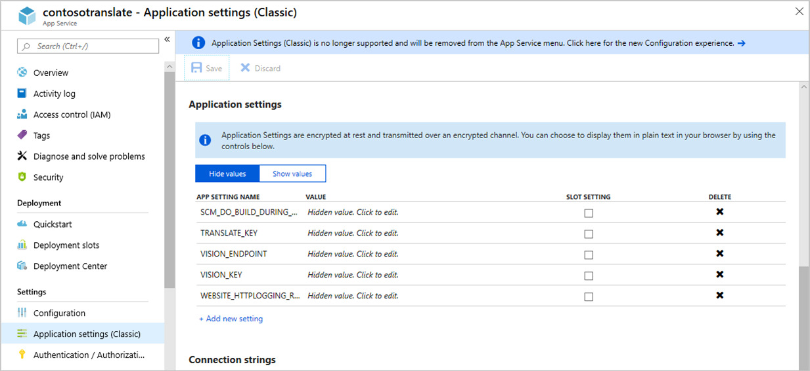
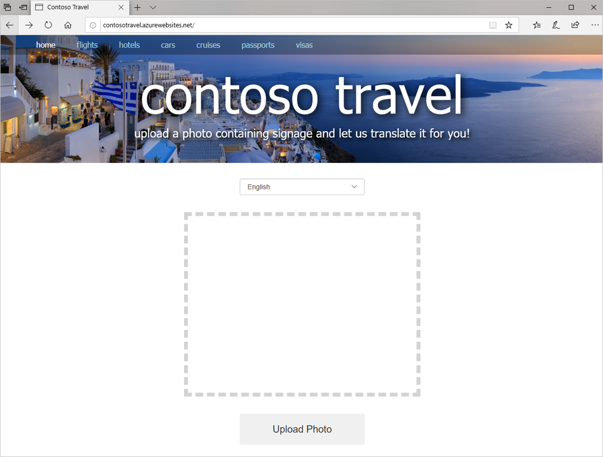

Azure App Service is a set of services provided by Microsoft Azure to enable developers to easily build and deploy web apps. Included in the App Service family are Azure Web Apps, which allow you to quickly and easily deploy websites built with tools and languages you’re already familiar with.

Azure Web Apps makes deploying websites extraordinarily easy, and not just websites built using the Microsoft stack. You can deploy Python apps that use MySQL just as easily as ASP.NET apps that use SQL Server. You can select from a wide variety of web app templates or build templates of your own. You can configure web apps to autoscale as traffic increases to ensure that your customers aren’t left waiting during periods of peak demand. You can publish apps to staging locations and test them in the cloud before taking them live, and then swap staging and production with the click of a button. You can even create WebJobs — programs or scripts that run continuously or on a schedule to handle billing and other time-critical tasks. In short, Azure Web Apps takes the pain out of publishing and maintaining web apps. Azure Web Apps is as suitable for a personal photo-sharing site as it is for enterprise-grade sites serving millions of customers.

In this unit, you will deploy Contoso Travel to Azure as an Azure web app so it can be accessed by anyone, from anywhere, using a browser. And you will learn about App Service application settings, which allow API keys and other "secrets" used by an application to be stored securely in the cloud.

Resources that are used in this exercise are located in a [Git code samples repository](https://github.com/MicrosoftDocs/mslearn-build-ai-web-app-with-python-and-flask).

## Create an Azure App Service

In this exercise, you will use the Azure CLI to deploy your website to Azure.

1. Create a text file named **requirements.txt** containing the following statements in the project directory—the directory containing the Contoso Travel site:

    ```bash
    requests
    Flask
    azure-cognitiveservices-vision-computervision
    ```

    **requirements.txt** contains a list of Python packages that must be installed along with the app when the app is deployed to Azure.

1. Open a Command Prompt window or terminal and `cd` to the **starter** directory.

1. Execute the command below to deploy the website to Azure, replacing APP_NAME with the name you want to assign to the site. The name must be **unique with Azure**, so you probably won't be able to use a common name such as "contoso" or "contosotravel" unless you append some random characters to the end.

    ```bash
    az webapp up -n APP_NAME --resource-group contoso-travel-rg --location northcentralus
    ```

    If you get an error like `"Could not auto-detect the runtime stack of your app, see 'https://go.microsoft.com/fwlink/?linkid=2109470' for more information"` make sure that you are in the correct directory! You should be in the **starter** directory within **mslearn-build-ai-web-app-with-python-and-flask** where you've been writing all your code.

    The `az webapp up` command creates an Azure App Service to host your website, configures the App Service with the packages specified in **requirements.txt**, zips the files in the current directory and its subdirectories, and uploads the site to the App Service—all with one simple command. Sites that run on Node.js and Python are deployed to Linux App Services, while sites built on ASP.NET and ASP.NET Core run in Windows App Services.

    > Observe that you deployed the App Service in the same region (North Central US) as the Computer Vision API. This makes calls to the API faster by co-locating the website and the API that it uses in the same Azure region.

Wait for the command to complete; it will take a few minutes. Then confirm from the output that the website was successfully deployed.

## Add application settings

When you ran the website locally, it used `os.environ` to load API keys for the Computer Vision API and the Translator Text API and the URL of the Computer Vision API from local environment variables. In order for the site to run in Azure, these same settings needed to be added to the Azure App Service's application settings. In the steps that follow, you will use the Azure CLI to create these application settings in Azure and initialize them with the same values used when you loaded them into local environment variables.

1. Execute the following CLI command to create an application setting named "VISION_API_KEY," replacing APP_NAME with the name assigned to your App Service and `computer_vision_api_key` with your Computer Vision API key:

    ```bash
    az webapp config appsettings set -g contoso-travel-rg -n APP_NAME --settings VISION_KEY=computer_vision_api_key
    ```

1. Now use this command to create an application setting named "VISION_ENDPOINT," replacing `computer_vision_endpoint` with your Computer Vision API endpoint:

    ```bash
    az webapp config appsettings set -g contoso-travel-rg -n APP_NAME --settings VISION_ENDPOINT=computer_vision_endpoint
    ```

1. Finish up by using the following command to load your Translator Text API key into application settings, replacing `translate_api_key` with your key:

    ```bash
    az webapp config appsettings set -g contoso-travel-rg -n APP_NAME --settings TRANSLATE_API_KEY=translate_api_key
    ```

If you would like, you can log into the Azure portal, open the Azure App Service created by the `az webapp up` command, and view the application settings that these commands created. The screenshot below illustrates what you will see if you do.

 ](../media/app-settings.png#lightbox)

_View application settings in the Azure portal_

## Run the site in Azure

Now it's time to see the fruits of your labor.

1. Point your browser to http\:\//APP_NAME.azurewebsites.net, replacing APP_NAME with the name of your App Service. Confirm that the site appears in your browser and that it looks exactly as it did when running locally.

    

    _Contoso Travel running in Azure_

1. Choose a language and upload a few photos containing signs with text that you want to translate. Does the site behave the same in Azure as it does when running locally?

If you later make changes to your site and want to update the App Service in Azure, run the `az webapp up` command again. Rather than create a new App Service, it will zip-deploy the files in the current directory to the existing App Service. If you would prefer to put the source-code files under source control and deploy them directly from Visual Studio Code, just follow the instructions in [Deploy to Azure App Service on Linux](https://code.visualstudio.com/docs/python/tutorial-deploy-app-service-on-linux).
