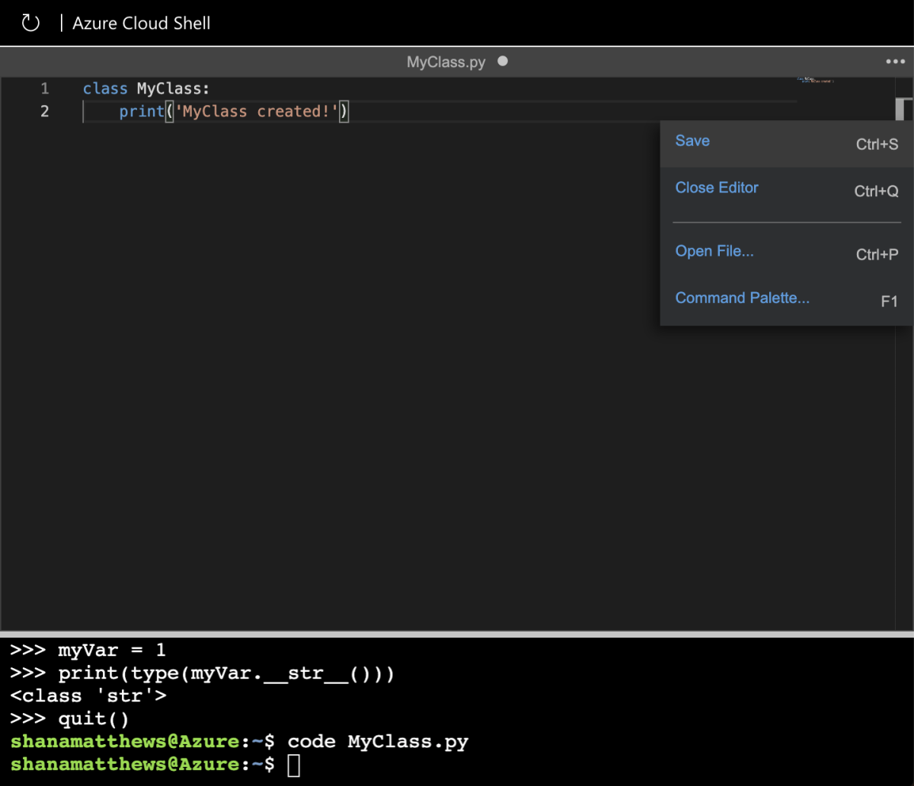

The first step in writing object-oriented code is writing the classes from which objects will be created. In this unit, you create a class in Python and then use the class to instantiate an object.

The term "instantiate" is just a fancy way of saying that Python uses the class to create an object by allocating memory for the object and copying the object's code and data into memory. Just as you use a blueprint to create a house or a recipe to create a cookie, Python uses classes to create objects.

To run your Python code, you will use Azure Cloud Shell to your right. Python comes preinstalled on Azure Cloud Shell so there's nothing we need to configure.

## Objects in Python

Everything is an object in Python. When you create a variable and assign it a number, Python creates an instance of a built-in class. When you create a variable and assign it a string, Python once more creates an instance of a built-in class, albeit a different one.

Before you begin writing classes of your own, it is helpful to peek under the hood and understand how Python itself uses objects.

First, we will start the Python interpreter in Cloud Shell to look at some objects.

1. In Cloud Shell to the right, type the following to start the Python interpreter:

    ```bash
    python3
    ```

1. You should see the following output, letting you know the Python interpreter is running:

    ```output
    Python 3.5.2 (default, Oct  8 2019, 13:06:37)
    [GCC 5.4.0 20160609] on linux
    Type "help", "copyright", "credits" or "license" for more information.
    >>>
    ```

1. Now, type or paste the following code into Cloud Shell:

    ```python
    print(type(1))
    print(type("Hello There!"))
    print(type(1.1))
    print(type(True))
    ```

    The `print()` function writes output to the screen. The `type()` function shows an object's underlying class.

1. You should see an output that looks like this:

    ```output
    >>> print(type(1))
    <class 'int'>
    >>> print(type("Hello There!"))
    <class 'str'>
    >>> print(type(1.1))
    <class 'float'>
    >>> print(type(True))
    <class 'bool'>
    ```

    The output shows that 1 is an instance of Python's built-in `int` class, while "Hello There!" is a `str` (string). Notice that Python uses different classes for 1 and 1.1; 1.1 is `float`, not an `int`. If something has a truth value, True or False, then it relies on the `bool` class.

    You could easily test other kinds of data (feel free to experiment!), but be assured that any sort of data you try has an associated class, whether one that is built into Python or one you have written yourself.

1. All classes have methods associated with them. Type the following code and press enter:

    ```python
    print(dir(1))
    ```

1. This is the output you should see:

    ```output
    ['__abs__', '__add__', '__and__', '__bool__', 
    '__ceil__', '__class__', '__delattr__', '__dir__', 
    '__divmod__', '__doc__', '__eq__', '__float__', 
    '__floor__', '__floordiv__', '__format__', '__ge__', 
    '__getattribute__', '__getnewargs__', '__gt__', 
    '__hash__', '__index__', '__init__', '__int__', 
    '__invert__', '__le__', '__lshift__', '__lt__', 
    '__mod__', '__mul__', '__ne__', '__neg__', '__new__', 
    '__or__', '__pos__', '__pow__', '__radd__', '__rand__', 
    '__rdivmod__', '__reduce__', '__reduce_ex__', 
    '__repr__', '__rfloordiv__', '__rlshift__', '__rmod__', 
    '__rmul__', '__ror__', '__round__', '__rpow__', 
    '__rrshift__', '__rshift__', '__rsub__', '__rtruediv__', 
    '__rxor__', '__setattr__', '__sizeof__', '__str__', 
    '__sub__', '__subclasshook__', '__truediv__', 
    '__trunc__', '__xor__', 'bit_length', 'conjugate', 
    'denominator', 'from_bytes', 'imag', 'numerator', 
    'real', 'to_bytes']
    ```

    This confusing list is all the `int` object's methods. The `dir()` function provides a list of attributes and methods for whatever you put within the parentheses.

    You sometimes hear methods referred to as *functions* when working with Python. The two terms are synonymous, but you can avoid confusion when talking with other people if you simply call them methods.

    All the entries you see in the list are methods. A method represents an action that you can perform on an object. For example, `to_bytes()` outputs the object value in byte format, which is just a special way of looking at the data.

    Notice the `__str__` method in the list. This method turns a value into a `str` (string) type. An object's type is simply the class it was created from. So the type of 1 is `int`.

1. Run the following code:

    ```python
    myVar = 1
    print(type(myVar.__str__()))
    ```

    The first line is an assignment. You're assigning the value `1` to an object named `myVar`. The `myVar` object now has an attribute: the value 1. The second line of code calls the `__str__()` method that is part of the `int` class and therefore present in the `myVar` object. What does the output from the code tell you?

The `__str__()` method created a new object from `myVar` of type `str`. The `myVar` object is still the same, completely untouched; it's still of type `int`. The new object – which doesn't have a name because you haven't assigned it one – is of type `str`.

## Define a class

Python has several built-in classes including `int`, `float`, `bool`, and `str`, but it also allows you to define classes of your own. This is the idea behind object-oriented programming.

Every Python class you create begins with the word `class` (which makes sense). Of course, a class needs a name. A class also needs to do something.

Let's begin with something simple: telling the user that the class has been created. In the real world, you wouldn't actually create a class like this, but it's helpful for learning in an incremental fashion.

Let's open Cloud Shell's built-in code editor to make our very first class.

1. First, paste or type the following to stop the Python interpreter:

    ```python
    quit()
    ```

1. Now, type the following to create a new Python file and open it:

    ```bash
    code MyClass.py
    ```

1. Type the following code into the open file above Cloud Shell:

    ```python
    class MyClass:
        print('MyClass created!')
    ```

    This is the simplest class you can create. It contains the bare essentials needed to create a class:

    - The keyword `class`
    - The class name ("myClass")
    - A colon marking the end of the `class` statement

    Notice that the next line is indented. This is important! Python uses indentation to indicate structure. In this case, the `print()` statement is part of `myClass`.

1. Save you file, by clicking on the 3 dots in the upper right hand corner, or pressing Ctrl+s (or Command+s on a Mac).

    

1. Run the code you've just written with this command:

    ```bash
    python3 MyClass.py
    ```

1. You should see this output:

    ```output
    MyClass created!
    ```

The output proves that the class was created (not that it was instantiated). The `print()` function executes during the creation process. Normally, you wouldn't use a `print(`) statement this way, but here it helps to see how the class creation works.

## Instantiate a class

At this point, you have a very simple (and nearly useless) class, but it serves to show how classes are defined. Now let's create an object from the class.

1. Add the following statement to the bottom of the file:

    ```python
    myVar = MyClass()
    ```

    This line creates an object named `myVar` from the class named `myClass`. Notice the parentheses after `myClass`. The parentheses tell Python to create an instance of the class without passing any parameters to it.

1. Now, add the following statements to the end of the file to prove that the object was created:

    ```python
    print(type(myVar))
    print(dir(myVar))
    ```

1. Save, then run your code again with the same command:

    ```bash
    python3 MyClass.py
    ```

    The output shows that the type of `myVar` is `__main__.myClass`. `__main__` is the scope in which this code is executing.

    A scope is a kind of logical grouping that holds pieces of code together.

    You don't see a scope for the `int` type because `int` is defined outside the scope of the current application. You see `__main__` for `myClass` because you defined `myClass` within the current application. It's the default scope, but you don't need to worry about it for now.

    The important takeaway, for the moment, is that `myVar` is an instance of the `myClass` class.

Also notice that you get default methods with your new class. Python provides a class with these default methods to perform essential tasks. These methods aren't all that important right now. It's simply a good idea to know that they exist. As you continue with this module, this information will become more relevant.
