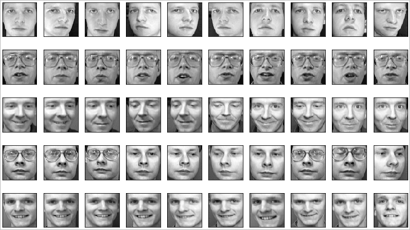
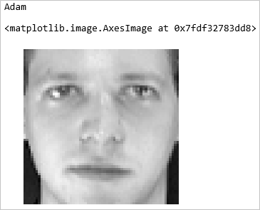

Attributes hold the data that defines an object. For a pink flower, "pink" is an attribute of the flower. If you wrote a `flower` class, you might include an attribute named `color` that describes the flower's color. You might also include an attribute indicating the flower's type — for example, iris, tulip, or rose. Objects are not required to have attributes, but in practice, most do.

In this unit, you write a class named `mPerson` to hold information about a person. You  add attributes to it and learn how to access those attributes. You  also learn about an important convention that enables selected members of a class to be marked "for internal use only" so other programmers will steer clear of them.

## Class attributes vs. instance attributes

Attributes come in two varieties: class attributes and instance attributes. A class attribute is one that applies to *all* instances of a class rather than to individual instances (objects created from the class). What's interesting about class attributes is that you don't have to instantiate a class to access them. They are always available. 

A great example can be found in Python's built-in `math` class, which has class attributes named `pi` and `e` containing the values of common mathematical constants. Because you don't have to create a class instance to access a class attribute, you can compute the area of a circle this way in Python:

```python
area = math.pi * radius * radius
```

You could easily write a class of your own that exposes these same values as class attributes:

```python
class constants:
    pi = 3.14159265358979323846264338327950288
    e =  2.71828182845904523536028747135266249
```

Using the constants would then be a simple matter of referencing class attributes on your own class:

```python
area = constants.pi * radius * radius
```

By contrast, an instance attribute is one that is "instanced" for each and every object you create. A `person` class might have a `name` attribute that holds a person's name. `name` would need to be an instance attribute so every `person` could be assigned a different name. That class could also have attributes defining additional information about a missing person, such as:

- A photo of the person's face
- A unique ID such as a Social Security number
- The person's date of birth

These should be instance attributes because they vary from person to person.

## Load a database of faces

So that we have some data to work with, let's load a database of facial images. The dataset is a publicly available one called the [Olivetti Faces dataset](https://scikit-learn.org/0.19/datasets/olivetti_faces.html). It was originally created by AT&T.

1. Return to the Azure Notebooks project you created in the previous unit and create a new Python 3.6 notebook named **Missing Persons.ipynb** or something similar. Then open the notebook.

1. One of the many popular packages available in Azure Notebooks is [Scikit-learn](https://scikit-learn.org/stable/index.html), which is an open-source library used to build [machine-learning](https://wikipedia.org/wiki/Machine_learning) models. Scikit-learn includes several built-in datasets, one of which is the Olivetti faces dataset.

	Paste the following statements into the empty cell at the top of the notebook to load the faces dataset:

	```python
	from sklearn.datasets import fetch_olivetti_faces
	
	# Load the dataset
	faces = fetch_olivetti_faces()

	# Prove that the dataset was loaded
	print(faces.data.shape)
	```

	The first line imports the Scikit-learn function that loads the dataset. The second loads the dataset, and the third shows the shape of the dataset.

1. Run the code and examine the output. The dataset contains 400 faces, each of which consists of an image with 4,096 pixels. The dataset contains 10 photos each of 40 different people. The first ten images in `faces.images` represent the first person, the next 10 images represent the second person, and so on.

1. Want to see what the faces look like? Paste the following statements into the next cell:

	```python
	%matplotlib inline
	import matplotlib.pyplot as plt
	
	# Plot the first 50 faces
	fig, axes = plt.subplots(5, 10, figsize=(12, 7), subplot_kw={'xticks': [], 'yticks': []})
	
	for i, ax in enumerate(axes.flat):
	    ax.imshow(faces.images[i], cmap=plt.cm.gray)
	```

	The code begins with something odd: a statement that starts with a percent sign. This is a "magic function" that relates specifically to Jupyter notebooks. It tells Jupyter to display graphics inline with the rest of the material in the notebook, which is handy when you need to visualize data.

	The next statement imports a module from the versatile [Matplotlib](https://matplotlib.org/) library and gives it the name `plt`. The remaining statements use Matplotlib's `imshow()` function to display the images.

1. Now run the cell and confirm that the output resembles the following:

	

	_The first five people in the Olivetti dataset_

Now that we have some faces to work with, let's shift our thinking to objects, classes, and attributes.

## Define a class containing instance attributes

Instance attributes differ from one class instance (object) to another. You can't access them without a class instance, as you can with class attributes. Instead, you must create an instance of the class.

Python provides multiple ways to create instance attributes, but the most common is to define an `__init__()` method containing the attributes you want objects to have.

1. Run the following code in a new notebook cell to define an `mPerson` class containing three instance attributes:

	```python
	class mPerson:
	    def __init__(self, name, photo, date_of_birth):
	        self.name = name
	        self.photo = photo
	        self.dob = date_of_birth
	```

	The `self` keyword refers to the object instance and is provided in the first argument to `__init__()`. Inside `__init__()` are three instance attributes that can be accessed on `mPerson` objects:

	- `name`, which holds the person's name
	- `photo`, which holds an image of the person's face
	- `dob`, which holds the person's date of birth

	Three arguments — `name`, `photo`, and `date_of_birth` — must be provided when the object is created. (The `self` argument is provided by Python itself.) Each is copied into the corresponding instance attribute.

1. Let's test these attributes. Use the following code to create an instance of `mPerson` named `aPerson` that has the name "Adam" and is assigned the first face in the Olivetti dataset:

	```python
	import datetime

	aPerson = mPerson("Adam", faces.images[0], datetime.datetime(1990, 9, 16))
	```

1. Now use these statements to display Adam's name and face:

	```python
	print(aPerson.name)
	plt.axis('off')
	plt.imshow(aPerson.photo, cmap=plt.cm.gray)
	```

	

	_Hello, Adam!_

Because `name`, `photo`, and `dob` are instance attributes, you could create hundreds of `mPerson` objects, and each could hold a different name, photo, and date of birth. If these were class attributes instead, `name`, `photo`, and `dob` would have to be the same for every person — clearly not a model of what happens in the real world.

## Data hiding

Many programming languages that support OOP also support *data hiding* by allowing methods and attributes — "class members" — to be declared private or protected. Private class members can be accessed from inside an object, but not from the outside. Protected class members can be accessed inside an object and objects subclassed from it (more on this later), but not from the outside.

Python doesn't support data hiding — at least not in the same sense that other languages do. Guido van Rossum, the creator of Python, felt that data hiding makes languages harder to use. Consequently, you can't hide class members in Python.

You can, however, use well-established conventions to let others know that certain class members are for internal use only and should *not* be accessed from the outside. Prefacing a class-member name with an underscore, as in `_myProtectedVar`, indicates that the class member is protected. Using two underscores (for example, `__cleanup()`) indicates that the class member is private.

Although you can still write code to access private and protected methods and attributes from the outside, many Python programming environments, including Jupyter notebooks, honor these conventions and hide private and protected members from view. So Python does support a limited form of data hiding, but only by convention and you need to be aware of that when you send your code to parts unknown.
