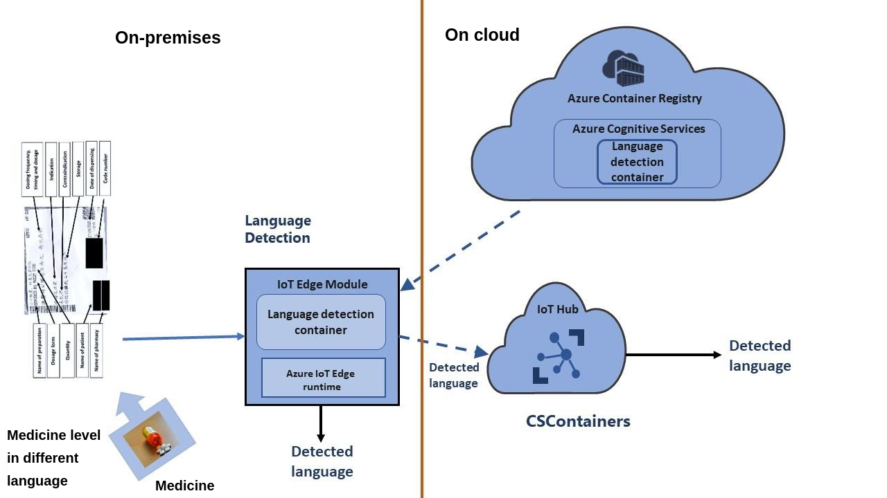

Azure AI services can be used on edge devices in many scenarios.

For example, the ability to detect language from text on an edge device can help in undertaking follow-on action such as translation. Using Azure AI services on Azure IoT Edge enables you to implement a language detection solution in areas affected by natural disaster.

Suppose you're assigned to an earthquake-affected area, and you're tasked with coordinating disaster relief aid. A recent earthquake has devastated the infrastructure of the region. Your job is to coordinate relief efforts on the ground. Specifically, you're tasked with managing the medical supplies. The region receives medicine from a variety of nations as emergency aid. You're the first point of contact assigned to receive the medical supplies. Hence, you want to scan the medicine labels so that you can correctly identify the country/region of origin. Once you have done so, you can pass the medicine to the appropriate medical staff who can verify other details on the label. Because you're in a disaster zone, you can't depend on connectivity.

Previously, the doctors had to wait until the appropriate person who spoke the language became available. It wasn't always easy to find the appropriate person in a disaster situation. So, you would like to use an app/service that could run offline if needed. The app would identify the language of medicine. If such a device were available, you could create a safer solution, which also optimizes precious time. The solution needs to employ Azure AI services (language detection) on edge devices as a part of the broader ‘AI for Good’ effort in the disaster zone.

## Learning objectives

In this module, you will:

- Implement a cognitive service for performing language detection on an edge device
- Describe how the components and services of a solution to deploy a cognitive service on an edge device work together to solve the problem of language detection on an edge device
