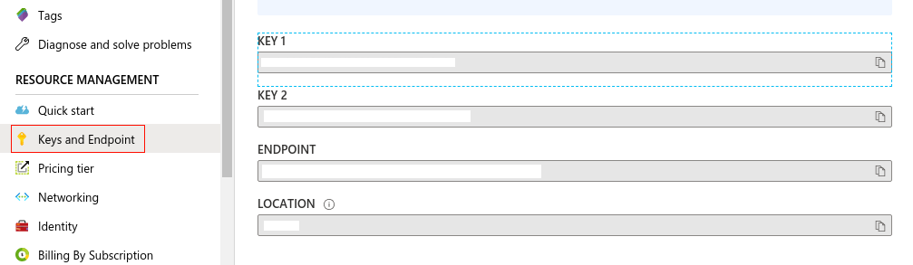
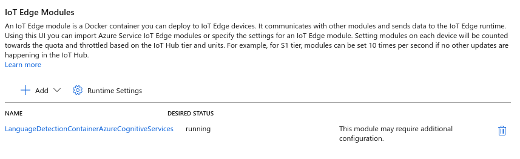
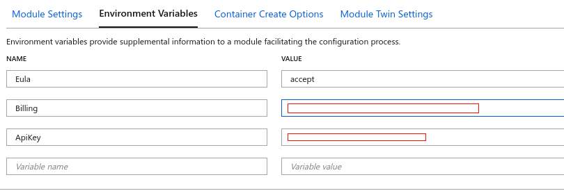

Before deploying the Language Detection module to your edge device, you need to configure the Azure AI services API key and endpoint into the container. 

<a name='create-an-azure-ai-services-text-analytics-resource'></a>

## Create an Azure AI Text Analytics resource

Create a Azure AI Text Analytics resource that matches the container.

1. Sign in to the [Azure portal](https://portal.azure.com/).
1. Select **Create a resource**, and then go to **AI + Machine Learning** > **Text Analytics**.
1. Enter all the required settings:

   | Setting        | Value                                   |
   | :------------- | :-------------------------------------- |
   | Name           | Enter a name (2-64 characters).         |
   | Subscription   | Select the appropriate subscription.    |
   | Location       | Select a nearby location.               |
   | Pricing tier   | Enter **S**, the standard pricing tier. |
   | Resource group | Select an available resource group.     |

1. Select **Create**, and wait for the resource to be created. Your browser automatically redirects to the newly created resource page.
1. Go to the resource.
1. In the **Keys and Endpoint** page under **Resource Management**, copy "API Key 1" and endpoint.

   

## Deploy the Language Detection module to the edge

To deploy the Language Detection container image as Azure IoT Edge modules from Azure Marketplace, follow these steps:

1. In the Azure portal, enter **Edge Module – Language Detection (Text Analytics)** into the search and open the Azure Marketplace result.

1. Select **Create** to create the image.

1. It will take you to the Azure portal's **Target Devices for IoT Edge Module** page. Provide the following required information.

    1. Select your subscription.

    1. Select the IoT hub created in an earlier step.

    1. Select **Find device** and find your IoT Edge device created in an earlier step.

1. Click the **Create** button. It will take you to the **Set modules** page. Keep the page open, because you'll configure Azure AI services in the next step.

1. Click on the **EdgeModuleLanguageDetectionTextAnalytics** IoT Edge module.

   

1. Navigate to **Environment Variables** and provide the following information.

    1. Keep the value **accept** for **Eula**.

    1. Fill out **Billing** with your Azure AI services endpoint.

    1. Fill out **ApiKey** with your Azure AI services API key.

   

1. Navigate to **Container Create Options**, and update the options to be:

    ```json
    {
        "ExposedPorts": {
            "5000/tcp": {}
        },
        "HostConfig": {
            "PortBindings": {
                "5000/tcp": [
                    {
                        "HostPort": "5000"
                    }
                ]
            }
        }
    }
    ```

    This adds port 5000 to the exposed ports so that the container can be connected to.

1. Click **Update**.

1. Select **Next: Routes** to  define your route. You define all messages from all modules to go to Azure IoT Hub.

1. Select **Next: Review + create**. You can preview the JSON file that defines all the modules that get deployed to your IoT Edge device.

1. Select **Create** to start the module deployment.

1. After you complete module deployment, you'll go back to the **IoT Edge** page of your IoT hub. Select your device from the list of IoT Edge devices to see its details.

1. Scroll down and see the modules listed. Check that the runtime status is running for modules.
