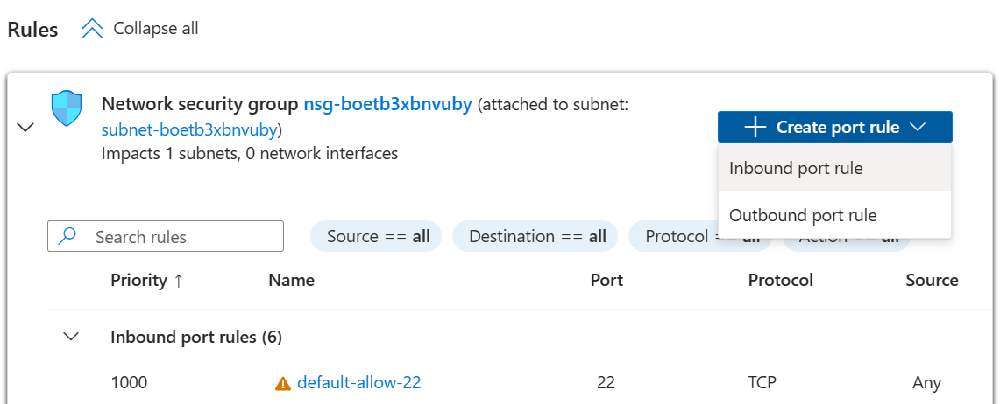
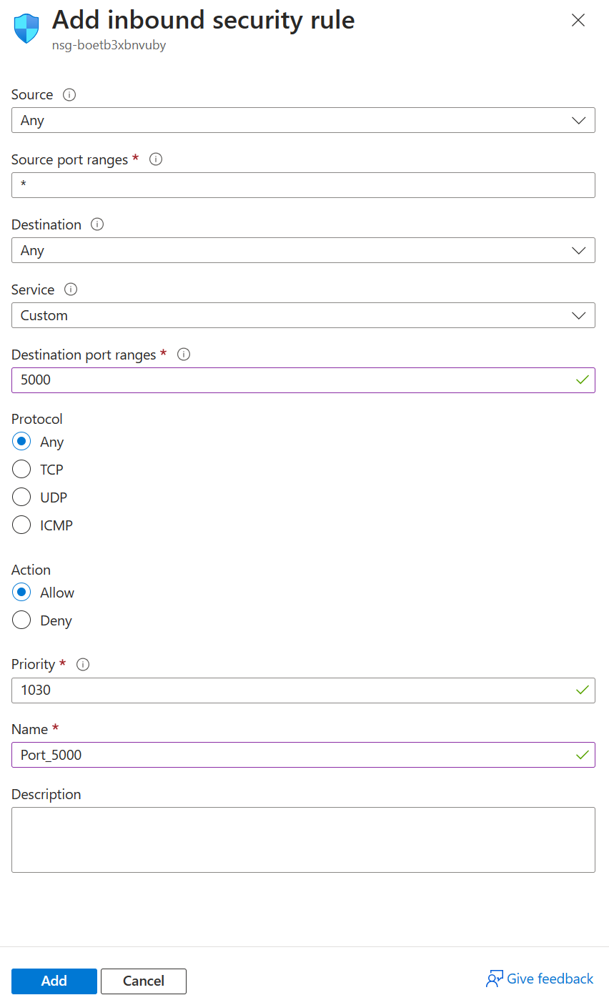
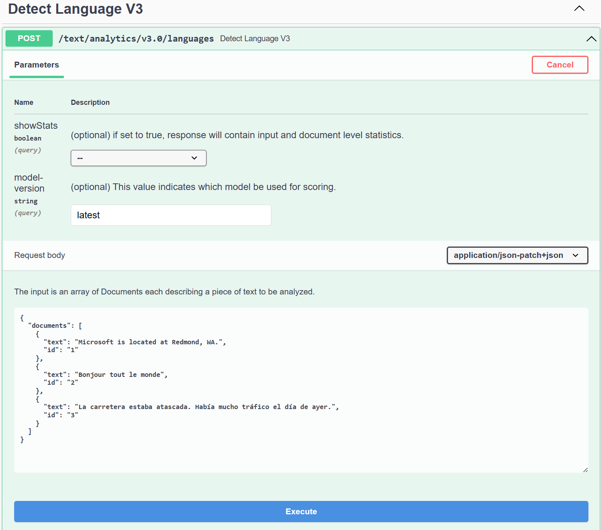

You'll make an HTTP call to the Azure IoT Edge device that has the Azure AI services container running. The container provides REST-based query prediction endpoint APIs. Use the host, `http://<<your-ipaddress>>:5000`, for container APIs.

## Open port 5000 of the edge device.

1. Go to the edge device VM you created in the Azure portal.

1. Under **Networking**, select **Network settings**.

1. Navigate to **Rules** section to add an inbound security rule to open port 5000.

    1. Select the **Create port rule** button and select **Inbound port rule**.
    

    1. Set the **Destination Port Ranges** to **5000**

    1. Set the **Name** to **Port_5000**

    1. Select the **Add button**

        

1. Copy the public IP address of your edge device from the overview page.

## Query the Azure AI services container running on your IoT Edge device from any browser

| Request URL                              | Purpose                                                      |
| :--------------------------------------- | :----------------------------------------------------------- |
| `http://<<your-ipaddress>>:5000/`        | The container provides a home page.                          |
| `http://<<your-ipaddress>>:5000/status`  | Requested with an HTTP GET, to validate that the container is running without causing an endpoint query. |
| `http://<<your-ipaddress>>:5000/swagger` | The container provides a full set of documentation for the endpoints and a **Try it out** feature. |

1. Open the browser, and replace the IP address of edge device with `<<your-ipaddress>>`.
1. Go to `http://<<your-ipaddress>>:5000`.
1. Select **API Description** or go to `http://<<your-ipaddress>>:5000/swagger` to get a detailed description of the API.
1. Select **Try it out** and then **Execute**. You can change the input value as you like. The result shows up farther down on the page.
    
